```
███████╗███╗   ██╗████████╗███████╗██████╗ ██████╗ ██████╗ ██╗███████╗███████╗
██╔════╝████╗  ██║╚══██╔══╝██╔════╝██╔══██╗██╔══██╗██╔══██╗██║██╔════╝██╔════╝
█████╗  ██╔██╗ ██║   ██║   █████╗  ██████╔╝██████╔╝██████╔╝██║███████╗█████╗  
██╔══╝  ██║╚██╗██║   ██║   ██╔══╝  ██╔══██╗██╔═══╝ ██╔══██╗██║╚════██║██╔══╝  
███████╗██║ ╚████║   ██║   ███████╗██║  ██║██║     ██║  ██║██║███████║███████╗
╚══════╝╚═╝  ╚═══╝   ╚═╝   ╚══════╝╚═╝  ╚═╝╚═╝     ╚═╝  ╚═╝╚═╝╚══════╝╚══════╝

 █████╗ ███████╗███████╗██╗███████╗████████╗ █████╗ ███╗   ██╗████████╗
██╔══██╗██╔════╝██╔════╝██║██╔════╝╚══██╔══╝██╔══██╗████╗  ██║╚══██╔══╝
███████║███████╗███████╗██║███████╗   ██║   ███████║██╔██╗ ██║   ██║   
██╔══██║╚════██║╚════██║██║╚════██║   ██║   ██╔══██║██║╚██╗██║   ██║   
██║  ██║███████║███████║██║███████║   ██║   ██║  ██║██║ ╚████║   ██║   
╚═╝  ╚═╝╚══════╝╚══════╝╚═╝╚══════╝   ╚═╝   ╚═╝  ╚═╝╚═╝  ╚═══╝   ╚═╝   
```

<div align="center">
  <h3>🚀 Multi-Agent Orchestrator with Plan-and-Execute Architecture 🚀</h3>
  
  [](https://www.python.org/downloads/)
  [](https://github.com/langchain-ai/langgraph)
  [](https://github.com/google-a2a/A2A)
  [](https://opensource.org/licenses/MIT)
  
  <p><em>A production-grade, multi-agent AI system implementing Plan-and-Execute workflows with real-time interrupts, conversational memory graphs, and seamless integration with Salesforce, Jira, and ServiceNow.</em></p>
</div>

---

## Table of Contents
- [Overview](#overview)
- [Architecture](#architecture)
- [Key Features](#key-features)
- [Quick Start](#quick-start)
- [System Requirements](#system-requirements)
- [Configuration](#configuration)
- [Usage Examples](#usage-examples)
- [Advanced Features](#advanced-features)
- [Development](#development)
- [Monitoring & Observability](#monitoring--observability)
- [Contributing](#contributing)
- [License](#license)

## Overview

The Enterprise Multi-Agent Assistant implements a sophisticated plan-and-execute workflow architecture that enables:

- **Plan-and-Execute Workflow**: Based on LangGraph's canonical tutorial, creates and executes multi-step plans with dynamic replanning
- **Real-time Interrupts**: User can modify plans mid-execution via ESC key, agents can request clarification via HumanInputTool
- **Conversational Memory Graph**: NetworkX-based graph structure for intelligent context retrieval and relationship tracking
- **A2A Protocol**: Industry-standard agent communication using JSON-RPC 2.0 with circuit breakers and connection pooling
- **Rich Terminal UI**: Split-screen interface with conversation history, plan execution status, and live memory graph visualization

### Why This Architecture?

This system solves key enterprise automation challenges:

1. **Transparency**: Users see the execution plan and can modify it in real-time
2. **Context Awareness**: Memory graph maintains relationships between entities and actions
3. **Resilient Communication**: Circuit breakers prevent cascade failures in distributed agent network
4. **Interactive Execution**: Agents can request human input when encountering ambiguity
5. **Visual Feedback**: Real-time plan status and memory graph provide operational visibility

## Architecture

```mermaid
flowchart TB
    %% Modern, sleek color scheme with subtle, muted tones
    classDef uiClass fill:#263238,stroke:#37474f,stroke-width:1px,color:#ffffff,font-weight:bold
    classDef orchestratorClass fill:#4527a0,stroke:#311b92,stroke-width:1px,color:#ffffff,font-weight:bold
    classDef protocolClass fill:#ef6c00,stroke:#e65100,stroke-width:1px,color:#ffffff
    classDef agentToolClass fill:#2e7d32,stroke:#1b5e20,stroke-width:1px,color:#ffffff
    classDef internalToolClass fill:#00695c,stroke:#004d40,stroke-width:1px,color:#ffffff
    classDef componentClass fill:#e8eaf6,stroke:#9fa8da,stroke-width:1px,color:#3f51b5
    
    %% User Interface Layer
    UI[🖥️ USER INTERFACE<br>Textual CLI]:::uiClass
    
    %% Main Orchestrator
    UI ==>|"requests"| ORCH[🧠 PLAN-AND-EXECUTE ORCHESTRATOR<br>━━━━━━━━━━━━━━━━━━━━━━━━━━<br>Intelligent Task Orchestration]:::orchestratorClass
    
    %% Core Components with semi-transparent styling
    subgraph components[" "]
        direction TB
        LG[📊 LangGraph<br>State Machine]:::componentClass
        PG[📝 Plan Generation<br>& Modification]:::componentClass
        EE[⚡ Execution Engine<br>Task Context Injection]:::componentClass
        AR[🔍 Agent Registry<br>Service Discovery]:::componentClass
        CS[💬 Conversation<br>Summarization]:::componentClass
        SS[🔒 Simplified State<br>Public/Private Schema]:::componentClass
    end
    
    %% All Tools under one umbrella
    ORCH ==>|"uses"| TOOLS[🛠️ ORCHESTRATOR TOOLS]:::orchestratorClass
    
    %% Tools subgraph containing both types
    subgraph tools[" "]
        direction TB
        
        %% Internal Tools (Direct)
        subgraph internal["Internal Tools - Direct"]
            WS[🔍 Web Search]:::internalToolClass
            HI[👤 Human Input Tool]:::internalToolClass
            REG[📋 Agent Registry]:::internalToolClass
            HM[❤️ Health Monitoring]:::internalToolClass
        end
        
        %% Agent Tools (via A2A)
        subgraph agents["Agent Tools - A2A Protocol"]
            SFT[☁️ Salesforce Agent Tool]:::agentToolClass
            JT[📋 Jira Agent Tool]:::agentToolClass
            SNT[🎫 ServiceNow Agent Tool]:::agentToolClass
        end
    end
    
    TOOLS -.->|contains| tools
    
    %% A2A Protocol connection from agent tools
    agents ==>|"communicate via"| PROTOCOL[🌐 A2A PROTOCOL LAYER<br>━━━━━━━━━━━━━━━━━━━━<br>📡 JSON-RPC 2.0 + HTTP<br>🛡️ Circuit Breakers<br>🔄 Connection Pooling]:::protocolClass
    
    %% Remote Agents
    PROTOCOL ==>|"routes to"| SF[☁️ SALESFORCE AGENT<br>━━━━━━━━━━━━━━━━━<br>🔧 6 Unified Tools<br>💬 Natural Language<br>🔍 SOQL Generation<br>🆔 Auto ID Detection<br>🔎 Cross-Object SOSL]:::agentToolClass
    
    PROTOCOL ==>|"routes to"| JIRA[📋 JIRA AGENT<br>━━━━━━━━━━━<br>🔧 11 Tools<br>🔍 JQL Search<br>🏃 Sprint Mgmt<br>📁 Project Creation<br>🔄 Issue Lifecycle]:::agentToolClass
    
    PROTOCOL ==>|"routes to"| SN[🎫 SERVICENOW AGENT<br>━━━━━━━━━━━━━━━━━<br>🔧 6 Unified Tools<br>💭 NLQ Support<br>⚙️ Workflow Mgmt<br>📊 Analytics<br>🔍 Auto Table Detect]:::agentToolClass
    
    %% Styling adjustments
    ORCH -.->|manages| components
    style components fill:#37474f30,stroke:#546e7a60,stroke-width:1px
    style tools fill:#37474f30,stroke:#546e7a60,stroke-width:1px
    style internal fill:#00695c20,stroke:#00695c40,stroke-width:1px
    style agents fill:#2e7d3220,stroke:#2e7d3240,stroke-width:1px
```



### Core Components

#### 1. **Plan-and-Execute Orchestrator** (`src/orchestrator/plan_and_execute.py`)
The heart of the system implementing:
- **Planner**: Generates multi-step execution plans from user requests
- **Executor**: Runs each step with full context injection
- **Replanner**: Dynamically adjusts plans based on results or interrupts
- **Interrupt Handler**: Manages user escapes and agent clarification requests
- **Memory Integration**: Provides relevant context to each execution step

#### 2. **Conversational Memory Graph** (`src/memory/memory_graph.py`)
Sophisticated context management system:
- **Node Types**: Users, entities, actions, search results, plans, clarifications
- **Edge Relationships**: led_to, relates_to, belongs_to, depends_on, produces
- **Intelligent Retrieval**: Relevance-based search with recency weighting
- **Entity Extraction**: Pattern-based detection of Salesforce, Jira, ServiceNow IDs
- **Visualization**: Real-time ASCII graph with force-directed layout

#### 3. **Rich Terminal UI** (`orchestrator_cli_textual.py`)
Interactive interface built with Textual:
- **Split Layout**: Conversation history (left), plan status and memory graph (right)
- **Plan Visualization**: Color-coded steps (pending ⚪, executing 🔵, completed ✅, failed ❌)
- **Memory Graph**: Live ASCII visualization with entity relationships
- **Interrupt Modal**: ESC key brings up plan modification dialog
- **SSE Integration**: Real-time updates via Server-Sent Events

#### 4. **A2A Protocol Layer** (`src/a2a/`)
Enterprise-grade agent communication:
- **Connection Pooling**: 50 total connections, 20 per host
- **Circuit Breakers**: 5 failure threshold, 60s timeout
- **Retry Logic**: 3 attempts with exponential backoff
- **Health Monitoring**: Concurrent agent availability checks

#### 5. **Observer System** (`src/orchestrator/observers/`)
Event-driven architecture for real-time updates:
- **SSE Observer**: Broadcasts plan changes, task progress, memory updates
- **Memory Observer**: Tracks conversation flow and entity relationships
- **Interrupt Observer**: Manages interrupt state persistence
- **WebSocket Handler**: Bidirectional communication for interrupts

## Key Features

### 🎯 Plan-and-Execute Workflow
- **Intelligent Planning**: LLM generates contextual multi-step plans
- **Step Execution**: Each step runs with full conversation context
- **Dynamic Replanning**: Adjusts plan based on results or failures
- **Past Steps Culling**: Intelligent trimming to prevent unbounded growth
- **Plan Persistence**: Full state checkpointing for resumability

### 🔄 Interactive Interrupts
- **User Escape (ESC)**: Modify plan mid-execution with natural language
- **Agent Clarification**: HumanInputTool for ambiguous requests
- **Interrupt Priority**: User escapes take precedence over agent requests
- **State Preservation**: Seamless resume after interrupt handling

### 🧠 Conversational Memory
- **Graph Structure**: NetworkX-based relationship tracking
- **Entity Recognition**: Automatic extraction of business entities
- **Contextual Retrieval**: Relevance + recency scoring
- **Relationship Types**: Multiple edge types for rich context
- **Memory Decay**: Task completion triggers context cleanup

### 📊 Visual Feedback
- **Plan Status**: Real-time step execution tracking
- **Memory Visualization**: ASCII graph with spring layout
- **Progress Indicators**: Animated spinners and status updates
- **Error Display**: Clear error messages with recovery options

## Quick Start

For a complete walkthrough of setup, architecture, and hands-on exploration, see our [**🚀 Comprehensive Onboarding Guide**](docs/guides/comprehensive-onboarding-guide.md).

```bash
# 1. Clone the repository
git clone https://github.com/your-org/consultant-assistant.git
cd consultant-assistant

# 2. Install dependencies
pip install -r requirements.txt

# 3. Configure environment
cp .env.example .env
# Edit .env with your credentials

# 4. Start the system
python3 start_system.py

# 5. In a new terminal, launch the UI
python3 orchestrator_cli_textual.py
```

## System Requirements

- **Python**: 3.11+ (async/await support required)
- **Memory**: 2GB RAM minimum, 4GB recommended
- **Terminal**: Modern terminal with Unicode support
- **Network**: Stable internet for API calls

### Python Dependencies

Core framework stack:
- `langchain==0.3.17` - Agent framework
- `langgraph==0.2.69` - State machine orchestration
- `textual==0.47.1` - Terminal UI framework
- `networkx==3.2.1` - Graph data structures
- `pydantic==2.10.3` - Data validation

## Configuration

### Environment Variables (.env)

```bash
# Azure OpenAI Configuration (Required)
AZURE_OPENAI_ENDPOINT=https://your-instance.openai.azure.com/
AZURE_OPENAI_CHAT_DEPLOYMENT_NAME=gpt-4o-mini
AZURE_OPENAI_API_VERSION=2024-06-01
AZURE_OPENAI_API_KEY=your-api-key

# Salesforce Configuration
SFDC_USER=your@email.com
SFDC_PASS=your-password
SFDC_TOKEN=your-security-token

# Jira Configuration
JIRA_BASE_URL=https://your-domain.atlassian.net
JIRA_USER=your@email.com
JIRA_API_TOKEN=your-api-token

# ServiceNow Configuration
SNOW_INSTANCE=your-instance.service-now.com
SNOW_USER=your-username
SNOW_PASS=your-password

# Optional Configuration
DEBUG_MODE=true
TAVILY_API_KEY=your-api-key  # For web search
```

## Usage Examples

### Basic CRM Operations
```
USER: update the SLA opportunity
ASSISTANT: I found 6 opportunities with "SLA" in their name. Please specify which one:
1. Express Logistics SLA
2. GenePoint SLA
3. United Oil SLA
...

USER: the last one
ASSISTANT: ✅ Successfully updated GenePoint SLA opportunity to Closed Won
```

### Plan Modification via Interrupt
```
USER: update the SLA opportunity
[Plan shows: 1. Search for SLA opportunities, 2. Update the opportunity]
USER: [Presses ESC]
[Modal appears with current plan]
USER: let's get it updated to closed won and start onboarding
[Plan updates to include onboarding steps]
```

### Cross-System Workflow
```
USER: create enterprise onboarding for GenePoint
ASSISTANT: I'll create a comprehensive onboarding workflow:

📋 Execution Plan:
1. ✅ Update GenePoint opportunity to Closed Won
2. ✅ Create onboarding case in Salesforce
3. ✅ Create company record in ServiceNow
4. ✅ Create Jira project for onboarding
5. ✅ Create task for buyer meeting (Josh)
6. ✅ Create task for design workshop (Larry)

All onboarding tasks completed successfully!
```

## Advanced Features

### Memory Graph Intelligence
The system maintains a sophisticated knowledge graph:
- **Entity Extraction**: Automatic detection of business entities with confidence scoring
- **Relationship Mapping**: Tracks how entities relate to each other
- **Contextual Search**: Uses embeddings for semantic similarity
- **Decay Mechanism**: Cleans up task-specific context after completion

### Interrupt Architecture
Two-tier interrupt system:
- **User Interrupts**: ESC key allows plan modification at any time
- **Agent Interrupts**: Tools can request human input for clarification
- **State Management**: Interrupt observer tracks state across resume cycles
- **Priority Handling**: User interrupts take precedence

### Plan Optimization
Intelligent plan management:
- **Past Steps Culling**: Keeps last 30 steps when exceeding 50
- **Context Injection**: Each step receives relevant memory context
- **Error Recovery**: Automatic replanning on step failures
- **Completion Detection**: Recognizes when tasks are fully complete

## Development

### Project Structure

```
consultant-assistant/
├── orchestrator_cli_textual.py   # Rich terminal UI with split-screen
├── orchestrator.py               # Main A2A server entry point
├── start_system.py              # System startup orchestration
├── salesforce_agent.py          # Salesforce agent entry point
├── jira_agent.py                # Jira agent entry point
├── servicenow_agent.py          # ServiceNow agent entry point
├── src/
│   ├── orchestrator/
│   │   ├── plan_and_execute.py # Core plan-execute workflow
│   │   ├── core/               # Core orchestrator components
│   │   │   ├── agent_registry.py    # Dynamic agent discovery
│   │   │   ├── llm_handler.py       # LLM integration
│   │   │   └── state.py             # State management
│   │   ├── observers/          # Event-driven observer pattern
│   │   │   ├── base.py              # Base observer class
│   │   │   ├── sse_observer.py      # Server-sent events
│   │   │   ├── memory_observer.py    # Memory graph updates
│   │   │   ├── interrupt_observer.py # Interrupt state tracking
│   │   │   └── registry.py          # Observer registration
│   │   ├── workflow/           # Workflow components
│   │   │   ├── entity_extractor.py  # Pattern-based entity detection
│   │   │   ├── event_decorators.py  # Workflow event emission
│   │   │   └── interrupt_handler.py # Interrupt management
│   │   ├── tools/              # Orchestrator tools
│   │   │   ├── agent_caller_tools.py # Agent communication tools
│   │   │   ├── base.py              # Base tool class
│   │   │   ├── human_input.py       # Human input tool
│   │   │   └── web_search.py        # Web search tool
│   │   └── a2a/                # A2A server components
│   │       ├── server.py            # WebSocket & SSE server
│   │       └── handler.py           # Request handlers
│   ├── agents/                 # Specialized agents
│   │   ├── salesforce/
│   │   │   ├── main.py              # Salesforce LangGraph agent
│   │   │   └── tools/               # Salesforce-specific tools
│   │   │       ├── base.py          # Tool implementations
│   │   │       └── unified.py       # Unified tool interface
│   │   ├── jira/
│   │   │   ├── main.py              # Jira LangGraph agent
│   │   │   └── tools/               # Jira-specific tools
│   │   │       ├── base.py          # Tool implementations
│   │   │       └── unified.py       # Unified tool interface
│   │   └── servicenow/
│   │       ├── main.py              # ServiceNow LangGraph agent
│   │       └── tools/               # ServiceNow-specific tools
│   │           ├── base.py          # Tool implementations
│   │           └── unified.py       # Unified tool interface
│   ├── a2a/                    # A2A protocol implementation
│   │   ├── protocol.py              # JSON-RPC 2.0 protocol
│   │   └── circuit_breaker.py       # Circuit breaker pattern
│   ├── memory/                 # Memory system
│   │   ├── memory_manager.py        # Memory management
│   │   ├── memory_graph.py          # NetworkX graph structure
│   │   ├── memory_node.py           # Node definitions
│   │   ├── graph_algorithms.py      # Graph algorithms
│   │   ├── semantic_embeddings.py   # Embedding generation
│   │   └── summary_generator.py     # Summarization
│   └── utils/                  # Shared utilities
│       ├── config/
│       │   ├── constants.py         # System-wide constants
│       │   └── unified_config.py    # Configuration management
│       ├── storage/
│       │   ├── async_store_adapter.py # SQLite async wrapper
│       │   ├── async_sqlite.py       # Async SQLite operations
│       │   ├── memory_schemas.py     # Memory data schemas
│       │   └── sqlite_store.py       # SQLite store
│       ├── logging/
│       │   ├── framework.py         # Logging framework
│       │   ├── logger.py            # Logger implementation
│       │   └── multi_file_logger.py # Multi-file logging
│       ├── ui/
│       │   ├── memory_graph_widget.py   # Memory graph widget
│       │   ├── clean_graph_renderer.py  # Graph rendering
│       │   ├── advanced_graph_renderer.py # Advanced rendering
│       │   ├── animations.py         # UI animations
│       │   ├── colors.py            # Color schemes
│       │   └── terminal.py          # Terminal utilities
│       ├── agents/
│       │   └── message_processing/
│       │       ├── helpers.py       # Message helpers
│       │       ├── serialization.py # Message serialization
│       │       └── unified_serialization.py
│       ├── message_serialization.py # LangChain msg handling
│       ├── helpers.py               # General helpers
│       ├── tool_execution.py        # Tool execution utilities
│       ├── input_validation.py      # Input validation
│       ├── soql_query_builder.py    # SOQL query building
│       └── glide_query_builder.py   # ServiceNow queries
├── docs/                       # Documentation
│   ├── architecture/          # Architecture docs
│   ├── components/            # Component docs
│   ├── guides/                # User guides
│   ├── operations/            # Operational docs
│   └── protocols/             # Protocol specs
├── logs/                       # Component-separated logs
│   ├── orchestrator.log       # Main workflow logs
│   ├── salesforce.log         # CRM operations
│   ├── jira.log               # Project management
│   ├── servicenow.log         # ITSM operations
│   ├── a2a_protocol.log       # Network operations
│   ├── storage.log            # Database operations
│   ├── system.log             # Startup/config
│   ├── client.log             # Client operations
│   ├── extraction.log         # Entity extraction
│   └── errors.log             # Aggregated errors
├── memory_store.db            # SQLite persistence
├── system_config.json         # System configuration
├── agent_registry.json        # Agent capabilities
├── textual_styles.tcss        # UI styling
├── CLAUDE.md                  # AI assistant guide
├── README.md                  # This file
└── requirements.txt           # Python dependencies
```

### Adding New Features

1. **New Agent**: Implement A2A protocol, create tools, register capabilities
2. **New Observer**: Extend base observer, register in workflow
3. **New UI Component**: Add Textual widget, integrate with SSE events
4. **New Memory Type**: Add to ContextType enum, implement extraction

## Monitoring & Observability

### Multi-File Logging System

```bash
logs/
├── orchestrator.log      # Main workflow and LLM operations
├── salesforce.log        # CRM operations
├── jira.log              # Project management
├── servicenow.log        # ITSM operations
├── a2a_protocol.log      # Network and circuit breakers
├── storage.log           # Database operations
├── system.log            # Startup and configuration
└── errors.log            # Aggregated errors
```

### Key Metrics
- Plan execution success rate
- Average steps per plan
- Memory graph size and growth
- Interrupt frequency and types
- Agent response times

## Contributing

We welcome contributions! Please:

1. Fork the repository
2. Create a feature branch
3. Add tests for new functionality
4. Ensure all tests pass
5. Submit a pull request

## License

This project is licensed under the MIT License - see the [LICENSE](LICENSE) file for details.

## Acknowledgments

Built on foundational work from:
- LangGraph's plan-and-execute tutorial
- A2A Protocol specification
- Textual framework for rich TUIs
- The open-source community