# Contextual Memory Graph Documentation

## Overview

The Contextual Memory Graph is a sophisticated hybrid memory system that combines PostgreSQL for persistent user memories with SQLite for transient processing state. This architecture provides intelligent context management for multi-turn conversations while ensuring data persistence, user isolation, and scalability. Built on NetworkX, it implements advanced graph algorithms to track relationships between entities, actions, and conversation elements, enabling smarter context retrieval and reasoning.

### Key Architectural Changes

- **Hybrid Storage**: PostgreSQL for persistent user memories, SQLite for transient thread state
- **User Scoping**: All persistent memories are scoped to individual users
- **Entity Deduplication**: Automatic deduplication of domain entities at the user level
- **Write-Through Caching**: Immediate local access with background persistence
- **Connection Pooling**: Efficient PostgreSQL connection management with asyncpg

## Architecture

```mermaid
flowchart TB
    %% Define styles
    classDef systemClass fill:#1e88e5,stroke:#0d47a1,stroke-width:3px,color:#ffffff,font-weight:bold
    classDef managerClass fill:#5e35b1,stroke:#311b92,stroke-width:2px,color:#ffffff
    classDef graphClass fill:#00897b,stroke:#004d40,stroke-width:2px,color:#ffffff
    classDef nodeClass fill:#e53935,stroke:#b71c1c,stroke-width:2px,color:#ffffff
    classDef algoClass fill:#fb8c00,stroke:#e65100,stroke-width:2px,color:#ffffff
    classDef featureClass fill:#43a047,stroke:#1b5e20,stroke-width:2px,color:#ffffff
    classDef observerClass fill:#0288d1,stroke:#01579b,stroke-width:2px,color:#ffffff
    classDef storageClass fill:#ff6f00,stroke:#e65100,stroke-width:2px,color:#ffffff
    classDef hybridClass fill:#6a1b9a,stroke:#4a148c,stroke-width:3px,color:#ffffff,font-weight:bold
    
    %% Top-level system
    SYSTEM[💾 HYBRID MEMORY GRAPH SYSTEM]:::systemClass
    
    %% Hybrid Manager
    SYSTEM --> HYBRID[🔄 Hybrid Memory Manager<br>━━━━━━━━━━━━━━━━━━━<br>• User Memory Loading<br>• Write-Through Cache<br>• Storage Coordination]:::hybridClass
    
    %% Storage Layer
    HYBRID --> POSTGRES[🐘 PostgreSQL Backend<br>━━━━━━━━━━━━━━━━━<br>• Persistent User Memory<br>• Entity Deduplication<br>• Connection Pooling<br>• JSONB Storage]:::storageClass
    HYBRID --> SQLITE[📊 SQLite Cache<br>━━━━━━━━━━━━<br>• Thread State<br>• Fast Local Access<br>• Transient Memory]:::storageClass
    
    %% Core components
    HYBRID --> MANAGER[📋 Memory Manager<br>━━━━━━━━━━━━━━━<br>• Thread Isolation<br>• Lifecycle Mgmt<br>• Cleanup Scheduler]:::managerClass
    MANAGER --> GRAPH[🕸️ Memory Graph<br>━━━━━━━━━━━━━<br>• NetworkX Core<br>• Relationship Mgmt<br>• Index Management]:::graphClass
    GRAPH --> NODE[📦 Memory Node<br>━━━━━━━━━━━━<br>• Content Store<br>• Relevance<br>• Decay Model]:::nodeClass
    
    %% Observer Integration
    SYSTEM --> OBSERVER[📡 Memory Observer<br>━━━━━━━━━━━━━━━<br>• SSE Events<br>• Content Inclusion<br>• UI Updates]:::observerClass
    
    %% Algorithms layer
    GRAPH --> ALGOS[🧮 GRAPH ALGORITHMS LAYER]:::algoClass
    
    %% Algorithm components
    ALGOS --> PR[📊 PageRank<br>━━━━━━━━━<br>• Importance<br>• Centrality<br>• Authority]:::algoClass
    ALGOS --> CD[🎯 Community Detection<br>━━━━━━━━━━━━━━━━━━<br>• Louvain Algorithm<br>• Topic Clusters<br>• Modularity]:::algoClass
    ALGOS --> SEM[🔍 Semantic Similarity<br>━━━━━━━━━━━━━━━━━━<br>• Embeddings<br>• Vector Search<br>• Cosine Distance]:::algoClass
    ALGOS --> BRIDGE[🌉 Bridge Detection<br>━━━━━━━━━━━━━━━<br>• Betweenness<br>• Articulation<br>• Cut Vertices]:::algoClass
    ALGOS --> PATH[🛤️ Path Finding<br>━━━━━━━━━━━━<br>• Shortest Path<br>• All Paths<br>• Reachability]:::algoClass
    ALGOS --> SUB[🔎 Subgraph Mining<br>━━━━━━━━━━━━━━━<br>• Pattern Match<br>• Motif Detection<br>• Frequent Subgraph]:::algoClass
    
    %% Features
    SYSTEM --> FEATURES[✨ INTEGRATION & FEATURES]:::featureClass
    FEATURES --> F1[Entity Extraction]:::featureClass
    FEATURES --> F2[Auto Summarization]:::featureClass
    FEATURES --> F3[Observer Events]:::featureClass
    FEATURES --> F4[Time-based Decay]:::featureClass
    FEATURES --> F5[Tag-based Indexing]:::featureClass
    FEATURES --> F6[Visualization]:::featureClass
    FEATURES --> F7[Multi-turn Support]:::featureClass
    FEATURES --> F8[Relevance Scoring]:::featureClass
    FEATURES --> F9[Thread Safety]:::featureClass
    
    %% Relationships
    POSTGRES -.->|persists| NODE
    SQLITE -.->|caches| NODE
    HYBRID -.->|coordinates| POSTGRES
    HYBRID -.->|coordinates| SQLITE
    MANAGER -.->|manages| GRAPH
    GRAPH -.->|contains| NODE
    NODE -.->|analyzed by| ALGOS
    OBSERVER -.->|monitors| GRAPH
    OBSERVER -.->|emits events for| NODE
```



## Hybrid Storage Architecture

### Data Flow


### Storage Split

**PostgreSQL (Persistent Storage)**
- User-scoped memory graphs that persist across sessions
- Entity deduplication at user level (unique per user_id + entity_id + entity_system)
- Long-term conversation context and learned facts
- Handles concurrent access from multiple instances
- JSONB storage for flexible content structure
- Connection pooling with asyncpg for performance

**SQLite (Transient Cache)**
- Thread-local processing state and workflow checkpoints
- Fast local access without network overhead
- Temporary execution memory for active sessions
- Acts as a cache for PostgreSQL data during processing
- Automatically cleaned up for inactive threads

## Core Components

### Memory Node (`memory_node.py`)

The fundamental unit of memory storage with intelligent decay and relevance scoring.

#### Context Types

```python
class ContextType(Enum):
    SEARCH_RESULT = "search_result"           # Results from searches
    USER_SELECTION = "user_selection"         # User choices
    TOOL_OUTPUT = "tool_output"              # Tool execution results
    DOMAIN_ENTITY = "domain_entity"          # Business objects
    COMPLETED_ACTION = "completed_action"     # Finished tasks
    CONVERSATION_FACT = "conversation_fact"   # Persistent knowledge
    TEMPORARY_STATE = "temporary_state"       # Short-lived state
```

#### Node Structure

```python
@dataclass
class MemoryNode:
    # Identity
    node_id: str                             # UUID
    content: Any                             # Stored data
    context_type: ContextType                # Type classification
    
    # Temporal
    created_at: datetime                     # Creation timestamp
    last_accessed: datetime                  # Last access time
    
    # Relevance
    base_relevance: float = 1.0             # Initial importance
    decay_rate: float = 0.1                 # Decay per hour
    min_relevance: float = 0.05             # Cleanup threshold
    
    # Metadata
    tags: Set[str]                          # Semantic tags
    summary: str                            # Human-readable summary
    
    # Relationships
    source_nodes: List[str]                 # Incoming edges
    derived_nodes: List[str]                # Outgoing edges
```

#### Relevance Calculation

```python
def current_relevance(self) -> float:
    """Time-based relevance decay with access boost."""
    hours_since_creation = (now - created_at).total_seconds() / 3600
    hours_since_access = (now - last_accessed).total_seconds() / 3600
    
    # Base decay
    creation_decay = base_relevance - (hours_since_creation * decay_rate)
    
    # Recent access boost
    access_boost = 0.2 - (hours_since_access * decay_rate * 0.5)
    
    return max(min_relevance, creation_decay + access_boost)
```

### Memory Graph (`memory_graph.py`)

Thread-specific graph structure managing nodes and relationships.

#### Key Features

1. **Multi-Directed Graph**
   - NetworkX MultiDiGraph backbone
   - Multiple edge types between nodes
   - Weighted relationships

2. **Indexing System**
   ```python
   nodes_by_type: Dict[ContextType, Set[str]]  # Fast type lookup
   nodes_by_tag: Dict[str, Set[str]]          # Tag-based search
   ```

3. **Relationship Types**
   ```python
   class RelationshipType:
       LED_TO = "led_to"           # Causal relationship
       RELATES_TO = "relates_to"   # Semantic similarity
       DEPENDS_ON = "depends_on"   # Dependency
       CONTRADICTS = "contradicts" # Conflict
       REFINES = "refines"         # Specialization
       ANSWERS = "answers"         # Q&A relationship
   ```

4. **Smart Retrieval**
   ```python
   def retrieve_relevant(query_text="", context_filter=None, 
                        max_age_hours=None, min_relevance=0.1):
       """Multi-factor relevance scoring:
       - Tag similarity (Jaccard)
       - Semantic embedding similarity
       - Graph importance (PageRank)
       - Time decay
       - Relationship proximity
       """
   ```

### Hybrid Memory Manager (`hybrid_memory_manager.py`)

Coordinates between PostgreSQL persistence and SQLite caching for optimal performance.

#### Key Features

1. **Dual Storage Management**
   ```python
   # PostgreSQL for persistence
   _postgres_backend: PostgresMemoryBackend
   
   # SQLite for fast local access
   thread_memories: Dict[str, MemoryGraph]
   ```

2. **User Memory Loading**
   ```python
   async def ensure_user_memories_loaded(user_id: str):
       """Load user's persistent memories from PostgreSQL on first access."""
       # Check if already loaded
       if memory.node_manager.nodes:
           return
       
       # Load from PostgreSQL
       nodes = await postgres.get_nodes_by_user(user_id, limit=1000)
       # Cache in SQLite for session
   ```

3. **Write-Through Persistence**
   ```python
   async def store_persistent_memory(user_id, content, context_type):
       # Store in SQLite immediately
       node_id = memory.store(content, context_type)
       
       # Persist to PostgreSQL asynchronously
       await persist_to_postgres(user_id, node)
   ```

4. **Entity Deduplication**
   - Automatic deduplication based on (user_id, entity_id, entity_system)
   - Updates existing entities instead of creating duplicates
   - Maintains update count and last_updated timestamp

### Memory Manager (`memory_manager.py`)

Thread-safe manager for SQLite memory graphs.

#### Key Responsibilities

1. **Thread Isolation**
   ```python
   thread_memories: Dict[str, MemoryGraph]  # Isolated graphs
   _lock: threading.Lock()                  # Thread safety
   ```

2. **Lifecycle Management**
   - Automatic graph creation
   - Activity tracking
   - Stale thread cleanup

3. **Local Memory Operations**
   ```python
   # Store in thread
   manager.store_in_thread(thread_id, content, ContextType.DOMAIN_ENTITY)
   
   # Retrieve with intelligence
   results = manager.retrieve_with_intelligence(thread_id, query)
   ```

### PostgreSQL Backend (`postgres_backend.py`)

Handles all PostgreSQL operations with best practices and performance optimizations.

#### Key Features

1. **Connection Pooling**
   ```python
   # Async connection pool with asyncpg
   pool = await asyncpg.create_pool(
       connection_string,
       min_size=2,
       max_size=20,  # Configurable via POSTGRES_POOL_SIZE
       command_timeout=60
   )
   ```

2. **Entity Storage with Deduplication**
   ```python
   async def store_node(node: MemoryNode, user_id: str):
       # Check for existing entity
       if entity_id and entity_system:
           existing = await check_existing_entity(user_id, entity_id, entity_system)
           if existing:
               # Update existing entity
               merge_content(existing_content, new_content)
               return existing_node_id
       
       # Insert new node
       return await insert_new_node(node, user_id)
   ```

3. **Efficient Queries**
   - Composite indexes for common query patterns
   - JSONB operators for content search
   - Trigram indexes for fuzzy text search
   - Proper use of prepared statements

4. **Schema Features**
   - UUID primary keys for distributed compatibility
   - JSONB storage for flexible content
   - Automatic timestamp updates via triggers
   - User metadata tracking
   - Materialized views for statistics

### Graph Algorithms (`graph_algorithms.py`)

Advanced algorithms for intelligent memory operations.

#### PageRank Implementation

```python
def calculate_pagerank(graph, personalization=None, damping=0.85):
    """Identify important memories based on graph structure.
    
    High PageRank indicates:
    - Frequently referenced memories
    - Central concepts in conversation
    - Key decision points
    """
```

#### Community Detection

```python
def detect_communities(graph):
    """Find clusters of related memories using Louvain algorithm.
    
    Communities represent:
    - Related topics
    - Conversation threads
    - Conceptual groupings
    """
```

#### Bridge Detection

```python
def find_bridge_nodes(graph, top_n=10):
    """Identify memories connecting different topics.
    
    High betweenness centrality indicates:
    - Topic transitions
    - Key insights
    - Connecting concepts
    """
```

### Semantic Embeddings (`semantic_embeddings.py`)

Vector-based semantic similarity for enhanced retrieval.

#### Features

1. **Lazy Embedding Generation**
   ```python
   def get_embedding(node: MemoryNode):
       """Generate embedding only when needed."""
       if node._embedding is None:
           text = node.get_embedding_text()
           node._embedding = embedding_model.encode(text)
       return node._embedding
   ```

2. **Similarity Calculation**
   ```python
   def calculate_similarity(query_embedding, node_embeddings):
       """Cosine similarity for semantic matching."""
       return cosine_similarity(query_embedding, node_embeddings)
   ```

3. **Hybrid Scoring**
   - Combines embedding similarity with graph metrics
   - Weights based on context type
   - Boosts recent and frequently accessed nodes

### Summary Generator (`summary_generator.py`)

Automatic summarization for memory nodes.

#### Context-Aware Summaries

```python
def auto_generate_summary(content, context_type, tags):
    """Generate summaries based on content type."""
    
    if context_type == ContextType.DOMAIN_ENTITY:
        # Extract key entity information
        return f"{entity_type} {entity_name} in {industry}"
        
    elif context_type == ContextType.COMPLETED_ACTION:
        # Summarize action and result
        return f"Completed: {action} with result: {outcome}"
```

## Integration Features

### Entity Extraction

Automatic detection and storage of business entities:

```python
# Pattern-based extraction
patterns = {
    'salesforce': r'\b[a-zA-Z0-9]{15,18}\b',
    'jira': r'[A-Z]+-\d+',
    'servicenow': r'(INC|CHG|PRB)\d{7}'
}

# Store extracted entities
for entity_id, entity_type in extracted_entities:
    memory.store(
        content={'id': entity_id, 'type': entity_type},
        context_type=ContextType.DOMAIN_ENTITY,
        tags={entity_type, 'entity'}
    )
```

### Observer Integration

Memory updates trigger observer events:

```python
# Node addition
observer.emit_node_added(thread_id, node_id, node)

# Edge creation
observer.emit_edge_added(thread_id, from_id, to_id, relationship)

# Graph snapshot
observer.emit_graph_snapshot(thread_id, graph_data)
```

### Visualization Support

Graph data formatted for UI rendering:

```python
def create_visualization_data(memory_graph):
    """Create D3.js compatible graph data."""
    return {
        'nodes': [
            {
                'id': node_id,
                'label': node.summary,
                'type': node.context_type.value,
                'relevance': node.current_relevance()
            }
            for node_id, node in memory_graph.nodes.items()
        ],
        'edges': [
            {
                'source': u,
                'target': v,
                'type': data['type']
            }
            for u, v, data in memory_graph.graph.edges(data=True)
        ]
    }
```

## Usage Patterns

### Hybrid Storage Pattern

```python
# Initialize session and load user memories
from src.memory.core.hybrid_memory_manager import ensure_user_memories

# Load user's persistent memories on session start
memory = await ensure_user_memories(user_id)

# Store persistent memory (user-scoped, survives sessions)
from src.memory.core.hybrid_memory_manager import get_hybrid_memory_manager
manager = get_hybrid_memory_manager()

node_id = await manager.store_persistent_memory(
    user_id=user_id,
    content={'account_id': '001234', 'name': 'Acme Corp', 'entity_id': '001234', 'entity_system': 'salesforce'},
    context_type=ContextType.DOMAIN_ENTITY,
    tags={'account', 'customer'},
    summary='Acme Corp account'
)

# Store transient memory (thread-scoped, session only)
thread_node_id = manager.store_transient_memory(
    thread_id=thread_id,
    content={'step': 'processing', 'status': 'in_progress'},
    context_type=ContextType.TEMPORARY_STATE
)

# Retrieve relevant context (searches SQLite cache)
relevant_nodes = memory.retrieve_relevant(
    query_text="Acme account details",
    max_results=5
)
```

### Entity Deduplication

```python
# First store of an entity
await manager.store_persistent_memory(
    user_id='user123',
    content={
        'entity_id': 'ACC-001',
        'entity_system': 'salesforce',
        'entity_type': 'Account',
        'entity_data': {'name': 'Acme Corp', 'industry': 'Technology'}
    },
    context_type=ContextType.DOMAIN_ENTITY
)

# Later update - automatically merges with existing
await manager.store_persistent_memory(
    user_id='user123',
    content={
        'entity_id': 'ACC-001',  # Same ID
        'entity_system': 'salesforce',  # Same system
        'entity_type': 'Account',
        'entity_data': {'revenue': 1000000, 'employees': 50}  # New fields
    },
    context_type=ContextType.DOMAIN_ENTITY
)
# Result: Single entity with merged data
```

### Advanced Graph Operations

```python
# Find important memories
important = memory.find_important_memories(top_n=10)

# Get topic clusters
clusters = memory.find_memory_clusters()
for cluster in clusters:
    print(f"Cluster: {[node.summary for node in cluster]}")

# Find connecting concepts
bridges = memory.find_bridge_memories(top_n=5)
```

### Multi-Turn Conversation Support

```python
# Track query history
memory._recent_query_history.append((query, datetime.now()))

# Access patterns boost relevance
for node in accessed_nodes:
    node.access()  # Updates last_accessed

# Contextual retrieval
context = memory.retrieve_with_graph_intelligence(
    query_text="continue with that",
    use_query_history=True
)
```

## Example Memory Graph

Here's a comprehensive example showing how a complex multi-domain workflow creates an interconnected memory graph:

```mermaid
graph TD
    %% Styling
    classDef entityClass fill:#e3f2fd,stroke:#1976d2,stroke-width:2px,color:#0d47a1
    classDef actionClass fill:#f3e5f5,stroke:#7b1fa2,stroke-width:2px,color:#4a148c
    classDef searchClass fill:#fff3e0,stroke:#f57c00,stroke-width:2px,color:#e65100
    classDef conversationClass fill:#e8f5e9,stroke:#388e3c,stroke-width:2px,color:#1b5e20
    classDef selectionClass fill:#fce4ec,stroke:#c2185b,stroke-width:2px,color:#880e4f
    classDef insightClass fill:#e0f2f1,stroke:#00796b,stroke-width:2px,color:#004d40
    classDef temporalClass fill:#f5f5f5,stroke:#616161,stroke-width:1px,color:#424242
    
    %% Core Business Entities
    ACC1[🏢 Acme Corp<br>Industry: Technology<br>Revenue: 50M USD]:::entityClass
    ACC2[🏢 TechStart Inc<br>Industry: SaaS<br>Revenue: 10M USD]:::entityClass
    ACC3[🏢 Global Systems<br>Industry: Consulting<br>Revenue: 100M USD]:::entityClass
    
    %% Contacts
    CONT1[👤 Sarah Chen<br>CEO @ Acme<br>sarah@acme.com]:::entityClass
    CONT2[👤 Mike Johnson<br>CTO @ TechStart<br>mike@techstart.com]:::entityClass
    CONT3[👤 Lisa Park<br>VP Sales @ Global<br>lisa@global.com]:::entityClass
    
    %% Opportunities
    OPP1[💰 Acme Enterprise Deal<br>Amount: 500K USD<br>Stage: Negotiation]:::entityClass
    OPP2[💰 TechStart Expansion<br>Amount: 250K USD<br>Stage: Qualification]:::entityClass
    
    %% Support Cases
    CASE1[🎫 P1: System Outage<br>Acme Corp<br>Status: Escalated]:::entityClass
    CASE2[🎫 P2: API Integration<br>TechStart<br>Status: In Progress]:::entityClass
    
    %% Jira Issues
    JIRA1[📋 PROJ-123<br>Feature: SSO Integration<br>Sprint: Q4-Sprint-3]:::entityClass
    JIRA2[📋 PROJ-456<br>Bug: Performance Issue<br>Priority: High]:::entityClass
    
    %% Search Results
    SEARCH1[Search Enterprise Customers<br>Found: 15 accounts<br>Top: Acme, Global Systems]:::searchClass
    SEARCH2[Search Support Cases<br>Found: 8 cases<br>Critical: 2]:::searchClass
    SEARCH3[Search Q4 Opportunities<br>Found: 12 opps<br>Total: 3.2M USD]:::searchClass
    
    %% Completed Actions
    ACTION1[✅ Updated Opp Stage<br>Acme Deal → Negotiation<br>Time: 10:30 AM]:::actionClass
    ACTION2[✅ Created Support Case<br>P1 for Acme Corp<br>Time: 10:45 AM]:::actionClass
    ACTION3[✅ Assigned Jira Issue<br>PROJ-123 to Dev Team<br>Time: 11:00 AM]:::actionClass
    ACTION4[✅ Scheduled Meeting<br>Demo with TechStart<br>Time: 11:15 AM]:::actionClass
    
    %% User Selections
    SELECT1[🎯 Selected: Acme Corp<br>Context: Opportunity Update<br>Time: 10:25 AM]:::selectionClass
    SELECT2[🎯 Selected: Sarah Chen<br>Context: Case Escalation<br>Time: 10:40 AM]:::selectionClass
    
    %% Conversation Facts
    CONV1[💬 Fact: Q4 Target<br>Focus on enterprise deals<br>Persistent Context]:::conversationClass
    CONV2[💬 Fact: Acme Preference<br>Prefers email over calls<br>Customer Insight]:::conversationClass
    CONV3[💬 Fact: Integration Priority<br>SSO is critical for enterprise<br>Product Requirement]:::conversationClass
    
    %% Derived Insights
    INSIGHT1[💡 Pattern: Deal Velocity<br>Enterprise deals: 45 days avg<br>Confidence: High]:::insightClass
    INSIGHT2[💡 Risk: Customer Health<br>Acme showing churn signals<br>Action: Escalate]:::insightClass
    INSIGHT3[💡 Opportunity: Upsell<br>TechStart ready for expansion<br>Timing: Q1 2025]:::insightClass
    
    %% Temporal Links
    TEMP1[🕐 Timeline: Morning Session<br>10:00 AM - 12:00 PM<br>15 actions completed]:::temporalClass
    
    %% Relationships - Business Connections
    ACC1 -->|has contact| CONT1
    ACC2 -->|has contact| CONT2
    ACC3 -->|has contact| CONT3
    ACC1 -->|has opportunity| OPP1
    ACC2 -->|has opportunity| OPP2
    ACC1 -->|has case| CASE1
    ACC2 -->|has case| CASE2
    
    %% Relationships - Cross-Domain
    CASE1 -->|related to| JIRA2
    OPP1 -->|requires| JIRA1
    CONT1 -->|escalated| CASE1
    
    %% Relationships - Search to Entities
    SEARCH1 -.->|contains| ACC1
    SEARCH1 -.->|contains| ACC3
    SEARCH2 -.->|contains| CASE1
    SEARCH2 -.->|contains| CASE2
    SEARCH3 -.->|contains| OPP1
    SEARCH3 -.->|contains| OPP2
    
    %% Relationships - Actions
    ACTION1 -->|modified| OPP1
    ACTION2 -->|created| CASE1
    ACTION3 -->|updated| JIRA1
    ACTION4 -->|scheduled for| CONT2
    
    %% Relationships - Selections
    SELECT1 -->|led to| ACTION1
    SELECT2 -->|led to| ACTION2
    
    %% Relationships - Insights
    INSIGHT1 -.->|derived from| OPP1
    INSIGHT1 -.->|derived from| OPP2
    INSIGHT2 -.->|derived from| CASE1
    INSIGHT2 -.->|derived from| ACTION2
    INSIGHT3 -.->|derived from| ACC2
    INSIGHT3 -.->|derived from| SEARCH3
    
    %% Relationships - Conversation Context
    CONV1 -.->|influences| SEARCH3
    CONV2 -.->|about| ACC1
    CONV3 -.->|relates to| JIRA1
    
    %% Relationships - Temporal
    TEMP1 -.->|contains| ACTION1
    TEMP1 -.->|contains| ACTION2
    TEMP1 -.->|contains| ACTION3
    TEMP1 -.->|contains| ACTION4
    
    %% Community Clusters (implicit visual grouping)
    subgraph cluster_acme["Acme Ecosystem"]
        ACC1
        CONT1
        OPP1
        CASE1
        ACTION1
        ACTION2
        INSIGHT2
    end
    
    subgraph cluster_product["Product Development"]
        JIRA1
        JIRA2
        ACTION3
        CONV3
    end
    
    subgraph cluster_sales["Sales Pipeline"]
        OPP1
        OPP2
        SEARCH3
        INSIGHT1
        INSIGHT3
    end
```



### Key Graph Concepts Illustrated

1. **Multi-Domain Integration**
   - Salesforce entities (Accounts, Contacts, Opportunities, Cases)
   - Jira issues and sprint planning
   - Cross-system relationships (Case → Jira issue)

2. **Temporal Context**
   - Actions timestamped and grouped by session
   - Chronological flow of user interactions
   - Time-based relevance decay

3. **Derived Intelligence**
   - Pattern detection (deal velocity insights)
   - Risk identification (churn signals)
   - Opportunity recognition (upsell timing)

4. **Search Context Preservation**
   - Search queries and their results
   - Dotted lines showing discovered entities
   - Context for why entities were accessed

5. **User Intent Tracking**
   - Selections leading to actions
   - Action outcomes and modifications
   - Intent inference from activity patterns

6. **Community Detection**
   - Natural clustering around business contexts
   - Acme ecosystem (account, contacts, issues)
   - Product development cluster
   - Sales pipeline cluster

7. **Conversation Memory**
   - Persistent facts across sessions
   - Customer preferences
   - Business rules and requirements

8. **Relationship Types**
   - Solid lines: Direct relationships
   - Dotted lines: Inferred/derived relationships
   - Arrows: Directional dependencies

### Graph Intelligence in Action

This memory graph enables sophisticated contextual retrieval:

- **Scenario**: User asks "What's the status with Acme?"
- **Graph Traversal**: Finds Acme Corp → discovers escalated case, negotiation-stage opportunity, recent actions, and churn risk insight
- **Context Injection**: Provides comprehensive view including the P1 case, $500K opportunity, Sarah Chen's contact preference, and recommended escalation

The PageRank algorithm would identify Acme Corp and the P1 case as high-importance nodes due to their many connections, while community detection would recognize the interconnected Acme ecosystem for holistic context retrieval.

## Performance and Scalability

### Hybrid Architecture Benefits

1. **Reduced Latency**
   - PostgreSQL loads happen once per session
   - All queries hit local SQLite cache
   - Sub-millisecond memory retrieval

2. **Scalability**
   - User data isolated in PostgreSQL
   - Connection pooling handles concurrent users
   - Horizontal scaling via read replicas

3. **Reliability**
   - Persistent storage survives crashes
   - SQLite continues working if PostgreSQL is down
   - Automatic retry and fallback logic

### PostgreSQL Optimizations

```sql
-- Composite indexes for common queries
CREATE INDEX idx_nodes_user_context ON memory.nodes (user_id, context_type);
CREATE INDEX idx_nodes_user_created ON memory.nodes (user_id, created_at DESC);

-- Entity lookup optimization
CREATE INDEX idx_nodes_entity_lookup ON memory.nodes 
    (user_id, entity_id, entity_system) 
    WHERE entity_id IS NOT NULL;

-- Full-text search
CREATE INDEX idx_nodes_summary_trgm ON memory.nodes 
    USING GIN (summary gin_trgm_ops);

-- JSONB search
CREATE INDEX idx_nodes_content ON memory.nodes 
    USING GIN (content);
```

### Connection Pool Configuration

```python
# Environment variables
POSTGRES_POOL_SIZE=20  # Max connections per instance
POSTGRES_HOST=localhost
POSTGRES_PORT=5432
POSTGRES_DB=consultant_assistant
```

### Memory Management

```python
# Hybrid cleanup strategy
async def cleanup_user_memories(user_id: str):
    """Clean up old memories while preserving important ones."""
    # Remove transient memories from SQLite
    manager.cleanup_stale_threads(max_idle_hours=24)
    
    # Archive old PostgreSQL memories (optional)
    await postgres.cleanup_old_nodes(user_id, days=90)
```

## Performance Optimizations

### Caching Strategy

```python
# Local SQLite acts as cache for PostgreSQL
# Graph metrics cached in memory
_pagerank_cache = None
_centrality_cache = None
_community_cache = None

def _invalidate_metrics_cache(self):
    """Clear caches on graph modification."""
    self._pagerank_cache = None
    self._centrality_cache = None
    self._community_cache = None
```

### Efficient Indexing

- PostgreSQL: Composite indexes, JSONB GIN, trigram search
- SQLite: Type-based and tag-based indexes
- Memory: Pre-computed embeddings for similarity

### Memory Cleanup

```python
def cleanup_stale_memories(self, aggressive=False):
    """Remove low-relevance nodes from SQLite cache."""
    threshold = 0.1 if not aggressive else 0.3
    
    stale_nodes = [
        node_id for node_id, node in self.nodes.items()
        if node.current_relevance() < threshold
    ]
    
    for node_id in stale_nodes:
        self._remove_node(node_id)
```

## Best Practices

### 1. Storage Type Selection

Choose the right storage for your data:

**Persistent Memory (PostgreSQL)**
- `DOMAIN_ENTITY`: Business objects that persist across sessions
- `CONVERSATION_FACT`: User preferences and learned information
- `COMPLETED_ACTION`: Important task outcomes
- Any data that should survive session restarts

**Transient Memory (SQLite only)**
- `TEMPORARY_STATE`: Workflow state and progress
- `SEARCH_RESULT`: Temporary search data
- Processing artifacts that don't need persistence

### 2. Entity Structure for Deduplication

```python
# Structure entities properly for deduplication
content = {
    'entity_id': 'ACC-001',        # Required for deduplication
    'entity_system': 'salesforce',  # Required for deduplication
    'entity_type': 'Account',       # Helpful for categorization
    'entity_name': 'Acme Corp',     # Human-readable name
    'entity_data': {                # All other fields
        'industry': 'Technology',
        'revenue': 1000000
    }
}
```

### 3. User Scoping

```python
# Always include user_id for persistent storage
await manager.store_persistent_memory(
    user_id=user_id,  # Critical for isolation
    content=content,
    context_type=ContextType.DOMAIN_ENTITY
)

# Thread memories don't need user_id
manager.store_transient_memory(
    thread_id=thread_id,  # Session-specific
    content=workflow_state,
    context_type=ContextType.TEMPORARY_STATE
)
```

### 4. Relationship Management

Create meaningful relationships that persist:
```python
# Persist important relationships
await manager.persist_relationship(
    user_id=user_id,
    from_node_id=account_id,
    to_node_id=contact_id,
    relationship_type=RelationshipType.RELATES_TO,
    strength=0.8
)
```

### 5. Tag Strategy

Use consistent, lowercase tags:
```python
tags = {'account', 'biotechnology', 'high-value', 'active'}
```

### 6. Summary Quality

Write clear, searchable summaries:
```python
# Good
summary = "Acme Corp account in biotechnology, $1M opportunity"

# Poor
summary = "Account data"
```

## Thread Isolation and UI Synchronization

### Thread Isolation Model

The memory system maintains strict thread isolation to ensure conversation context separation:

1. **Thread-Specific Graphs**
   - Each thread ID maintains its own memory graph
   - No cross-thread memory sharing by design
   - Prevents context pollution between conversations

2. **UI Data Flow**
   ```
   Memory Store → Memory Observer → SSE Events → UI Client
        ↓               ↓                ↓           ↓
   (All nodes)    (Content Filter)   (JSON)    (Render)
   ```

3. **Content Inclusion Strategy**
   - Memory observer includes full content for all node types
   - Ensures UI has complete data for rendering
   - Prevents "Unknown" labels in visualization

### Recent Improvements

#### Memory Observer Content Fix
The memory observer now includes content for all node types to ensure proper UI display:

```python
# In memory_observer.py
def emit_node_added(self, thread_id, node_id, node, task_id=None):
    """Include content for all node types."""
    include_content = True  # Fixed to ensure UI has all data
    
    node_data = {
        "node_id": node.node_id,
        "summary": node.summary,
        "context_type": node.context_type.value,
        "tags": list(node.tags),
        "relevance": node.current_relevance(),
        "created_at": node.created_at.isoformat(),
        "content": node.content if include_content else None
    }
```

#### UI Renderer Enhancements
The clean graph renderer handles missing nodes gracefully:

```python
# In clean_graph_renderer.py
def _render_relationships(cls, edges, nodes, width):
    """Skip relationships where nodes are missing."""
    for from_id, to_id, rel_type in edges[:10]:
        # Skip if either node is missing from UI data
        if from_id not in nodes or to_id not in nodes:
            continue
        # Render relationship with available nodes
```

#### Enhanced Name Resolution
Multiple fallback strategies ensure meaningful node names:

```python
def _get_short_name(cls, node_data):
    """Improved name extraction with multiple fallbacks."""
    # Priority order:
    # 1. Direct entity_name field
    # 2. Name fields in entity_data
    # 3. Raw data fields
    # 4. Summary parsing
    # 5. Shortened entity ID
    # 6. "Unknown" as last resort
```

## Common Issues and Solutions

### Issue: "Unknown" Labels in UI
**Cause**: Memory observer not including content field
**Solution**: Ensure memory observer includes content for all node types:
```python
# This is now fixed in the codebase
include_content = True  # Always include content
```

### Issue: Missing Nodes in Relationships
**Cause**: Thread isolation preventing cross-thread node access
**Solution**: UI renderer skips incomplete relationships:
```python
# Skip relationships where nodes are missing
if from_id not in nodes or to_id not in nodes:
    continue
```

### Issue: Memory Graph Growing Too Large
**Solution**: Implement aggressive cleanup:
```python
memory.cleanup_stale_memories(aggressive=True)
memory.compress_completed_tasks()
```

### Issue: Poor Retrieval Relevance
**Solution**: Tune retrieval parameters:
```python
results = memory.retrieve_relevant(
    query_text=query,
    min_relevance=0.3,  # Increase threshold
    use_embeddings=True,  # Enable semantic search
    personalization_bias={'domain_entity': 2.0}  # Boost entities
)
```

### Issue: Thread Memory Leaks
**Solution**: Enable automatic cleanup:
```python
manager.cleanup_stale_threads(max_idle_hours=12)
```

## Migration and Deployment

### Environment Setup

```bash
# Required PostgreSQL environment variables
export POSTGRES_DB=consultant_assistant
export POSTGRES_USER=your_user
export POSTGRES_PASSWORD=your_password
export POSTGRES_HOST=localhost
export POSTGRES_PORT=5432

# Optional configuration
export POSTGRES_POOL_SIZE=20
export POSTGRES_SSL=false
```

### Database Initialization

```bash
# Create database
createdb consultant_assistant

# Apply schema (automatic on first run)
psql consultant_assistant < src/memory/storage/postgres_schema.sql
```

### Rollback Strategy

The hybrid architecture provides a seamless rollback path:
- If PostgreSQL is unavailable, system falls back to SQLite-only mode
- No data migration required for new deployments
- Existing SQLite data remains separate from PostgreSQL

## Future Enhancements

1. **Advanced Algorithms**
   - Temporal graph analysis with time-series patterns
   - Predictive relevance scoring using ML models
   - Adaptive decay rates based on access patterns
   - Graph neural networks for enhanced retrieval

2. **Enhanced Semantics**
   - Multi-modal embeddings (text + structured data)
   - Cross-lingual support for global teams
   - Domain-specific embedding models
   - Contextual embedding updates

3. **Distributed Features**
   - Read replicas for geographic distribution
   - Sharding strategies for massive scale
   - Event streaming for real-time sync
   - Cross-region replication

4. **Performance Improvements**
   - Incremental graph algorithm updates
   - Parallel relationship processing
   - Compressed storage formats
   - Query result caching in Redis