# Contextual Memory Graph Documentation

## Overview

The Contextual Memory Graph is a sophisticated graph-based memory system that provides intelligent context management for multi-turn conversations. Built on NetworkX, it implements advanced graph algorithms to track relationships between entities, actions, and conversation elements, enabling smarter context retrieval and reasoning.

## Architecture

```mermaid
flowchart TB
    %% Define styles
    classDef systemClass fill:#1e88e5,stroke:#0d47a1,stroke-width:3px,color:#ffffff,font-weight:bold
    classDef managerClass fill:#5e35b1,stroke:#311b92,stroke-width:2px,color:#ffffff
    classDef graphClass fill:#00897b,stroke:#004d40,stroke-width:2px,color:#ffffff
    classDef nodeClass fill:#e53935,stroke:#b71c1c,stroke-width:2px,color:#ffffff
    classDef algoClass fill:#fb8c00,stroke:#e65100,stroke-width:2px,color:#ffffff
    classDef featureClass fill:#43a047,stroke:#1b5e20,stroke-width:2px,color:#ffffff
    
    %% Top-level system
    SYSTEM[💾 CONTEXTUAL MEMORY GRAPH SYSTEM]:::systemClass
    
    %% Core components
    SYSTEM --> MANAGER[📋 Memory Manager<br/>━━━━━━━━━━━━━━━<br/>• Thread Isolation<br/>• Lifecycle Mgmt<br/>• Cleanup Scheduler]:::managerClass
    SYSTEM --> GRAPH[🕸️ Memory Graph<br/>━━━━━━━━━━━━━<br/>• NetworkX Core<br/>• Relationship Mgmt<br/>• Index Management]:::graphClass
    SYSTEM --> NODE[📦 Memory Node<br/>━━━━━━━━━━━━<br/>• Content Store<br/>• Relevance<br/>• Decay Model]:::nodeClass
    
    %% Algorithms layer
    GRAPH --> ALGOS[🧮 GRAPH ALGORITHMS LAYER]:::algoClass
    
    %% Algorithm components
    ALGOS --> PR[📊 PageRank<br/>━━━━━━━━━<br/>• Importance<br/>• Centrality<br/>• Authority]:::algoClass
    ALGOS --> CD[🎯 Community Detection<br/>━━━━━━━━━━━━━━━━━━<br/>• Louvain Algorithm<br/>• Topic Clusters<br/>• Modularity]:::algoClass
    ALGOS --> SEM[🔍 Semantic Similarity<br/>━━━━━━━━━━━━━━━━━━<br/>• Embeddings<br/>• Vector Search<br/>• Cosine Distance]:::algoClass
    ALGOS --> BRIDGE[🌉 Bridge Detection<br/>━━━━━━━━━━━━━━━<br/>• Betweenness<br/>• Articulation<br/>• Cut Vertices]:::algoClass
    ALGOS --> PATH[🛤️ Path Finding<br/>━━━━━━━━━━━━<br/>• Shortest Path<br/>• All Paths<br/>• Reachability]:::algoClass
    ALGOS --> SUB[🔎 Subgraph Mining<br/>━━━━━━━━━━━━━━━<br/>• Pattern Match<br/>• Motif Detection<br/>• Frequent Subgraph]:::algoClass
    
    %% Features
    SYSTEM --> FEATURES[✨ INTEGRATION & FEATURES]:::featureClass
    FEATURES --> F1[Entity Extraction]:::featureClass
    FEATURES --> F2[Auto Summarization]:::featureClass
    FEATURES --> F3[Observer Events]:::featureClass
    FEATURES --> F4[Time-based Decay]:::featureClass
    FEATURES --> F5[Tag-based Indexing]:::featureClass
    FEATURES --> F6[Visualization]:::featureClass
    FEATURES --> F7[Multi-turn Support]:::featureClass
    FEATURES --> F8[Relevance Scoring]:::featureClass
    FEATURES --> F9[Thread Safety]:::featureClass
    
    %% Relationships
    MANAGER -.->|manages| GRAPH
    GRAPH -.->|contains| NODE
    NODE -.->|analyzed by| ALGOS
```



## Core Components

### Memory Node (`memory_node.py`)

The fundamental unit of memory storage with intelligent decay and relevance scoring.

#### Context Types

```python
class ContextType(Enum):
    SEARCH_RESULT = "search_result"           # Results from searches
    USER_SELECTION = "user_selection"         # User choices
    TOOL_OUTPUT = "tool_output"              # Tool execution results
    DOMAIN_ENTITY = "domain_entity"          # Business objects
    COMPLETED_ACTION = "completed_action"     # Finished tasks
    CONVERSATION_FACT = "conversation_fact"   # Persistent knowledge
    TEMPORARY_STATE = "temporary_state"       # Short-lived state
```

#### Node Structure

```python
@dataclass
class MemoryNode:
    # Identity
    node_id: str                             # UUID
    content: Any                             # Stored data
    context_type: ContextType                # Type classification
    
    # Temporal
    created_at: datetime                     # Creation timestamp
    last_accessed: datetime                  # Last access time
    
    # Relevance
    base_relevance: float = 1.0             # Initial importance
    decay_rate: float = 0.1                 # Decay per hour
    min_relevance: float = 0.05             # Cleanup threshold
    
    # Metadata
    tags: Set[str]                          # Semantic tags
    summary: str                            # Human-readable summary
    
    # Relationships
    source_nodes: List[str]                 # Incoming edges
    derived_nodes: List[str]                # Outgoing edges
```

#### Relevance Calculation

```python
def current_relevance(self) -> float:
    """Time-based relevance decay with access boost."""
    hours_since_creation = (now - created_at).total_seconds() / 3600
    hours_since_access = (now - last_accessed).total_seconds() / 3600
    
    # Base decay
    creation_decay = base_relevance - (hours_since_creation * decay_rate)
    
    # Recent access boost
    access_boost = 0.2 - (hours_since_access * decay_rate * 0.5)
    
    return max(min_relevance, creation_decay + access_boost)
```

### Memory Graph (`memory_graph.py`)

Thread-specific graph structure managing nodes and relationships.

#### Key Features

1. **Multi-Directed Graph**
   - NetworkX MultiDiGraph backbone
   - Multiple edge types between nodes
   - Weighted relationships

2. **Indexing System**
   ```python
   nodes_by_type: Dict[ContextType, Set[str]]  # Fast type lookup
   nodes_by_tag: Dict[str, Set[str]]          # Tag-based search
   ```

3. **Relationship Types**
   ```python
   class RelationshipType:
       LED_TO = "led_to"           # Causal relationship
       RELATES_TO = "relates_to"   # Semantic similarity
       DEPENDS_ON = "depends_on"   # Dependency
       CONTRADICTS = "contradicts" # Conflict
       REFINES = "refines"         # Specialization
       ANSWERS = "answers"         # Q&A relationship
   ```

4. **Smart Retrieval**
   ```python
   def retrieve_relevant(query_text="", context_filter=None, 
                        max_age_hours=None, min_relevance=0.1):
       """Multi-factor relevance scoring:
       - Tag similarity (Jaccard)
       - Semantic embedding similarity
       - Graph importance (PageRank)
       - Time decay
       - Relationship proximity
       """
   ```

### Memory Manager (`memory_manager.py`)

Thread-safe manager for multiple conversation contexts.

#### Key Responsibilities

1. **Thread Isolation**
   ```python
   thread_memories: Dict[str, MemoryGraph]  # Isolated graphs
   _lock: threading.Lock()                  # Thread safety
   ```

2. **Lifecycle Management**
   - Automatic graph creation
   - Activity tracking
   - Stale thread cleanup

3. **Convenience Methods**
   ```python
   # Store in thread
   manager.store_in_thread(thread_id, content, ContextType.DOMAIN_ENTITY)
   
   # Retrieve with intelligence
   results = manager.retrieve_with_intelligence(thread_id, query)
   ```

### Graph Algorithms (`graph_algorithms.py`)

Advanced algorithms for intelligent memory operations.

#### PageRank Implementation

```python
def calculate_pagerank(graph, personalization=None, damping=0.85):
    """Identify important memories based on graph structure.
    
    High PageRank indicates:
    - Frequently referenced memories
    - Central concepts in conversation
    - Key decision points
    """
```

#### Community Detection

```python
def detect_communities(graph):
    """Find clusters of related memories using Louvain algorithm.
    
    Communities represent:
    - Related topics
    - Conversation threads
    - Conceptual groupings
    """
```

#### Bridge Detection

```python
def find_bridge_nodes(graph, top_n=10):
    """Identify memories connecting different topics.
    
    High betweenness centrality indicates:
    - Topic transitions
    - Key insights
    - Connecting concepts
    """
```

### Semantic Embeddings (`semantic_embeddings.py`)

Vector-based semantic similarity for enhanced retrieval.

#### Features

1. **Lazy Embedding Generation**
   ```python
   def get_embedding(node: MemoryNode):
       """Generate embedding only when needed."""
       if node._embedding is None:
           text = node.get_embedding_text()
           node._embedding = embedding_model.encode(text)
       return node._embedding
   ```

2. **Similarity Calculation**
   ```python
   def calculate_similarity(query_embedding, node_embeddings):
       """Cosine similarity for semantic matching."""
       return cosine_similarity(query_embedding, node_embeddings)
   ```

3. **Hybrid Scoring**
   - Combines embedding similarity with graph metrics
   - Weights based on context type
   - Boosts recent and frequently accessed nodes

### Summary Generator (`summary_generator.py`)

Automatic summarization for memory nodes.

#### Context-Aware Summaries

```python
def auto_generate_summary(content, context_type, tags):
    """Generate summaries based on content type."""
    
    if context_type == ContextType.DOMAIN_ENTITY:
        # Extract key entity information
        return f"{entity_type} {entity_name} in {industry}"
        
    elif context_type == ContextType.COMPLETED_ACTION:
        # Summarize action and result
        return f"Completed: {action} with result: {outcome}"
```

## Integration Features

### Entity Extraction

Automatic detection and storage of business entities:

```python
# Pattern-based extraction
patterns = {
    'salesforce': r'\b[a-zA-Z0-9]{15,18}\b',
    'jira': r'[A-Z]+-\d+',
    'servicenow': r'(INC|CHG|PRB)\d{7}'
}

# Store extracted entities
for entity_id, entity_type in extracted_entities:
    memory.store(
        content={'id': entity_id, 'type': entity_type},
        context_type=ContextType.DOMAIN_ENTITY,
        tags={entity_type, 'entity'}
    )
```

### Observer Integration

Memory updates trigger observer events:

```python
# Node addition
observer.emit_node_added(thread_id, node_id, node)

# Edge creation
observer.emit_edge_added(thread_id, from_id, to_id, relationship)

# Graph snapshot
observer.emit_graph_snapshot(thread_id, graph_data)
```

### Visualization Support

Graph data formatted for UI rendering:

```python
def create_visualization_data(memory_graph):
    """Create D3.js compatible graph data."""
    return {
        'nodes': [
            {
                'id': node_id,
                'label': node.summary,
                'type': node.context_type.value,
                'relevance': node.current_relevance()
            }
            for node_id, node in memory_graph.nodes.items()
        ],
        'edges': [
            {
                'source': u,
                'target': v,
                'type': data['type']
            }
            for u, v, data in memory_graph.graph.edges(data=True)
        ]
    }
```

## Usage Patterns

### Basic Storage and Retrieval

```python
# Get thread memory
memory = get_thread_memory(thread_id)

# Store information
node_id = memory.store(
    content={'account_id': '001234', 'name': 'Acme Corp'},
    context_type=ContextType.DOMAIN_ENTITY,
    tags={'account', 'customer'},
    summary='Acme Corp account'
)

# Retrieve relevant context
relevant_nodes = memory.retrieve_relevant(
    query_text="Acme account details",
    max_results=5
)
```

### Advanced Graph Operations

```python
# Find important memories
important = memory.find_important_memories(top_n=10)

# Get topic clusters
clusters = memory.find_memory_clusters()
for cluster in clusters:
    print(f"Cluster: {[node.summary for node in cluster]}")

# Find connecting concepts
bridges = memory.find_bridge_memories(top_n=5)
```

### Multi-Turn Conversation Support

```python
# Track query history
memory._recent_query_history.append((query, datetime.now()))

# Access patterns boost relevance
for node in accessed_nodes:
    node.access()  # Updates last_accessed

# Contextual retrieval
context = memory.retrieve_with_graph_intelligence(
    query_text="continue with that",
    use_query_history=True
)
```

## Performance Optimizations

### Caching Strategy

```python
# Cache expensive computations
_pagerank_cache = None
_centrality_cache = None
_community_cache = None

def _invalidate_metrics_cache(self):
    """Clear caches on graph modification."""
    self._pagerank_cache = None
    self._centrality_cache = None
    self._community_cache = None
```

### Efficient Indexing

- Type-based index for fast filtering
- Tag-based index for semantic search
- Pre-computed embeddings for similarity

### Memory Cleanup

```python
def cleanup_stale_memories(self, aggressive=False):
    """Remove low-relevance nodes."""
    threshold = 0.1 if not aggressive else 0.3
    
    stale_nodes = [
        node_id for node_id, node in self.nodes.items()
        if node.current_relevance() < threshold
    ]
    
    for node_id in stale_nodes:
        self._remove_node(node_id)
```

## Best Practices

### 1. Context Type Selection

Choose appropriate context types for different data:
- `DOMAIN_ENTITY`: Long-lived business objects
- `SEARCH_RESULT`: Temporary search data
- `COMPLETED_ACTION`: Task outcomes
- `CONVERSATION_FACT`: Persistent user preferences

### 2. Relationship Management

Create meaningful relationships:
```python
# Causal chain
memory.add_relationship(search_id, selection_id, RelationshipType.LED_TO)

# Semantic grouping
memory.add_relationship(account_id, contact_id, RelationshipType.RELATES_TO)
```

### 3. Tag Strategy

Use consistent, lowercase tags:
```python
tags = {'account', 'biotechnology', 'high-value', 'active'}
```

### 4. Summary Quality

Write clear, searchable summaries:
```python
# Good
summary = "Acme Corp account in biotechnology, $1M opportunity"

# Poor
summary = "Account data"
```

## Common Issues and Solutions

### Issue: Memory Graph Growing Too Large
**Solution**: Implement aggressive cleanup:
```python
memory.cleanup_stale_memories(aggressive=True)
memory.compress_completed_tasks()
```

### Issue: Poor Retrieval Relevance
**Solution**: Tune retrieval parameters:
```python
results = memory.retrieve_relevant(
    query_text=query,
    min_relevance=0.3,  # Increase threshold
    use_embeddings=True,  # Enable semantic search
    personalization_bias={'domain_entity': 2.0}  # Boost entities
)
```

### Issue: Thread Memory Leaks
**Solution**: Enable automatic cleanup:
```python
manager.cleanup_stale_threads(max_idle_hours=12)
```

## Future Enhancements

1. **Persistent Storage**
   - SQLite backend for memory graphs
   - Graph serialization/deserialization

2. **Advanced Algorithms**
   - Temporal graph analysis
   - Predictive relevance scoring
   - Adaptive decay rates

3. **Enhanced Semantics**
   - Multi-modal embeddings
   - Cross-lingual support
   - Domain-specific models

4. **Distributed Memory**
   - Redis-backed shared memory
   - Distributed graph processing