# Interrupt Handling System Documentation

## Overview

The Interrupt Handling System provides sophisticated control over workflow execution, enabling real-time plan modifications and agent clarification requests. It implements a two-tier interrupt mechanism that seamlessly integrates with the Plan-and-Execute workflow and supports both user-initiated and agent-initiated interrupts.

## Architecture


## Interrupt Flow Diagram

```mermaid
sequenceDiagram
    participant User as 👤 User
    participant UI as 🖥️ UI Layer
    participant Orch as 🧠 Orchestrator
    participant Handler as 🎮 Handler
    participant Observer as 👀 Observer
    
    %% User Escape Flow
    rect rgb(233, 30, 99, 0.1)
        note right of User: User Escape Flow
        User->>UI: Press ESC
        UI->>UI: Set interrupt flag
        UI->>Orch: Send interrupt
        Orch->>Handler: Detect type
        Handler->>Observer: Record state
        Orch-->>UI: Show modal
        UI->>User: "Modify plan?"
        User->>UI: Enter changes
        UI->>Orch: Resume with mods
        Orch->>Orch: Replan
    end
    
    %% Agent Interrupt Flow
    rect rgb(63, 81, 181, 0.1)
        note right of User: Agent Clarification Flow
        Orch->>Orch: HumanInputTool
        Orch-->>UI: Show question
        UI->>User: Display query
        User->>UI: Provide answer
        UI->>Orch: Resume
        Orch->>Orch: Continue
    end
```



## Interrupt Types

### 1. User Escape Interrupts

Triggered when user presses ESC key during execution:

```python
# Raised in execute_step when user_interrupted flag is set
if state.get("user_interrupted", False):
    interrupt_reason = state.get("interrupt_reason", "User requested plan modification")
    raise GraphInterrupt({
        "type": "user_escape",
        "reason": interrupt_reason
    })
```

**Characteristics:**
- Highest priority - takes precedence over agent interrupts
- Allows plan modification or cancellation
- Preserves execution state for resume
- Triggers modal UI for user input

### 2. Human Input Tool Interrupts

Triggered when agents need clarification:

```python
# In agent tools
from langgraph.prebuilt import HumanInputTool

human_input_tool = HumanInputTool()
response = await human_input_tool.ainvoke({
    "question": "Multiple accounts found. Which one did you mean?"
})
```

**Characteristics:**
- Lower priority than user interrupts
- Provides contextual question to user
- Continues execution after response
- No plan modification capability

### 3. System Error Interrupts

Triggered by system failures (planned enhancement):

```python
# Future implementation
if critical_error:
    raise GraphInterrupt({
        "type": "system_error",
        "error": error_details,
        "recoverable": True
    })
```

## Interrupt Handler (`interrupt_handler.py`)

Core logic for interrupt management:

### Type Detection

```python
class InterruptHandler:
    @staticmethod
    def is_user_escape_interrupt(interrupt: GraphInterrupt) -> bool:
        """Check if this is a user escape interrupt."""
        if hasattr(interrupt, 'value') and isinstance(interrupt.value, dict):
            return interrupt.value.get("type") == "user_escape"
        return False
    
    @staticmethod
    def is_human_input_interrupt(interrupt: GraphInterrupt) -> bool:
        """Check if this is a HumanInputTool interrupt."""
        if hasattr(interrupt, 'value'):
            if isinstance(interrupt.value, dict):
                return interrupt.value.get("type") != "user_escape"
            return True  # String interrupts are from HumanInputTool
        return False
```

### Clash Detection

Handles concurrent interrupt scenarios:

```python
@staticmethod
def detect_interrupt_clash(state: Dict[str, Any], interrupt: GraphInterrupt) -> bool:
    """Detect if user interrupted while agent was trying to interrupt."""
    user_interrupted = state.get("user_interrupted", False)
    is_agent_interrupt = InterruptHandler.is_human_input_interrupt(interrupt)
    
    if user_interrupted and is_agent_interrupt:
        # User interrupt takes precedence
        return True
    return False
```

### Resume Handling

Prepares state updates based on interrupt type:

```python
@staticmethod
def handle_resume(state: Dict[str, Any], user_input: str, 
                 interrupt_type: str) -> Dict[str, Any]:
    """Handle resume based on interrupt type."""
    
    if interrupt_type == "user_escape":
        # User wants to modify the plan
        return {
            "user_modification_request": user_input,
            "should_force_replan": True,
            "user_interrupted": False,
            "interrupt_reason": None
        }
    
    elif interrupt_type == "human_input":
        # Agent needed clarification - just continue
        return {}
```

## Interrupt Observer

Tracks interrupt state across sessions:

```python
class InterruptObserver(PlanExecuteObserver):
    """Observer that tracks interrupt states and context."""
    
    def record_interrupt(self, thread_id: str, interrupt_type: str, 
                        reason: str, current_plan: list = None):
        """Record interrupt with full context."""
        self.interrupt_states[thread_id] = {
            "interrupt_type": interrupt_type,
            "interrupt_reason": reason,
            "interrupt_time": datetime.now().isoformat(),
            "current_plan": current_plan or [],
            "completed_steps": completed_steps,
            "total_steps": total_steps
        }
```

## WebSocket Integration

Enables real-time interrupt communication:

### Interrupt Request

```javascript
// Client sends interrupt request
ws.send(JSON.stringify({
    type: 'interrupt',
    payload: {
        thread_id: 'thread-123',
        reason: 'user_interrupt'
    },
    id: 'msg-001'
}));
```

### Server Handler

```python
async def handle_websocket(request):
    """WebSocket handler for interrupts."""
    ws = web.WebSocketResponse()
    await ws.prepare(request)
    
    async for msg in ws:
        if msg.type == aiohttp.WSMsgType.TEXT:
            data = json.loads(msg.data)
            
            if data.get("type") == "interrupt":
                # Handle interrupt request
                thread_id = data["payload"]["thread_id"]
                result = await orchestrator_handler.interrupt_task(
                    thread_id, 
                    data["payload"]["reason"]
                )
                
                # Send acknowledgment
                await ws.send_json({
                    "type": "interrupt_ack",
                    "payload": {"success": True, "thread_id": thread_id}
                })
```

## UI Integration

### Textual CLI Implementation

```python
class InterruptModal(ModalScreen):
    """Modal for handling plan modifications."""
    
    def compose(self):
        with Container():
            yield Label("Current Plan:")
            yield TextArea(self.current_plan, disabled=True)
            yield Label("How would you like to modify the plan?")
            yield TextArea(id="user_input")
            yield Button("Submit", id="submit")
            yield Button("Cancel", id="cancel")
    
    @on(Button.Pressed, "#submit")
    async def submit_modification(self):
        user_input = self.query_one("#user_input").value
        await self.resume_with_modification(user_input)
```

### ESC Key Handler

```python
def on_key(self, event: Key):
    """Handle ESC key press."""
    if event.key == "escape" and self.current_thread_id:
        # Send interrupt via WebSocket
        asyncio.create_task(
            self.send_interrupt(self.current_thread_id)
        )
```

## State Management

### Interrupt Flags

```python
class PlanExecute(TypedDict):
    # Interrupt handling flags
    user_interrupted: bool              # ESC key pressed
    interrupt_reason: Optional[str]     # Why interrupted
    should_force_replan: bool          # Skip to replan
    user_modification_request: str      # User's plan change
```

### State Persistence

Interrupt state survives across resume:

```python
# Before interrupt
state = {
    "user_interrupted": True,
    "interrupt_reason": "User wants to add validation step",
    "plan": current_plan,
    "past_steps": completed_steps
}

# After resume
Command(
    resume=user_input,
    update={
        "should_force_replan": True,
        "user_modification_request": user_input
    }
)
```

## Workflow Integration

### Execute Step Integration

```python
def execute_step(state: PlanExecute):
    # Check for user interrupt FIRST
    if state.get("user_interrupted", False):
        raise GraphInterrupt({
            "type": "user_escape",
            "reason": state.get("interrupt_reason")
        })
    
    # Normal execution...
    # If agent needs input, HumanInputTool raises its own interrupt
```

### Replan Step Integration

```python
def replan_step(state: PlanExecute):
    # Check if user requested replanning
    if state.get("should_force_replan", False):
        user_request = state.get("user_modification_request", "")
        
        # Include user request in replanning prompt
        context = InterruptHandler.prepare_replan_context(state)
        # Generate new plan with user modifications
```

## Usage Patterns

### Basic Interrupt Handling

```python
# In orchestrator
try:
    result = await app.ainvoke(initial_state, config)
except GraphInterrupt as e:
    interrupt_type = determine_interrupt_type(e)
    
    if interrupt_type == "user_escape":
        # Show plan modification UI
        user_input = await get_plan_modification()
        # Resume with modifications
        result = await app.ainvoke(
            None, 
            config,
            Command(resume=user_input, update={"should_force_replan": True})
        )
    else:
        # Agent needs clarification
        user_input = await get_user_response(e.value)
        # Resume with answer
        result = await app.ainvoke(None, config, Command(resume=user_input))
```

### Priority Handling

```python
# User interrupts take precedence
if InterruptHandler.detect_interrupt_clash(state, interrupt):
    # Ignore agent interrupt, process user interrupt
    return handle_user_interrupt(state)
```

### State Recovery

```python
# Get interrupt context from observer
interrupt_observer = get_interrupt_observer()
interrupt_context = interrupt_observer.get_interrupt_context(thread_id)

if interrupt_context:
    interrupt_type = interrupt_context.get("interrupt_type")
    # Restore appropriate state
```

## Best Practices

### 1. Interrupt Priority

- Always check user interrupts before agent interrupts
- User escape takes precedence over all other interrupts
- Clear interrupt flags after processing

### 2. State Consistency

- Preserve execution state during interrupts
- Clear modification flags after replanning
- Maintain interrupt history for debugging

### 3. User Experience

- Provide clear context in interrupt modals
- Show current plan state
- Allow cancellation without side effects

### 4. Error Handling

- Gracefully handle WebSocket disconnections
- Timeout long-running interrupt handlers
- Log all interrupt events for debugging

## Common Issues and Solutions

### Issue: Interrupt Not Triggering
**Solution**: Verify flag is set before execution:
```python
# Set flag in UI layer
state["user_interrupted"] = True
state["interrupt_reason"] = "User pressed ESC"

# Then invoke graph
result = await app.ainvoke(state, config)
```

### Issue: Wrong Interrupt Type Detected
**Solution**: Use proper interrupt format:
```python
# User escape format
raise GraphInterrupt({"type": "user_escape", "reason": "..."})

# Agent interrupt format
raise GraphInterrupt("Question for user")  # or
raise GraphInterrupt({"question": "..."})
```

### Issue: State Not Persisting
**Solution**: Use Command properly:
```python
# Include state updates in Command
Command(
    resume=user_input,
    update={"key": "value"}  # These persist
)
```

### Issue: Concurrent Interrupts
**Solution**: Implement clash detection:
```python
if InterruptHandler.detect_interrupt_clash(state, interrupt):
    logger.warning("Interrupt clash - prioritizing user interrupt")
    # Handle user interrupt only
```

## Future Enhancements

1. **Interrupt History**
   - Track all interrupts in a session
   - Replay capability for debugging
   - Analytics on interrupt patterns

2. **Advanced Modals**
   - Suggest plan modifications
   - Preview changes before applying
   - Undo/redo support

3. **Interrupt Policies**
   - Configurable interrupt priorities
   - Auto-resume for certain types
   - Batch interrupt handling

4. **System Error Handling**
   - Recoverable vs non-recoverable errors
   - Automatic retry with backoff
   - Error context preservation