# Observer System Documentation

## Overview

The Observer System implements a decoupled event-driven architecture that enables real-time monitoring and interaction with the plan-execute workflow without coupling business logic to UI concerns. It provides the foundation for SSE streaming, memory graph updates, and interrupt handling.

## Architecture

```mermaid
flowchart TB
    %% Define styles
    classDef baseClass fill:#263238,stroke:#37474f,stroke-width:2px,color:#ffffff,font-weight:bold
    classDef eventClass fill:#4527a0,stroke:#311b92,stroke-width:2px,color:#ffffff
    classDef registryClass fill:#c62828,stroke:#8b0000,stroke-width:2px,color:#ffffff
    classDef observerClass fill:#00695c,stroke:#004d40,stroke-width:2px,color:#ffffff
    classDef integrationClass fill:#ef6c00,stroke:#e65100,stroke-width:2px,color:#ffffff
    
    %% Top-level system
    SYSTEM[🎭 OBSERVER SYSTEM]:::baseClass
    
    %% Base layer
    subgraph base["Base Classes & Events"]
        BASE[📋 Base Classes<br>━━━━━━━━━━━━<br>• PlanExecuteObserver<br>• UXObserver]:::baseClass
        EVENTS[📨 Event Definitions<br>━━━━━━━━━━━━━━━<br>• WorkflowEvents<br>• MemoryEvents<br>• InterruptEvents]:::eventClass
        REGISTRY[🎛️ Observer Registry<br>━━━━━━━━━━━━━━━<br>• Registration<br>• Notification<br>• Lifecycle]:::registryClass
    end
    
    %% Concrete observers
    subgraph observers["Concrete Observers"]
        SSE[📡 SSE Observer<br>━━━━━━━━━━━<br>• Event Queue<br>• Client Mgmt<br>• Async Emit<br>• Thread Safe]:::observerClass
        MEMORY[🧠 Memory Observer<br>━━━━━━━━━━━━━━<br>• Node Tracking<br>• Edge Updates<br>• Content Inclusion<br>• Graph Snapshots]:::observerClass
        INTERRUPT[⚡ Interrupt Observer<br>━━━━━━━━━━━━━━━━<br>• State Tracking<br>• Context Storage<br>• Resume Support<br>• Type Detection]:::observerClass
    end
    
    %% Workflow integration
    WORKFLOW[🔄 WORKFLOW INTEGRATION<br>━━━━━━━━━━━━━━━━━━━<br>• Event Decorators<br>• Async Distribution<br>• SSE/WebSocket Delivery]:::integrationClass
    
    %% Connections
    SYSTEM --> base
    SYSTEM --> observers
    BASE --> SSE
    BASE --> MEMORY
    BASE --> INTERRUPT
    EVENTS --> REGISTRY
    REGISTRY --> SSE
    REGISTRY --> MEMORY
    REGISTRY --> INTERRUPT
    observers --> WORKFLOW
    
    %% Data flow annotations
    REGISTRY -.->|distributes events| observers
    WORKFLOW -.->|emits via decorators| REGISTRY
    SSE -.->|streams to UI| CLIENT[🖥️ UI Clients]
    MEMORY -.->|updates visualization| CLIENT
```



## Core Components

### Base Classes (`base.py`)

#### PlanExecuteObserver

Abstract base class that defines the observer interface:

```python
class PlanExecuteObserver(ABC):
    """Abstract base class for plan-execute workflow observers."""
    
    @abstractmethod
    def on_search_results(self, event: SearchResultsEvent) -> None:
        """Called when search results are produced."""
        
    @abstractmethod
    def on_human_input_requested(self, event: HumanInputRequestedEvent) -> Optional[str]:
        """Called when human input is needed."""
        
    @abstractmethod
    def on_plan_created(self, event: PlanCreatedEvent) -> None:
        """Called when a new plan is created."""
        
    @abstractmethod
    def on_task_started(self, event: TaskStartedEvent) -> None:
        """Called when a task begins execution."""
        
    @abstractmethod
    def on_task_completed(self, event: TaskCompletedEvent) -> None:
        """Called when a task completes."""
        
    @abstractmethod
    def on_plan_updated(self, event: PlanUpdatedEvent) -> None:
        """Called with full plan status update."""
```

#### UXObserver

Concrete implementation that tracks user-visible data:

```python
class UXObserver(PlanExecuteObserver):
    """Tracks user-visible data for display in human input requests."""
    
    def __init__(self):
        self.user_visible_data: List[str] = []
        self.current_plan: List[str] = []
        self.completed_steps: List[str] = []
        self.failed_steps: List[str] = []
```

### Event Types

#### Workflow Events

- **SearchResultsEvent**: Search tool results that may need user selection
- **HumanInputRequestedEvent**: Request for user input with context
- **PlanCreatedEvent**: Initial plan creation with steps
- **TaskStartedEvent**: Task execution beginning
- **TaskCompletedEvent**: Task execution completion (success/failure)
- **PlanModifiedEvent**: Plan structure changes
- **PlanUpdatedEvent**: Comprehensive plan state update

#### Memory Events

- **MemoryNodeAddedEvent**: New node added to memory graph
- **MemoryEdgeAddedEvent**: New relationship between nodes
- **MemoryGraphSnapshotEvent**: Full graph state snapshot

#### Interrupt Events

- **InterruptEvent**: Workflow interrupted by user or system
- **InterruptResumeEvent**: Workflow resuming after interrupt

## Concrete Observer Implementations

### SSE Observer (`sse_observer.py`)

Converts workflow events to Server-Sent Events for real-time UI updates.

#### Key Features

1. **Event Queue Management**
   - Maintains queue of last 50 events
   - Thread-safe operations
   - Automatic queue replay for new connections

2. **Async Event Emission**
   - Thread-safe event submission
   - Async delivery to connected clients
   - Automatic client cleanup on failure

3. **Event Loop Integration**
   ```python
   def set_main_loop(self, loop=None):
       """Capture main event loop for cross-thread communication."""
       if loop is None:
           loop = asyncio.get_running_loop()
       self._main_loop = loop
   ```

4. **SSE Message Format**
   ```json
   {
       "event": "plan_update",
       "data": {
           "task_id": "uuid",
           "thread_id": "thread-123",
           "plan": {...}
       },
       "timestamp": "2025-01-23T10:30:00Z"
   }
   ```

#### Usage Example

```python
# In the A2A server
sse_observer = SSEObserver()
sse_observer.set_main_loop()

# Register with observer registry
registry = get_observer_registry()
registry.register_observer(sse_observer)

# Add SSE client
async def client_callback(message):
    await response.write(f"data: {json.dumps(message)}\n\n")
    
sse_observer.add_client(client_callback)
```

### Memory Observer (`memory_observer.py`)

Tracks memory graph changes and emits updates for visualization with full content inclusion.

#### Key Features

1. **Node Addition Tracking with Content**
   ```python
   def emit_node_added(self, thread_id, node_id, node, task_id=None):
       """Emit event when memory node is added."""
       # IMPORTANT: Always include content to prevent UI "Unknown" labels
       include_content = True
       
       node_data = {
           "node_id": node.node_id,
           "summary": node.summary,
           "context_type": node.context_type.value,
           "tags": list(node.tags),
           "relevance": node.current_relevance(),
           "created_at": node.created_at.isoformat(),
           "content": node.content if include_content else None
       }
   ```

2. **Edge Creation Events**
   - Tracks relationships between nodes
   - Includes relationship type and timestamp
   - Validates node existence before creating edges

3. **Periodic Snapshots**
   - Full graph snapshot every 5 seconds
   - Includes visualization data with content
   - Graph statistics (node/edge counts)
   - Ensures UI has complete data for rendering

4. **Content Inclusion Strategy**
   ```python
   # Recent fix: Always include content for all node types
   # This ensures the UI renderer has access to:
   # - entity_name fields
   # - entity_data dictionaries
   # - tool_name information
   # - action descriptions
   include_content = True  # Fixed to prevent "Unknown" labels
   ```

5. **Integration with Memory System**
   ```python
   # In memory operations
   observer = MemoryObserverIntegration()
   observer.emit_node_added(thread_id, node_id, node)
   observer.emit_edge_added(thread_id, from_id, to_id, "relates_to")
   ```

#### Recent Improvements

- **Content Field Inclusion**: Fixed "Unknown" label issue by ensuring all node types include their content field in SSE events
- **Debug Logging**: Added comprehensive logging to track entity content flow
- **Thread Safety**: Ensures thread-safe operations when emitting events across thread boundaries

### Interrupt Observer (`interrupt_observer.py`)

Manages interrupt state and context for workflow interruptions.

#### Key Features

1. **Interrupt State Tracking**
   ```python
   def record_interrupt(self, thread_id, interrupt_type, reason, 
                       current_plan=None, state=None):
       """Record interrupt with full context."""
       self.interrupt_states[thread_id] = {
           "interrupt_type": interrupt_type,  # "user_escape" or "human_input"
           "interrupt_reason": reason,
           "interrupt_time": datetime.now().isoformat(),
           "current_plan": current_plan,
           "completed_steps": completed_steps
       }
   ```

2. **Context Persistence**
   - Stores interrupt context by thread ID
   - Preserves plan progress
   - Maintains state snapshot

3. **Resume Support**
   ```python
   def get_interrupt_context(self, thread_id):
       """Retrieve interrupt context for resume."""
       return self.interrupt_states.get(thread_id)
   ```

4. **Integration with WebSocket Handler**
   ```python
   # In WebSocket handler
   interrupt_observer = get_interrupt_observer()
   interrupt_observer.record_interrupt(
       thread_id, "user_escape", "User requested plan modification"
   )
   ```

## Observer Registry (`registry.py`)

Central hub for observer management and event distribution.

### Key Features

1. **Observer Registration**
   ```python
   registry = ObserverRegistry()
   registry.register_observer(sse_observer)
   registry.register_observer(memory_observer)
   ```

2. **Event Distribution**
   ```python
   def notify_plan_created(self, event: PlanCreatedEvent):
       """Notify all observers of plan creation."""
       for observer in self._observers:
           observer.on_plan_created(event)
   ```

3. **Global Access**
   ```python
   # Singleton pattern
   _global_registry = None
   
   def get_observer_registry():
       global _global_registry
       if _global_registry is None:
           _global_registry = ObserverRegistry()
       return _global_registry
   ```

## Integration with Plan-Execute Workflow

### Event Decorators

The workflow uses decorators to emit events without coupling:

```python
@emit_plan_created
def create_plan(state):
    """Create execution plan."""
    plan = generate_plan(state["input"])
    return {"plan": plan}

@emit_task_completed
def execute_step(state):
    """Execute a plan step."""
    result = run_task(state["current_step"])
    return {"result": result}
```

### Event Flow

1. **Workflow Action** → Decorator captures result
2. **Decorator** → Creates appropriate event object
3. **Registry** → Distributes to all observers
4. **Observers** → Process events asynchronously
5. **SSE/WebSocket** → Deliver to UI clients

## Usage Patterns

### Setting Up Observers

```python
# In orchestrator startup
def setup_observers():
    registry = get_observer_registry()
    
    # SSE for real-time updates
    sse_observer = SSEObserver()
    sse_observer.set_main_loop()
    registry.register_observer(sse_observer)
    
    # Memory tracking
    memory_observer = MemoryObserverIntegration()
    registry.register_observer(memory_observer)
    
    # Interrupt handling
    interrupt_observer = InterruptObserver()
    registry.register_observer(interrupt_observer)
    
    # UX data aggregation
    ux_observer = UXObserver()
    registry.register_observer(ux_observer)
```

### Emitting Custom Events

```python
# In workflow code
from src.orchestrator.observers import get_observer_registry

registry = get_observer_registry()

# Emit custom event
event = PlanUpdatedEvent(
    step_name="custom_action",
    task_id=task_id,
    plan_steps=current_plan,
    completed_steps=completed,
    current_step=executing
)
registry.notify_plan_updated(event)
```

### Consuming Events in UI

```javascript
// Connect to SSE
const eventSource = new EventSource('/sse');

eventSource.onmessage = (event) => {
    const data = JSON.parse(event.data);
    
    switch(data.event) {
        case 'plan_created':
            updatePlanDisplay(data.data.plan_steps);
            break;
            
        case 'task_completed':
            markStepComplete(data.data.step_number);
            break;
            
        case 'memory_update':
            renderMemoryGraph(data.data.visualization);
            break;
    }
};
```

## Best Practices

1. **Event Granularity**
   - Emit specific events for specific actions
   - Avoid event spam - batch related updates
   - Include sufficient context in events

2. **Thread Safety**
   - Use thread-safe operations in observers
   - Capture event loop for cross-thread async
   - Handle concurrent observer access

3. **Error Handling**
   - Observers should not crash workflow
   - Log errors but continue processing
   - Remove failed clients gracefully

4. **Performance**
   - Keep observer operations lightweight
   - Use async for I/O operations
   - Limit queue sizes to prevent memory growth

5. **Testing**
   - Mock observers for unit tests
   - Test event emission separately
   - Verify thread safety with concurrent tests

## Common Issues and Solutions

### Issue: SSE Events Not Reaching Client
**Solution**: Ensure SSE observer has captured main event loop:
```python
sse_observer.set_main_loop(asyncio.get_running_loop())
```

### Issue: Memory Observer Missing Events
**Solution**: Check that memory operations emit events:
```python
# After adding node
memory_observer.emit_node_added(thread_id, node_id, node)
```

### Issue: "Unknown" Labels in Memory Visualization
**Cause**: Memory observer not including content field for nodes
**Solution**: Ensure memory observer includes content:
```python
# In memory_observer.py
include_content = True  # Must be True for all node types
node_data["content"] = node.content if include_content else None
```

### Issue: Missing Nodes in Relationship Display
**Cause**: Thread isolation causing relationships to reference nodes not in UI's current thread view
**Solution**: UI renderer skips incomplete relationships:
```python
# In clean_graph_renderer.py
if from_id not in nodes or to_id not in nodes:
    continue  # Skip this relationship
```

### Issue: Interrupt Context Lost
**Solution**: Verify interrupt observer is registered and recording:
```python
interrupt_observer.record_interrupt(thread_id, type, reason, plan, state)
```

### Issue: Events Processing Out of Order
**Solution**: Use timestamp ordering in client:
```javascript
events.sort((a, b) => new Date(a.timestamp) - new Date(b.timestamp));
```

## Future Enhancements

1. **Event Persistence**
   - Store events in SQLite for replay
   - Event sourcing for state reconstruction

2. **Event Filtering**
   - Client-side event type subscriptions
   - Server-side event filtering

3. **Metrics and Analytics**
   - Event throughput monitoring
   - Observer performance tracking

4. **Enhanced Security**
   - Event encryption for sensitive data
   - Client authentication for SSE/WS