# Plan-and-Execute Workflow Documentation

## Overview

The Plan-and-Execute Workflow is the core orchestration pattern that drives intelligent multi-step task execution. Based on LangGraph's canonical tutorial, it implements a sophisticated planning system with memory integration, entity extraction, and real-time interrupt support.

## Architecture

```mermaid
flowchart TB
    %% Define styles
    classDef systemClass fill:#9c27b0,stroke:#6a1b9a,stroke-width:3px,color:#ffffff,font-weight:bold
    classDef stateClass fill:#1976d2,stroke:#0d47a1,stroke-width:2px,color:#ffffff
    classDef modelClass fill:#388e3c,stroke:#1b5e20,stroke-width:2px,color:#ffffff
    classDef nodeClass fill:#f57c00,stroke:#e65100,stroke-width:2px,color:#ffffff
    classDef featureClass fill:#00acc1,stroke:#006064,stroke-width:2px,color:#ffffff
    
    %% Main system
    SYSTEM[🔄 PLAN-AND-EXECUTE WORKFLOW]:::systemClass
    
    %% Core components
    SYSTEM --> STATE[📋 State Management]:::stateClass
    SYSTEM --> MODELS[📚 Core Models]:::modelClass
    SYSTEM --> NODES[⚙️ Node Functions]:::nodeClass
    SYSTEM --> FEATURES[✨ Enhanced Features]:::featureClass
    
    %% State components
    STATE --> PS[PlanExecute State<br>━━━━━━━━━━━━━━<br>• Messages<br>• Past Steps<br>• Memory Context]:::stateClass
    STATE --> FLAGS[Interrupt Flags<br>━━━━━━━━━━━━<br>• user_interrupted<br>• should_force_replan<br>• interrupt_reason]:::stateClass
    
    %% Model components  
    MODELS --> PLAN[Plan Model<br>━━━━━━━━━<br>• Steps List<br>• Validation]:::modelClass
    MODELS --> RESP[Response Model<br>━━━━━━━━━━━━━<br>• Final Answer]:::modelClass
    MODELS --> ACT[Act Model<br>━━━━━━━━<br>• Plan or Response]:::modelClass
    MODELS --> STEP[StepExecution<br>━━━━━━━━━━━━<br>• Step History]:::modelClass
    
    %% Node functions
    NODES --> PLANNER[📝 planner<br>━━━━━━━<br>• Generate Plan<br>• Agent Context]:::nodeClass
    NODES --> EXECUTE[⚡ execute_step<br>━━━━━━━━━━━━<br>• Memory Retrieval<br>• Agent Execution<br>• Entity Extract]:::nodeClass
    NODES --> REPLAN[🔄 replan_step<br>━━━━━━━━━━━<br>• Continue/End<br>• Plan Modify]:::nodeClass
    NODES --> SHOULDEND[🎯 should_end<br>━━━━━━━━━━<br>• Conditional]:::nodeClass
    
    %% Enhanced features
    FEATURES --> MEM[💾 Memory Context<br>━━━━━━━━━━━━━━<br>• Retrieval<br>• Relationships<br>• Graph Intel]:::featureClass
    FEATURES --> ENTITY[🔍 Entity Extraction<br>━━━━━━━━━━━━━━━━<br>• Pattern Match<br>• Multi-System<br>• Auto Storage]:::featureClass
    FEATURES --> EVENTS[📡 Event Decorators<br>━━━━━━━━━━━━━━━<br>• Plan Events<br>• Task Lifecycle<br>• Memory Updates]:::featureClass
    FEATURES --> INT[🚨 Interrupt Support<br>━━━━━━━━━━━━━━━━<br>• User Escape<br>• Human Input<br>• Plan Modify]:::featureClass
    FEATURES --> AGENT[🤖 Agent Integration<br>━━━━━━━━━━━━━━━━<br>• ReAct Agents<br>• Tool Calling<br>• Context Pass]:::featureClass
    FEATURES --> PERSIST[💾 State Persistence<br>━━━━━━━━━━━━━━━━━<br>• Checkpointing<br>• Thread Isolation<br>• Resume Support]:::featureClass
```



## Workflow Graph Flow


## Core Models

### Plan Model

```python
class Plan(BaseModel):
    """Plan to follow in future"""
    steps: List[str] = Field(
        description="different steps to follow, should be in sorted order"
    )
    
    @validator('steps', each_item=True)
    def validate_steps(cls, v):
        if v is None or v == "":
            raise ValueError("Plan step cannot be None or empty")
        return v
```

### Response Model

```python
class Response(BaseModel):
    """Response to user."""
    response: str
```

### Act Model

```python
class Act(BaseModel):
    """Action to perform."""
    action: Union[Response, Plan] = Field(
        description="CRITICAL: Only use Response when ALL original plan steps are completed."
    )
```

### State Schema

```python
class PlanExecute(TypedDict):
    """State for plan-and-execute workflow."""
    # Core workflow state
    messages: Annotated[List[BaseMessage], add_messages]
    plan: List[str]
    past_steps: Annotated[List[StepExecution], Field(...)]
    response: str
    
    # Context and metadata
    input: str
    thread_id: str
    task_id: str
    available_agents: List[AgentInfo]
    
    # Interrupt handling
    user_interrupted: bool
    interrupt_reason: Optional[str]
    should_force_replan: bool
    
    # Execution tracking
    plan_step_offset: int  # Where current plan starts in past_steps
```

## Node Functions

### Planner Node

Creates initial execution plan from user input:

```python
@emit_coordinated_events(["plan_created"])
def planner(state: PlanExecute):
    """Create initial plan from user input."""
    # Get available agents for context
    available_agents = get_available_agents_with_format()
    
    # Generate plan using LLM
    planner_prompt = create_planner_prompt(available_agents)
    plan_response = llm.invoke([planner_prompt, ("user", state["input"])])
    
    return {
        "plan": plan_response.action.steps,
        "available_agents": available_agents
    }
```

### Execute Step Node

Executes individual plan steps with memory integration:

```python
@emit_coordinated_events(["task_lifecycle", "plan_updated"])
def execute_step(state: PlanExecute):
    """Execute current plan step with memory context."""
    
    # 1. Check for interrupts
    if state.get("user_interrupted", False):
        raise GraphInterrupt({"type": "user_escape"})
    
    # 2. Get memory context
    memory = get_thread_memory(state["thread_id"])
    relevant_memories = memory.retrieve_relevant(
        query_text=f"{task} {state['input']}",
        max_results=5
    )
    
    # 3. Format task with context
    task_formatted = format_task_with_memory(
        task, plan, relevant_memories, past_steps
    )
    
    # 4. Execute with ReAct agent
    agent_response = react_agent_executor.invoke({
        "messages": agent_messages
    })
    
    # 5. Extract entities and store in memory
    entities = extract_entities_intelligently(response)
    store_entities_in_memory(entities, memory)
    
    # 6. Store execution result
    memory_node_id = memory.store(
        content={"task": task, "response": response},
        context_type=ContextType.COMPLETED_ACTION
    )
    
    return {
        "messages": [response_message],
        "past_steps": updated_steps
    }
```

### Replan Step Node

Decides whether to continue, replan, or complete:

```python
@emit_coordinated_events(["plan_replanned"])
def replan_step(state: PlanExecute):
    """Decide next action: continue, replan, or complete."""
    
    # Check if plan is complete
    if not state["plan"]:
        return {"response": final_response}
    
    # Decide action using LLM
    replanner_response = llm.invoke([
        replanner_prompt,
        ("user", format_conversation_for_replanner(state))
    ])
    
    # Handle response
    if isinstance(replanner_response.action, Response):
        return {"response": replanner_response.action.response}
    else:
        return {"plan": replanner_response.action.steps}
```

### Should End Conditional

```python
def should_end(state: PlanExecute) -> Literal["agent", "__end__"]:
    """Route to end if response is filled."""
    if state.get("response"):
        return END
    return "agent"
```

## Memory Integration

### Context Retrieval

The workflow retrieves relevant memories for each step:

```python
# Retrieve relevant context
relevant_memories = memory.retrieve_relevant(
    query_text=f"{task} {state['input']}",
    max_age_hours=2,      # Recent context
    min_relevance=0.3,    # Quality threshold
    max_results=5         # Limit results
)

# Format as context
memory_context = format_memory_context(relevant_memories)
```

### Memory Storage

Each execution stores results with relationships:

```python
# Store execution result
memory_node_id = memory.store(
    content={
        "task": task,
        "response": response,
        "plan_context": plan,
        "step_number": current_step_num,
        "produced_user_data": produced_user_data,
        "tool_calls": tool_calls
    },
    context_type=ContextType.COMPLETED_ACTION,
    tags=semantic_tags,
    base_relevance=0.9,
    relates_to=[previous_step_id]  # Chain steps
)

# Create relationships
memory.add_relationship(
    previous_step_id,
    memory_node_id,
    RelationshipType.LED_TO
)
```

## Entity Extraction

### Intelligent Entity Extractor

The workflow includes sophisticated entity extraction:

```python
class IntelligentEntityExtractor:
    """Extracts entities from any data structure."""
    
    # Pattern matching for different systems
    ID_PATTERNS = {
        'salesforce': {
            'account': r'\b001[a-zA-Z0-9]{12,15}\b',
            'contact': r'\b003[a-zA-Z0-9]{12,15}\b'
        },
        'jira': {
            'issue': r'\b[A-Z]{2,10}-\d{1,10}\b'
        },
        'servicenow': {
            'incident': r'\bINC\d{7,10}\b'
        }
    }
```

### Entity Storage

Extracted entities are stored as domain entities:

```python
# Store entity in memory
entity_node_id = memory.store(
    content={
        "entity_id": entity_info['id'],
        "entity_name": entity_info['name'],
        "entity_type": entity_info['type'],
        "entity_system": entity_info['system'],
        "entity_data": entity_info['data'],
        "extraction_confidence": entity_info['confidence']
    },
    context_type=ContextType.DOMAIN_ENTITY,
    tags=entity_tags,
    base_relevance=0.6 + (confidence * 0.3)
)
```

## Event Decorators

### Coordinated Event Emission

```python
@emit_coordinated_events(["task_lifecycle", "plan_updated"])
def execute_step(state: PlanExecute):
    """Events emitted:
    - task_started: When execution begins
    - task_completed: When execution ends
    - plan_updated: With current plan status
    """
```

### Event Types

1. **plan_created**: Initial plan generation
2. **task_started**: Step execution beginning
3. **task_completed**: Step execution completion
4. **plan_updated**: Full plan status update
5. **plan_replanned**: Plan modification

## Interrupt Handling

### User Escape Interrupts

```python
# Check for user interrupt flag
if state.get("user_interrupted", False):
    interrupt_reason = state.get("interrupt_reason")
    raise GraphInterrupt({
        "type": "user_escape",
        "reason": interrupt_reason
    })
```

### Human Input Tool Interrupts

```python
# In agent tools
if ambiguous_request:
    response = human_input_tool.invoke({
        "question": "Please clarify which account you mean"
    })
    # This raises GraphInterrupt internally
```

### Interrupt Resume

```python
# Resume with user input
resume_command = Command(
    resume=user_input,
    update={"should_force_replan": True}  # For plan modifications
)
```

## State Management

### Past Steps Tracking

```python
# Track execution history
past_step = StepExecution(
    step_seq_no=total_steps + 1,
    step_description=task,
    result=f"Completed. Result: {final_response}",
    completed_at=datetime.now().isoformat()
)
updated_steps = existing_steps + [past_step]
```

### Plan Step Offset

Manages plan modifications:

```python
# Track where current plan starts
if replanning:
    plan_step_offset = len(past_steps)  # New plan starts here
```

### Message Management

```python
# Combine conversation history with task
agent_messages = list(state["messages"])  # Conversation
agent_messages.append(("user", task_formatted))  # Current task

# Trim for context limits
if len(agent_messages) > 15:
    agent_messages = trim_messages_for_context(
        agent_messages,
        max_tokens=40000,
        keep_last_n=15
    )
```

## Graph Construction

```python
def create_plan_execute_graph():
    """Build the plan-and-execute workflow graph."""
    
    # Create nodes
    graph = StateGraph(PlanExecute)
    graph.add_node("planner", planner)
    graph.add_node("agent", execute_step)
    graph.add_node("replan", replan_step)
    
    # Add edges
    graph.set_entry_point("planner")
    graph.add_edge("planner", "agent")
    graph.add_edge("agent", "replan")
    graph.add_conditional_edges(
        "replan",
        should_end,
        {"agent": "agent", END: END}
    )
    
    # Compile with memory
    return graph.compile(checkpointer=MemorySaver())
```

## Visual Graph Representation

```mermaid
flowchart LR
    classDef plannerClass fill:#9c27b0,stroke:#6a1b9a,stroke-width:3px,color:#ffffff
    classDef executeClass fill:#ff6f00,stroke:#e65100,stroke-width:3px,color:#ffffff
    classDef replanClass fill:#00897b,stroke:#00695c,stroke-width:3px,color:#ffffff
    classDef endClass fill:#d32f2f,stroke:#b71c1c,stroke-width:3px,color:#ffffff
    
    START((🎯 START)) --> PLAN[📝 planner<br>━━━━━━━<br>Generate initial<br>execution plan]:::plannerClass
    PLAN --> EXEC[⚡ execute_step<br>━━━━━━━━━━━<br>Execute current<br>plan step]:::executeClass
    EXEC --> REPLAN[🔄 replan_step<br>━━━━━━━━━━━<br>Decide next<br>action]:::replanClass
    REPLAN -->|Continue| EXEC
    REPLAN -->|Complete| END((🎆 END)):::endClass
    
    %% Interrupt flow
    EXEC -.->|🚨 Interrupt| INT{{User/Agent<br>Interrupt}}
    INT -.->|Resume| EXEC
```



## Usage Patterns

### Basic Execution

```python
# Create graph
app = create_plan_execute_graph()

# Execute with state
result = await app.ainvoke({
    "input": "Update the GenePoint opportunity to Closed Won",
    "thread_id": "thread-123",
    "task_id": "task-456"
})
```

### With Interrupt Handling

```python
try:
    result = await app.ainvoke(initial_state, config)
except GraphInterrupt as e:
    # Handle interrupt
    if e.args[0]["type"] == "user_escape":
        # User wants to modify plan
        new_input = await get_user_input()
        # Resume with modification
        result = await app.ainvoke(
            None,  # No new state
            config,
            Command(resume=new_input, update={"should_force_replan": True})
        )
```

## Best Practices

### 1. Plan Quality

- Keep plan steps atomic and actionable
- Include sufficient context in each step
- Order steps logically with dependencies

### 2. Memory Usage

- Store important results as domain entities
- Create meaningful relationships between steps
- Use appropriate context types

### 3. Entity Extraction

- Configure patterns for your systems
- Set confidence thresholds appropriately
- Store entity relationships

### 4. Error Handling

- Gracefully handle tool failures
- Allow replanning on errors
- Preserve partial progress

### 5. Performance

- Limit memory retrieval to relevant items
- Trim message history for context
- Cache entity extraction results

## Common Issues and Solutions

### Issue: Plan Steps Too Vague
**Solution**: Enhance planner prompt with examples:
```python
planner_prompt = create_planner_prompt(
    available_agents,
    examples=GOOD_PLAN_EXAMPLES
)
```

### Issue: Memory Context Overwhelming
**Solution**: Tune retrieval parameters:
```python
relevant_memories = memory.retrieve_relevant(
    max_age_hours=1,      # More recent
    min_relevance=0.5,    # Higher quality
    max_results=3         # Fewer results
)
```

### Issue: Entity Extraction Missing Items
**Solution**: Add custom patterns:
```python
CUSTOM_PATTERNS = {
    'custom_system': {
        'entity': re.compile(r'PATTERN')
    }
}
```

### Issue: Interrupt Not Working
**Solution**: Check state flags:
```python
# Ensure flag is set before graph execution
state["user_interrupted"] = True
state["interrupt_reason"] = "User pressed ESC"
```

## Future Enhancements

1. **Parallel Execution**
   - Execute independent steps concurrently
   - Merge results intelligently

2. **Plan Templates**
   - Pre-defined plans for common tasks
   - Template variable substitution

3. **Advanced Memory**
   - Episodic memory for similar plans
   - Learning from execution patterns

4. **Enhanced Entity Resolution**
   - Cross-reference entities across systems
   - Entity merge and deduplication