# PostgreSQL Memory Backend Documentation

## Overview

The PostgreSQL Memory Backend provides persistent, user-scoped storage for the Contextual Memory Graph system. It implements a hybrid architecture where PostgreSQL stores long-term user memories while SQLite handles transient processing state. This design ensures data persistence, user isolation, scalability, and high performance.

## Architecture Overview

```mermaid
flowchart TB
    %% Define styles
    classDef postgresClass fill:#336791,stroke:#1e3a5f,stroke-width:3px,color:#ffffff,font-weight:bold
    classDef backendClass fill:#5e35b1,stroke:#311b92,stroke-width:2px,color:#ffffff
    classDef poolClass fill:#00897b,stroke:#004d40,stroke-width:2px,color:#ffffff
    classDef schemaClass fill:#e53935,stroke:#b71c1c,stroke-width:2px,color:#ffffff
    classDef featureClass fill:#fb8c00,stroke:#e65100,stroke-width:2px,color:#ffffff
    
    %% Top level
    POSTGRES[🐘 PostgreSQL Memory Backend]:::postgresClass
    
    %% Core components
    POSTGRES --> BACKEND[📊 Async Backend<br>━━━━━━━━━━━━━━<br>• asyncpg Driver<br>• Connection Management<br>• Query Optimization]:::backendClass
    POSTGRES --> POOL[🔄 Connection Pool<br>━━━━━━━━━━━━━━━<br>• 20 Connections<br>• Auto-reconnect<br>• Load Balancing]:::poolClass
    POSTGRES --> SCHEMA[🗂️ Schema Design<br>━━━━━━━━━━━━━<br>• User Isolation<br>• Entity Dedup<br>• Optimized Indexes]:::schemaClass
    
    %% Features
    POSTGRES --> FEATURES[✨ Key Features]:::featureClass
    FEATURES --> F1[User Scoping]:::featureClass
    FEATURES --> F2[Entity Deduplication]:::featureClass
    FEATURES --> F3[JSONB Storage]:::featureClass
    FEATURES --> F4[Full-Text Search]:::featureClass
    FEATURES --> F5[Automatic Timestamps]:::featureClass
    FEATURES --> F6[Relationship Tracking]:::featureClass
```



## Database Schema

### Core Tables

#### memory.nodes
Stores all memory nodes with user isolation and entity deduplication.

```sql
CREATE TABLE memory.nodes (
    -- Identity
    node_id UUID PRIMARY KEY DEFAULT uuid_generate_v4(),
    user_id TEXT NOT NULL,
    
    -- Content
    content JSONB NOT NULL,
    context_type TEXT NOT NULL,
    summary TEXT,
    
    -- Temporal
    created_at TIMESTAMPTZ NOT NULL DEFAULT NOW(),
    last_accessed TIMESTAMPTZ NOT NULL DEFAULT NOW(),
    access_count INTEGER DEFAULT 1,
    
    -- Relevance
    base_relevance REAL DEFAULT 0.5,
    
    -- Metadata
    tags TEXT[] DEFAULT '{}',
    metadata JSONB DEFAULT '{}',
    
    -- Entity deduplication
    entity_id TEXT,
    entity_type TEXT,
    entity_system TEXT,
    
    -- Constraints
    CONSTRAINT unique_user_entity UNIQUE (user_id, entity_id, entity_system),
    CONSTRAINT valid_context_type CHECK (context_type IN (
        'search_result', 'user_selection', 'tool_output', 
        'domain_entity', 'completed_action', 'conversation_fact', 
        'temporary_state'
    ))
);
```

#### memory.relationships
Tracks relationships between nodes within user scope.

```sql
CREATE TABLE memory.relationships (
    id UUID PRIMARY KEY DEFAULT uuid_generate_v4(),
    user_id TEXT NOT NULL,
    from_node_id UUID NOT NULL,
    to_node_id UUID NOT NULL,
    relationship_type TEXT NOT NULL,
    strength REAL DEFAULT 1.0,
    created_at TIMESTAMPTZ NOT NULL DEFAULT NOW(),
    metadata JSONB DEFAULT '{}',
    
    -- Foreign keys
    FOREIGN KEY (from_node_id) REFERENCES memory.nodes(node_id) ON DELETE CASCADE,
    FOREIGN KEY (to_node_id) REFERENCES memory.nodes(node_id) ON DELETE CASCADE,
    
    -- Constraints
    CONSTRAINT unique_user_relationship UNIQUE (
        user_id, from_node_id, to_node_id, relationship_type
    ),
    CONSTRAINT valid_relationship_type CHECK (relationship_type IN (
        'led_to', 'relates_to', 'depends_on', 'produces', 'belongs_to'
    ))
);
```

#### memory.user_metadata
Tracks user-level statistics and metadata.

```sql
CREATE TABLE memory.user_metadata (
    user_id TEXT PRIMARY KEY,
    created_at TIMESTAMPTZ NOT NULL DEFAULT NOW(),
    last_activity TIMESTAMPTZ NOT NULL DEFAULT NOW(),
    total_nodes INTEGER DEFAULT 0,
    total_relationships INTEGER DEFAULT 0,
    metadata JSONB DEFAULT '{}'
);
```

### Indexes for Performance

```sql
-- User-based queries
CREATE INDEX idx_nodes_user_id ON memory.nodes (user_id);
CREATE INDEX idx_nodes_user_context ON memory.nodes (user_id, context_type);
CREATE INDEX idx_nodes_user_created ON memory.nodes (user_id, created_at DESC);

-- Entity lookups (partial index for efficiency)
CREATE INDEX idx_nodes_entity_lookup ON memory.nodes 
    (user_id, entity_id, entity_system) 
    WHERE entity_id IS NOT NULL;

-- Search capabilities
CREATE INDEX idx_nodes_tags ON memory.nodes USING GIN (tags);
CREATE INDEX idx_nodes_content ON memory.nodes USING GIN (content);
CREATE INDEX idx_nodes_summary_trgm ON memory.nodes USING GIN (summary gin_trgm_ops);

-- Relationship queries
CREATE INDEX idx_relationships_user ON memory.relationships (user_id);
CREATE INDEX idx_relationships_from ON memory.relationships (user_id, from_node_id);
CREATE INDEX idx_relationships_to ON memory.relationships (user_id, to_node_id);
CREATE INDEX idx_relationships_type ON memory.relationships (user_id, relationship_type);
```

### Automatic Features

#### Timestamp Updates
```sql
CREATE FUNCTION memory.update_last_accessed()
RETURNS TRIGGER AS $$
BEGIN
    NEW.last_accessed = NOW();
    NEW.access_count = NEW.access_count + 1;
    RETURN NEW;
END;
$$ LANGUAGE plpgsql;

CREATE TRIGGER update_node_last_accessed
    BEFORE UPDATE ON memory.nodes
    FOR EACH ROW
    WHEN (OLD.* IS DISTINCT FROM NEW.*)
    EXECUTE FUNCTION memory.update_last_accessed();
```

#### User Metadata Maintenance
```sql
CREATE FUNCTION memory.update_user_metadata()
RETURNS TRIGGER AS $$
BEGIN
    IF TG_OP = 'INSERT' THEN
        INSERT INTO memory.user_metadata (user_id, total_nodes)
        VALUES (NEW.user_id, 1)
        ON CONFLICT (user_id) DO UPDATE
        SET total_nodes = memory.user_metadata.total_nodes + 1,
            last_activity = NOW();
    ELSIF TG_OP = 'DELETE' THEN
        UPDATE memory.user_metadata
        SET total_nodes = GREATEST(0, total_nodes - 1),
            last_activity = NOW()
        WHERE user_id = OLD.user_id;
    END IF;
    RETURN NULL;
END;
$$ LANGUAGE plpgsql;
```

## Implementation Details

### Connection Management

The backend uses asyncpg for high-performance async PostgreSQL operations:

```python
class PostgresMemoryBackend:
    def __init__(self, connection_string: str = None, pool_size: int = 20):
        """Initialize with connection pooling."""
        self._pool = await asyncpg.create_pool(
            connection_string,
            min_size=2,
            max_size=pool_size,
            command_timeout=60,
            server_settings={
                'application_name': 'consultant_assistant_memory'
            }
        )
```

### Entity Deduplication

The system automatically deduplicates entities at the user level:

```python
async def store_node(self, node: MemoryNode, user_id: str) -> str:
    """Store node with entity deduplication."""
    
    # Check for existing entity
    if entity_id and entity_system:
        existing = await conn.fetchrow("""
            SELECT node_id, content 
            FROM memory.nodes 
            WHERE user_id = $1 AND entity_id = $2 AND entity_system = $3
        """, user_id, entity_id, entity_system)
        
        if existing:
            # Merge content
            existing_content['entity_data'].update(
                node.content.get('entity_data', {})
            )
            existing_content['last_updated'] = datetime_to_iso_utc(utc_now())
            existing_content['update_count'] += 1
            
            # Update existing node
            await conn.execute("""
                UPDATE memory.nodes SET
                    content = $1,
                    tags = $2,
                    last_accessed = NOW(),
                    access_count = access_count + 1
                WHERE node_id = $3
            """, json.dumps(existing_content), tags, existing['node_id'])
            
            return str(existing['node_id'])
    
    # Insert new node if not duplicate
    # ...
```

### Content Structure

For proper entity deduplication, content should follow this structure:

```json
{
    "entity_id": "001234",           // Required for dedup
    "entity_system": "salesforce",    // Required for dedup
    "entity_type": "Account",         // Entity classification
    "entity_name": "Acme Corp",       // Human-readable name
    "entity_data": {                  // All other fields
        "industry": "Technology",
        "revenue": 1000000,
        "employees": 50
    },
    "last_updated": "2024-01-15T10:30:00Z",
    "update_count": 3
}
```

### Search Capabilities

The backend supports multiple search strategies:

```python
async def search_nodes(self, user_id: str, query: str, 
                      context_filter: Optional[Set[ContextType]] = None,
                      limit: int = 50) -> List[MemoryNode]:
    """Search using PostgreSQL full-text and JSONB operators."""
    
    # Text search on summary and content
    conditions.append(
        "(summary ILIKE $2 OR content::text ILIKE $2)"
    )
    params.append(f"%{query}%")
    
    # Results ordered by relevance
    rows = await conn.fetch(f"""
        SELECT * FROM memory.nodes
        WHERE {where_clause}
        ORDER BY 
            CASE WHEN summary ILIKE $2 THEN 0 ELSE 1 END,
            created_at DESC
        LIMIT {limit}
    """, *params)
```

## Performance Optimization

### Connection Pool Configuration

```python
# Environment variables
POSTGRES_POOL_SIZE=20      # Max connections per instance
POSTGRES_HOST=localhost
POSTGRES_PORT=5432
POSTGRES_DB=consultant_assistant
POSTGRES_USER=your_user
POSTGRES_PASSWORD=your_pass
```

### Query Optimization Strategies

1. **Composite Indexes**: Cover common query patterns
2. **Partial Indexes**: For entity lookups (WHERE entity_id IS NOT NULL)
3. **GIN Indexes**: For JSONB and array searches
4. **Trigram Indexes**: For fuzzy text matching

### Batch Operations

```python
# Efficient bulk loading
async def load_user_memories(self, user_id: str) -> None:
    """Load all user nodes efficiently."""
    
    # Single query for all nodes
    nodes = await postgres.get_nodes_by_user(user_id, limit=1000)
    
    # Batch relationship loading
    # Process in memory for graph construction
```

## Usage Patterns

### Basic Operations

```python
from src.memory.storage.postgres_backend import get_postgres_backend

# Get backend instance (singleton)
postgres = await get_postgres_backend()

# Store a node
node_id = await postgres.store_node(memory_node, user_id)

# Search nodes
results = await postgres.search_nodes(
    user_id="user123",
    query="Acme Corp",
    context_filter={ContextType.DOMAIN_ENTITY}
)

# Get user statistics
stats = await postgres.get_user_stats(user_id)
```

### Entity Management

```python
# First store - creates new entity
await postgres.store_node(MemoryNode(
    content={
        'entity_id': 'ACC-001',
        'entity_system': 'salesforce',
        'entity_type': 'Account',
        'entity_data': {'name': 'Acme Corp'}
    },
    context_type=ContextType.DOMAIN_ENTITY
), user_id)

# Second store - updates existing entity
await postgres.store_node(MemoryNode(
    content={
        'entity_id': 'ACC-001',
        'entity_system': 'salesforce',
        'entity_data': {'revenue': 1000000}  # Merged with existing
    },
    context_type=ContextType.DOMAIN_ENTITY
), user_id)
```

### Relationship Management

```python
# Store relationship
await postgres.store_relationship(
    user_id="user123",
    from_node_id=account_node_id,
    to_node_id=contact_node_id,
    relationship_type=RelationshipType.RELATES_TO,
    strength=0.8
)

# Get all relationships for a node
relationships = await postgres.get_relationships(node_id, user_id)
```

## Monitoring and Maintenance

### Health Checks

```python
# Check connection pool health
async with postgres.acquire() as conn:
    await conn.fetchval("SELECT 1")
```

### Statistics Queries

```sql
-- User memory distribution
SELECT user_id, COUNT(*) as node_count,
       COUNT(DISTINCT entity_id) as entity_count
FROM memory.nodes
GROUP BY user_id
ORDER BY node_count DESC;

-- Memory type breakdown
SELECT context_type, COUNT(*) 
FROM memory.nodes 
WHERE user_id = 'user123'
GROUP BY context_type;

-- Recent activity
SELECT user_id, MAX(created_at) as last_activity
FROM memory.nodes
WHERE created_at > NOW() - INTERVAL '24 hours'
GROUP BY user_id;
```

### Maintenance Operations

```python
# Clean up old memories
deleted_count = await postgres.cleanup_old_nodes(
    user_id="user123",
    days=90  # Remove nodes older than 90 days
)

# Refresh materialized views
await conn.execute("REFRESH MATERIALIZED VIEW memory.user_stats")
```

## Troubleshooting

### Common Issues

1. **Connection Pool Exhaustion**
   - Symptom: Timeout acquiring connection
   - Solution: Increase POSTGRES_POOL_SIZE
   - Check: Active connections with pg_stat_activity

2. **Slow Entity Lookups**
   - Symptom: High latency on entity queries
   - Solution: Ensure idx_nodes_entity_lookup exists
   - Check: EXPLAIN ANALYZE on queries

3. **Memory Growth**
   - Symptom: Database size increasing rapidly
   - Solution: Implement cleanup_old_nodes regularly
   - Check: Table sizes with pg_size_pretty()

### Debug Commands

```bash
# Connect to database
psql -U postgres -d consultant_assistant

# Check table sizes
SELECT schemaname, tablename, 
       pg_size_pretty(pg_total_relation_size(schemaname||'.'||tablename)) AS size
FROM pg_tables 
WHERE schemaname = 'memory'
ORDER BY pg_total_relation_size(schemaname||'.'||tablename) DESC;

# Active connections
SELECT pid, usename, application_name, state, query_start
FROM pg_stat_activity
WHERE datname = 'consultant_assistant';

# Slow queries
SELECT query, mean_exec_time, calls
FROM pg_stat_statements
WHERE query LIKE '%memory.nodes%'
ORDER BY mean_exec_time DESC
LIMIT 10;
```

## Security Considerations

1. **User Isolation**: All queries filtered by user_id
2. **SQL Injection**: Using parameterized queries exclusively
3. **Connection Security**: SSL support via POSTGRES_SSL env var
4. **Credential Management**: Use environment variables, never hardcode

## Migration Guide

### From SQLite to PostgreSQL

Since this is a new feature, no data migration is needed. The system will:
1. Continue using SQLite for existing data
2. Start storing new persistent memories in PostgreSQL
3. Load PostgreSQL memories on session start

### Rollback Plan

If PostgreSQL needs to be disabled:
1. System automatically falls back to SQLite-only mode
2. No code changes required
3. Set environment to disable PostgreSQL loading

## Best Practices

1. **Always Use User Scoping**: Every operation must include user_id
2. **Structure Entities Properly**: Include entity_id and entity_system for deduplication
3. **Use Appropriate Context Types**: Choose between persistent and transient storage
4. **Monitor Pool Usage**: Track connection pool metrics
5. **Regular Maintenance**: Schedule cleanup and statistics refresh
6. **Batch Operations**: Load related data in single queries when possible

## Future Enhancements

1. **Partitioning**: Partition by user_id for massive scale
2. **Read Replicas**: Geographic distribution support
3. **Streaming Replication**: Real-time memory sync
4. **Advanced Search**: PostgreSQL full-text search with ranking
5. **Time-Series Features**: Temporal analysis of memory patterns