# 🚀 Comprehensive Onboarding Guide

Welcome to the Enterprise Multi-Agent Assistant system! This guide will take you from zero to productive, whether you're setting up the system for the first time or diving deep into its architecture.

## 📚 Table of Contents

1. [Getting Started](#getting-started)
   - [Prerequisites](#prerequisites)
   - [Initial Setup](#initial-setup)
   - [First Run](#first-run)
   - [Troubleshooting Setup](#troubleshooting-setup)
2. [System Overview](#system-overview)
   - [Architecture](#architecture)
   - [Core Components](#core-components)
   - [Data Flow](#data-flow)
3. [Core Concepts](#core-concepts)
   - [Plan-and-Execute Workflow](#plan-and-execute-workflow)
   - [Memory Graph](#memory-graph)
   - [Observer Pattern](#observer-pattern)
   - [Interrupt System](#interrupt-system)
4. [Hands-On Exploration](#hands-on-exploration)
   - [Stage 1: Basic Operations](#stage-1-basic-operations)
   - [Stage 2: Advanced Features](#stage-2-advanced-features)
   - [Stage 3: System Integration](#stage-3-system-integration)
5. [Developer Guide](#developer-guide)
   - [Adding New Agents](#adding-new-agents)
   - [Creating Custom Tools](#creating-custom-tools)
   - [Extending the UI](#extending-the-ui)
6. [Testing & Debugging](#testing--debugging)
   - [Test Scripts](#test-scripts)
   - [Monitoring](#monitoring)
   - [Common Issues](#common-issues)
7. [Best Practices](#best-practices)
8. [Next Steps](#next-steps)

---

## 🎯 Getting Started

### Prerequisites

Before you begin, ensure you have:

1. **System Requirements**
   - Python 3.11 or higher
   - 4GB RAM minimum (8GB recommended)
   - Modern terminal with Unicode support
   - macOS, Linux, or WSL2 on Windows

2. **Required Accounts** (for full functionality)
   - Azure OpenAI API access
   - Salesforce developer account (optional)
   - Jira Cloud account (optional)
   - ServiceNow developer instance (optional)

3. **Development Tools**
   - Git
   - SQLite3
   - A text editor (VS Code recommended)

### Initial Setup

#### 1. Clone the Repository

```bash
git clone https://github.com/your-org/consultant-assistant.git
cd consultant-assistant
```

#### 2. Create Python Virtual Environment

```bash
# Create virtual environment
python3 -m venv venv

# Activate it
source venv/bin/activate  # On macOS/Linux
# or
venv\Scripts\activate     # On Windows
```

#### 3. Install Dependencies

```bash
# Install all requirements
pip install -r requirements.txt

# Verify installation
python -c "import langchain, langgraph, textual, networkx; print('✅ Core packages installed')"
```

#### 4. Configure Environment

```bash
# Create environment file from template
cat > .env << 'EOF'
# Azure OpenAI Configuration (Required)
AZURE_OPENAI_ENDPOINT=https://your-instance.openai.azure.com/
AZURE_OPENAI_CHAT_DEPLOYMENT_NAME=gpt-4o-mini
AZURE_OPENAI_API_VERSION=2024-06-01
AZURE_OPENAI_API_KEY=your-api-key-here

# Optional Services - uncomment and fill if using
# SFDC_USER=your@email.com
# SFDC_PASS=your-password
# SFDC_TOKEN=your-security-token

# JIRA_BASE_URL=https://your-domain.atlassian.net
# JIRA_USER=your@email.com
# JIRA_API_TOKEN=your-api-token

# SNOW_INSTANCE=your-instance.service-now.com
# SNOW_USER=your-username
# SNOW_PASS=your-password

# Optional Features
# DEBUG_MODE=true
# TAVILY_API_KEY=your-api-key  # For web search
EOF

# Edit with your credentials
nano .env  # or use your preferred editor
```

**Essential .env configuration:**

```bash
# Azure OpenAI (REQUIRED)
AZURE_OPENAI_ENDPOINT=https://your-instance.openai.azure.com/
AZURE_OPENAI_CHAT_DEPLOYMENT_NAME=gpt-4o-mini
AZURE_OPENAI_API_VERSION=2024-06-01
AZURE_OPENAI_API_KEY=your-api-key-here

# Optional Services
SFDC_USER=your@email.com
SFDC_PASS=your-password
SFDC_TOKEN=your-security-token

JIRA_BASE_URL=https://your-domain.atlassian.net
JIRA_USER=your@email.com
JIRA_API_TOKEN=your-api-token

SNOW_INSTANCE=your-instance.service-now.com
SNOW_USER=your-username
SNOW_PASS=your-password

# Optional Features
DEBUG_MODE=true
TAVILY_API_KEY=your-api-key  # For web search
```

#### 5. Initialize the System

```bash
# Create necessary directories
mkdir -p logs

# Database will be created automatically on first run
# Verify imports work correctly
python3 -c "from src.utils.storage import get_async_store_adapter; from src.memory import get_thread_memory; print('✅ System initialized successfully')"
```

### First Run

#### 1. Start the System

```bash
# Start all agents and orchestrator
python3 start_system.py

# You should see:
# ✅ Starting Salesforce agent on port 8001...
# ✅ Starting Jira agent on port 8002...
# ✅ Starting ServiceNow agent on port 8003...
# ✅ Starting orchestrator on port 8000...
# 🚀 System ready!
```

#### 2. Launch the UI (in a new terminal)

```bash
# Make sure you're in the project directory with venv activated
python3 orchestrator_cli_textual.py

# You'll see the rich terminal UI with:
# - Conversation panel (main area)
# - Plan execution status (right panel)
# - Memory graph visualization (right panel)
# - Input box at the bottom
```

#### 3. Try Your First Commands

```
You: Hello
Assistant: Hello! I'm your AI assistant. I can help you with Salesforce, Jira, and ServiceNow operations...

You: What can you do?
Assistant: I can help you with...

You: Get the GenePoint account
Assistant: I'll search for the GenePoint account...
[Plan execution begins]
```

### Troubleshooting Setup

#### Issue: "No module named 'langchain'"
```bash
# Ensure virtual environment is activated
which python  # Should show venv path
pip install -r requirements.txt
```

#### Issue: "Azure OpenAI error"
```bash
# Test your credentials
python3 -c "
import os
from dotenv import load_dotenv
load_dotenv()
print('Endpoint:', os.getenv('AZURE_OPENAI_ENDPOINT'))
print('Key exists:', bool(os.getenv('AZURE_OPENAI_API_KEY')))
"
```

#### Issue: "Port already in use"
```bash
# Find and kill existing processes
lsof -i :8000  # Check what's using the port
pkill -f "start_system.py"  # Kill existing instances
```

---

## 🏗️ System Overview

### Architecture

The system implements a sophisticated multi-agent architecture with the following layers:

```mermaid
flowchart TB
    %% Modern, sleek color scheme with subtle, muted tones
    classDef uiClass fill:#263238,stroke:#37474f,stroke-width:1px,color:#ffffff,font-weight:bold
    classDef orchestratorClass fill:#4527a0,stroke:#311b92,stroke-width:1px,color:#ffffff,font-weight:bold
    classDef protocolClass fill:#ef6c00,stroke:#e65100,stroke-width:1px,color:#ffffff
    classDef agentToolClass fill:#2e7d32,stroke:#1b5e20,stroke-width:1px,color:#ffffff
    classDef internalToolClass fill:#00695c,stroke:#004d40,stroke-width:1px,color:#ffffff
    classDef componentClass fill:#e8eaf6,stroke:#9fa8da,stroke-width:1px,color:#3f51b5
    
    %% User Interface Layer
    UI[🖥️ USER INTERFACE<br>Textual CLI]:::uiClass
    
    %% Main Orchestrator
    UI ==>|"requests"| ORCH[🧠 PLAN-AND-EXECUTE ORCHESTRATOR<br>━━━━━━━━━━━━━━━━━━━━━━━━━━<br>Intelligent Task Orchestration]:::orchestratorClass
    
    %% Core Components with semi-transparent styling
    subgraph components[" "]
        direction TB
        LG[📊 LangGraph<br>State Machine]:::componentClass
        PG[📝 Plan Generation<br>& Modification]:::componentClass
        EE[⚡ Execution Engine<br>Task Context Injection]:::componentClass
        AR[🔍 Agent Registry<br>Service Discovery]:::componentClass
        CS[💬 Conversation<br>Summarization]:::componentClass
        SS[🔒 Simplified State<br>Public/Private Schema]:::componentClass
    end
    
    %% All Tools under one umbrella
    ORCH ==>|"uses"| TOOLS[🛠️ ORCHESTRATOR TOOLS]:::orchestratorClass
    
    %% Tools subgraph containing both types
    subgraph tools[" "]
        direction TB
        
        %% Internal Tools (Direct)
        subgraph internal["Internal Tools (Direct)"]
            WS[🔍 Web Search]:::internalToolClass
            HI[👤 Human Input Tool]:::internalToolClass
            REG[📋 Agent Registry]:::internalToolClass
            HM[❤️ Health Monitoring]:::internalToolClass
        end
        
        %% Agent Tools (via A2A)
        subgraph agents["Agent Tools - A2A Protocol"]
            SFT[☁️ Salesforce Agent Tool]:::agentToolClass
            JT[📋 Jira Agent Tool]:::agentToolClass
            SNT[🎫 ServiceNow Agent Tool]:::agentToolClass
        end
    end
    
    TOOLS -.->|contains| tools
    
    %% A2A Protocol connection from agent tools
    agents ==>|"communicate via"| PROTOCOL[🌐 A2A PROTOCOL LAYER<br>━━━━━━━━━━━━━━━━━━━━<br>📡 JSON-RPC 2.0 + HTTP<br>🛡️ Circuit Breakers<br>🔄 Connection Pooling]:::protocolClass
    
    %% Remote Agents
    PROTOCOL ==>|"routes to"| SF[☁️ SALESFORCE AGENT<br>━━━━━━━━━━━━━━━━━<br>🔧 6 Unified Tools<br>💬 Natural Language<br>🔍 SOQL Generation<br>🆔 Auto ID Detection<br>🔎 Cross-Object SOSL]:::agentToolClass
    
    PROTOCOL ==>|"routes to"| JIRA[📋 JIRA AGENT<br>━━━━━━━━━━━<br>🔧 11 Tools<br>🔍 JQL Search<br>🏃 Sprint Mgmt<br>📁 Project Creation<br>🔄 Issue Lifecycle]:::agentToolClass
    
    PROTOCOL ==>|"routes to"| SN[🎫 SERVICENOW AGENT<br>━━━━━━━━━━━━━━━━━<br>🔧 6 Unified Tools<br>💭 NLQ Support<br>⚙️ Workflow Mgmt<br>📊 Analytics<br>🔍 Auto Table Detect]:::agentToolClass
    
    %% Styling adjustments
    ORCH -.->|manages| components
    style components fill:#37474f30,stroke:#546e7a60,stroke-width:1px
    style tools fill:#37474f30,stroke:#546e7a60,stroke-width:1px
    style internal fill:#00695c20,stroke:#00695c40,stroke-width:1px
    style agents fill:#2e7d3220,stroke:#2e7d3240,stroke-width:1px
```



### Core Components

1. **Plan-and-Execute Orchestrator**
   - Creates multi-step execution plans
   - Manages state with LangGraph
   - Handles interrupts and replanning
   - Integrates memory context

2. **Contextual Memory Graph**
   - NetworkX-based graph structure
   - Tracks entities and relationships
   - Provides intelligent context retrieval
   - Implements relevance decay

3. **Observer System**
   - Event-driven architecture
   - SSE for real-time updates
   - Memory graph visualization
   - Interrupt state tracking

4. **Agent Communication (A2A)**
   - JSON-RPC 2.0 protocol
   - Circuit breaker resilience
   - Connection pooling
   - Async execution

### Data Flow

```mermaid
sequenceDiagram
    %% Define participant styles
    participant User as 👤 User
    participant UI as 🖥️ UI<br>Terminal Interface
    participant Orchestrator as 🧠 Orchestrator<br>Plan & Execute
    participant Memory as 💾 Memory<br>Graph Store
    participant Agent as 🤖 Agent<br>Specialized
    participant Tool as 🛠️ Tool<br>Execution

    %% User initiates request
    rect rgba(33, 150, 243, 0.1)
        note right of User: 🚀 Request Initiation
        User->>+UI: Enter request
        UI->>+Orchestrator: Send via A2A<br>JSON-RPC 2.0
    end

    %% Planning phase
    rect rgba(156, 39, 176, 0.1)
        note right of Orchestrator: 📋 Planning Phase
        Orchestrator->>+Memory: 🔍 Retrieve context
        Memory-->>-Orchestrator: 📊 Relevant memories
        Orchestrator->>Orchestrator: 📝 Generate plan
    end
    
    %% Execution phase
    rect rgba(76, 175, 80, 0.1)
        note right of Orchestrator: ⚡ Execution Phase
        loop For each plan step
            Orchestrator->>+Agent: Execute step ➡️
            Agent->>+Tool: Call tool 🔧
            Tool-->>-Agent: Result ✅
            Agent-->>-Orchestrator: Response 📤
            Orchestrator->>Memory: Store result 💾
            Orchestrator->>UI: SSE update 📡
            UI-->>User: Show progress 📊
        end
    end
    
    %% Completion
    rect rgba(255, 152, 0, 0.1)
        note right of Orchestrator: ✨ Completion
        Orchestrator->>-UI: Final response 🎯
        UI-->>-User: Display result 📋
    end
```



---

## 🔑 Core Concepts

### Plan-and-Execute Workflow

The heart of the system - creates and executes multi-step plans:

```python
# Example plan for "Update GenePoint opportunity to Closed Won"
plan = [
    "Search for GenePoint opportunities",
    "Update the opportunity status to Closed Won",
    "Create a follow-up task for the account manager"
]
```

**Key Features:**
- Dynamic plan generation
- Step-by-step execution with context
- Automatic replanning on errors
- Memory integration for each step

### Memory Graph

Sophisticated context management using NetworkX:

```python
# Memory stores different types of context
ContextType.DOMAIN_ENTITY      # Business objects (accounts, opportunities)
ContextType.COMPLETED_ACTION   # Finished tasks/operations
ContextType.SEARCH_RESULT      # Results from searches/queries
ContextType.CONVERSATION_FACT  # Persistent conversation knowledge
ContextType.USER_SELECTION     # User choices/selections
ContextType.TOOL_OUTPUT        # Raw tool execution results
ContextType.TEMPORARY_STATE    # Short-lived execution state
```

**Graph Intelligence:**
- PageRank for importance scoring
- Community detection for topic clustering
- Time-based relevance decay (0.1 per hour by default)
- Semantic similarity search with embeddings
- Centrality metrics for key nodes
- Multi-hop relationship traversal

### Observer Pattern

Decoupled event system for real-time updates:

```python
# Events flow through observers
PlanCreatedEvent → SSEObserver → UI Update
TaskCompletedEvent → MemoryObserver → Graph Update
InterruptEvent → InterruptObserver → State Storage
```

### Interrupt System

Two-tier interrupt handling:

1. **User Interrupts (ESC key)**
   - Highest priority
   - Allows plan modification
   - Modal UI for input

2. **Agent Interrupts (Clarification)**
   - When agents need input
   - Continues after response
   - No plan modification

---

## 🛤️ Hands-On Exploration

### Stage 1: Basic Operations

#### 1.1 Simple Requests

```bash
# Start with basic queries
You: List all accounts
You: Get the GenePoint account
You: Show me high-value opportunities
```

**What to observe:**
- Plan creation in the UI
- Step-by-step execution
- Memory graph updates
- Entity extraction

#### 1.2 Watch the Logs

```bash
# In another terminal, watch orchestrator logs
tail -f logs/orchestrator.log | jq 'select(.component=="orchestrator")'

# Watch agent communication
tail -f logs/salesforce.log | jq 'select(.tool_name)'

# Monitor memory updates
tail -f logs/orchestrator.log | grep -E "memory_node_stored|entity_extraction"
```

#### 1.3 Explore the Memory

```python
# Script: explore_memory.py
from src.memory import get_thread_memory

# Get your thread's memory
memory = get_thread_memory("your-thread-id")

# See all stored nodes
for node_id, node in memory.nodes.items():
    print(f"{node.context_type.value}: {node.summary}")

# Find important memories
important = memory.find_important_memories(top_n=5)
for node in important:
    print(f"Important: {node.summary}")
```

### Stage 2: Advanced Features

#### 2.1 Interrupt Testing

```bash
# Start a multi-step operation
You: Create a comprehensive report for GenePoint including all contacts and opportunities

# While it's executing, press ESC
# The modal will appear - try modifying the plan
Modal: Also include the account's recent cases

# Watch the plan update and continue
```

#### 2.2 Cross-System Workflows

```bash
# Test workflows that span multiple systems
You: When the GenePoint opportunity closes, create a Jira project for implementation

# This will:
# 1. Check opportunity status
# 2. Update if needed
# 3. Create Jira project
# 4. Link them in memory
```

#### 2.3 Memory Context

```bash
# Test how memory affects responses
You: Get the SLA account
# [Multiple results shown]

You: The one in biotechnology
# [System uses memory to disambiguate]
```

### Stage 3: System Integration

#### 3.1 Direct Agent Testing

```bash
# Test agents directly
curl http://localhost:8001/a2a/agent-card | jq

# Send direct task
curl -X POST http://localhost:8001/a2a \
  -H "Content-Type: application/json" \
  -d '{
    "jsonrpc": "2.0",
    "method": "process_task",
    "params": {
      "task": {
        "id": "test-001",
        "instruction": "get account 001234",
        "context": {},
        "state_snapshot": {}
      }
    },
    "id": "1"
  }'
```

#### 3.2 SSE Monitoring

```javascript
// Script: monitor_sse.js
const eventSource = new EventSource('http://localhost:8000/a2a/stream');

eventSource.onmessage = (event) => {
    const data = JSON.parse(event.data);
    console.log(`[${data.event}]`, data.data);
};

// Run with: node monitor_sse.js
```

---

## 👨‍💻 Developer Guide

### Adding New Agents

#### Step 1: Create Agent Structure

```python
# src/agents/weather/main.py
from langgraph.graph import StateGraph
from src.a2a import A2AServer, AgentCard

class WeatherAgentState(TypedDict):
    messages: List[Any]
    current_task: str
    
def build_weather_graph():
    graph = StateGraph(WeatherAgentState)
    # ... implement graph logic
    return graph.compile()
```

#### Step 2: Implement Tools

```python
# src/agents/weather/tools/base.py
from langchain.tools import BaseTool
from pydantic import BaseModel, Field

class WeatherGetTool(BaseTool):
    name = "weather_get"
    description = "Get weather for a location"
    
    class Input(BaseModel):
        location: str = Field(description="City or location name")
    
    args_schema = Input
    
    def _run(self, location: str) -> str:
        # Implementation
        return f"Weather in {location}: Sunny, 72°F"
```

#### Step 3: Register Agent

```json
// agent_registry.json
{
  "weather": {
    "name": "weather-agent",
    "url": "http://localhost:8004/a2a",
    "capabilities": ["weather_query", "forecast"],
    "health_check_timeout": 5
  }
}
```

### Creating Custom Tools

#### Creating a Custom Tool

```python
# src/orchestrator/tools/custom_tool.py
from pydantic import BaseModel, Field
from src.orchestrator.tools.base import BaseUtilityTool

class CustomSearchTool(BaseUtilityTool):
    """Search for custom data."""
    name = "custom_search"
    description = "Search custom database"
    
    class Input(BaseModel):
        query: str = Field(description="Search query")
        filters: Optional[Dict] = Field(None, description="Filters")
    
    args_schema = Input
    
    def _run(self, query: str, filters: Optional[Dict] = None) -> str:
        """Execute the tool."""
        self._log_call(query=query, filters=filters)
        
        try:
            # Implementation
            results = self.search_database(query, filters)
            formatted = self.format_results(results)
            
            self._log_result(formatted)
            return formatted
        except Exception as e:
            self._log_error(e)
            return self._format_error_with_guidance(e)
```

### Extending the UI

#### Adding Custom Widgets

```python
# src/utils/ui/custom_widget.py
from textual.widget import Widget
from rich.panel import Panel

class CustomGraphWidget(Widget):
    """Custom visualization widget."""
    
    def render(self):
        # Return rich renderable
        return Panel("Custom content")
    
    def update_data(self, data):
        # Update visualization
        self.refresh()
```

---

## 🧪 Testing & Debugging

### Test Scripts

#### Memory System Test

```python
# test_memory_system.py
from src.memory import get_thread_memory, ContextType

def test_memory():
    memory = get_thread_memory("test-thread")
    
    # Store some data
    node_id = memory.store(
        content={"name": "Test Entity", "type": "Account"},
        context_type=ContextType.DOMAIN_ENTITY,
        tags={"test", "account"},
        summary="Test account entity"
    )
    
    # Retrieve relevant
    results = memory.retrieve_relevant("test account")
    print(f"Found {len(results)} relevant memories")
    
    # Test graph algorithms
    important = memory.find_important_memories(top_n=3)
    clusters = memory.find_memory_clusters()
    
test_memory()
```

#### Interrupt System Test

```python
# test_interrupts.py
from src.orchestrator.workflow.interrupt_handler import InterruptHandler
from langgraph.errors import GraphInterrupt

# Test interrupt detection
interrupt = GraphInterrupt({"type": "user_escape", "reason": "test"})
is_user = InterruptHandler.is_user_escape_interrupt(interrupt)
print(f"Is user interrupt: {is_user}")

# Test resume handling
state = {"user_interrupted": True}
updates = InterruptHandler.handle_resume(
    state, 
    "modify plan to include validation",
    "user_escape"
)
print(f"State updates: {updates}")
```

### Monitoring

#### Real-time Monitoring Commands

```bash
# Watch task execution
tail -f logs/orchestrator.log | jq 'select(.event=="task_completed")'

# Monitor memory growth
watch -n 5 'sqlite3 memory_store.db "SELECT COUNT(*) as nodes FROM store WHERE namespace LIKE \"%memory%\""'

# Track agent health
tail -f logs/system.log | jq 'select(.operation=="health_check")'

# Error monitoring
tail -f logs/errors.log | jq '{time:.timestamp, error:.error, component:.component}'
```

#### Performance Analysis

```python
# profile_request.py
import time
import asyncio
import cProfile
from src.orchestrator.plan_and_execute import create_plan_execute_graph

async def profile_execution():
    graph = await create_plan_execute_graph()
    
    start = time.time()
    result = await graph.ainvoke({
        "input": "get all accounts in biotechnology",
        "thread_id": "profile-test"
    })
    
    print(f"Execution time: {time.time() - start:.2f}s")
    print(f"Plan steps: {len(result.get('plan', []))}")

cProfile.run('asyncio.run(profile_execution())')
```

### Common Issues

#### Issue: Memory Graph Not Updating

```python
# Debug memory observer
from src.orchestrator.observers import get_observer_registry

registry = get_observer_registry()
print(f"Registered observers: {len(registry._observers)}")

# Check if memory observer is registered
for obs in registry._observers:
    print(f"Observer: {type(obs).__name__}")
```

#### Issue: Interrupt Not Working

```bash
# Check WebSocket connection
curl -i -N \
  -H "Connection: Upgrade" \
  -H "Upgrade: websocket" \
  -H "Sec-WebSocket-Version: 13" \
  -H "Sec-WebSocket-Key: x3JJHMbDL1EzLkh9GBhXDw==" \
  http://localhost:8000/ws
```

#### Issue: Agent Not Responding

```bash
# Check circuit breaker state
grep "CIRCUIT_BREAKER" logs/a2a_protocol.log | tail -20

# Test direct connection
curl http://localhost:8001/a2a/agent-card

# Check health endpoint
curl http://localhost:8001/health
```

---

## 📋 Best Practices

### 1. Plan Design

✅ **DO:**
- Keep plan steps atomic and specific
- Include context in each step
- Order steps by dependencies

❌ **DON'T:**
- Create vague steps like "handle the data"
- Make steps too granular
- Ignore error possibilities

### 2. Memory Usage

✅ **DO:**
- Use appropriate context types
- Add meaningful tags
- Create relationships between nodes

❌ **DON'T:**
- Store everything as TEMPORARY_STATE
- Ignore relevance decay
- Create orphaned nodes

### 3. Tool Development

✅ **DO:**
- Set produces_user_data correctly
- Validate inputs thoroughly
- Return consistent formats

❌ **DON'T:**
- Throw unhandled exceptions
- Return raw API responses
- Ignore error cases

### 4. Error Handling

✅ **DO:**
- Log errors with context
- Allow graceful degradation
- Provide helpful error messages

❌ **DON'T:**
- Swallow exceptions silently
- Crash the entire system
- Expose internal details

---

## 🚀 Next Steps

### Immediate Next Steps

1. **Run Example Workflows**
   - Try all examples in this guide
   - Experiment with interrupts
   - Explore the memory graph

2. **Read Component Docs**
   - [Plan-and-Execute Workflow](../components/plan-and-execute-workflow.md)
   - [Contextual Memory Graph](../components/contextual-memory-graph.md)
   - [Observer System](../components/observer-system.md)
   - [Interrupt Handling](../components/interrupt-handling-system.md)

3. **Customize Your Setup**
   - Add your organization's agents
   - Configure memory retention
   - Customize UI appearance

### Advanced Projects

1. **Build a Custom Agent**
   - Choose a new data source
   - Implement unified tools
   - Integrate with orchestrator

2. **Enhance the Memory System**
   - Add new relationship types
   - Implement custom algorithms
   - Create visualizations

3. **Extend the UI**
   - Add new widgets
   - Create web interface
   - Build mobile app

### Learning Path

```mermaid
flowchart TD
    %% Define styles for learning stages
    classDef startClass fill:#4caf50,stroke:#2e7d32,stroke-width:3px,color:#ffffff,font-weight:bold
    classDef exploreClass fill:#2196f3,stroke:#1565c0,stroke-width:3px,color:#ffffff,font-weight:bold
    classDef buildClass fill:#ff9800,stroke:#e65100,stroke-width:3px,color:#ffffff,font-weight:bold
    classDef contributeClass fill:#9c27b0,stroke:#6a1b9a,stroke-width:3px,color:#ffffff,font-weight:bold
    
    %% Learning journey nodes
    A[🚀 Complete Setup<br>━━━━━━━━━━━━━<br>Environment Ready]:::startClass
    B[📚 Run Examples<br>━━━━━━━━━━━━<br>Basic Operations]:::startClass
    C[🔍 Explore Logs<br>━━━━━━━━━━━<br>Debug & Monitor]:::exploreClass
    D[🧠 Understand Flow<br>━━━━━━━━━━━━━━<br>Architecture Deep Dive]:::exploreClass
    E[✏️ Modify Plans<br>━━━━━━━━━━━<br>Interrupt & Customize]:::buildClass
    F[🛠️ Create Tools<br>━━━━━━━━━━━<br>Extend Capabilities]:::buildClass
    G[🤖 Build Agent<br>━━━━━━━━━━<br>New Integration]:::buildClass
    H[🌟 Contribute Back<br>━━━━━━━━━━━━━━<br>Share & Improve]:::contributeClass
    
    %% Connections with labels
    A ==>|"Ready to explore"| B
    B ==>|"Dive deeper"| C
    C ==>|"Connect dots"| D
    D ==>|"Get creative"| E
    E ==>|"Build features"| F
    F ==>|"Go advanced"| G
    G ==>|"Give back"| H
    
    %% Add milestone markers
    B -.->|milestone| MS1{{"🎯 Basics<br>Mastered"}}
    D -.->|milestone| MS2{{"🎯 System<br>Understood"}}
    F -.->|milestone| MS3{{"🎯 Developer<br>Ready"}}
    H -.->|milestone| MS4{{"🎯 Expert<br>Level"}}
    
    %% Style milestones
    classDef milestoneClass fill:#ffeb3b,stroke:#f57f17,stroke-width:2px,color:#000000
    class MS1,MS2,MS3,MS4 milestoneClass
```



### Community Resources

- **Documentation**: This guide and component docs
- **Issues**: Report bugs and request features
- **Discussions**: Share use cases and get help
- **Contributing**: See CONTRIBUTING.md

---

## 🎯 Quick Reference

### Key Commands

```bash
# System control
python3 start_system.py          # Start everything
python3 orchestrator_cli_textual.py  # Launch UI
pkill -f "start_system"          # Stop everything

# Debugging
tail -f logs/orchestrator.log    # Watch main logs
sqlite3 memory_store.db          # Explore database
curl http://localhost:8000/a2a/stream   # Monitor SSE

# Testing
python3 test_memory_system.py    # Test memory
python3 test_interrupts.py       # Test interrupts
```

### Important Files

```
orchestrator_cli_textual.py      # UI entry point
src/orchestrator/plan_and_execute.py  # Core workflow
src/memory/memory_graph.py       # Memory system
src/orchestrator/observers/      # Observer pattern
src/orchestrator/workflow/interrupt_handler.py  # Interrupts
```

### Environment Variables

```bash
DEBUG_MODE=true                  # Enable debug logging
LLM_TEMPERATURE=0.1             # Control creativity
LLM_MAX_TOKENS=4000             # Response length
A2A_TIMEOUT=30                  # Agent timeout
```

---

Remember: The best way to learn is by doing. Start with simple requests, watch how the system responds, and gradually explore more complex scenarios. Happy exploring! 🚀