# Circuit Breaker & Resilience

Network resilience patterns for multi-agent A2A protocol communication with circuit breakers, retry logic, and graceful degradation.

## Overview

Circuit breakers are used **exclusively for network operations** in this system:
- ✅ A2A protocol calls between agents
- ✅ Health check endpoints  
- ✅ External API calls
- ❌ Not used for local SQLite operations

## Circuit Breaker States

```mermaid
stateDiagram-v2
    %% Define state styles
    [*] --> CLOSED: Initial State
    
    %% State definitions with descriptions
    CLOSED: CLOSED<br/>━━━━━━━━<br/>Normal Operation<br/>All requests allowed
    OPEN: OPEN<br/>━━━━━━<br/>Circuit Broken<br/>Requests rejected
    HALF_OPEN: HALF_OPEN<br/>━━━━━━━━━━━<br/>Testing Recovery<br/>Limited requests
    
    %% State transitions
    CLOSED --> OPEN: failures >= threshold<br/>(5 failures)
    CLOSED --> CLOSED: Request Success
    
    OPEN --> HALF_OPEN: Timeout Elapsed<br/>(60 seconds)
    OPEN --> OPEN: Reject Requests<br/>(fail immediately)
    
    HALF_OPEN --> CLOSED: Test Success<br/>(3 successful calls)
    HALF_OPEN --> OPEN: Test Failure<br/>(any failure)
    
    %% Add visual indicators
    note right of CLOSED: ✅ Healthy State<br/>━━━━━━━━━━━━<br/>• Normal latency<br/>• Full throughput<br/>• Monitor failures
    
    note right of OPEN: ❌ Protection Mode<br/>━━━━━━━━━━━━━━<br/>• Fast fail<br/>• No network calls<br/>• Wait for timeout
    
    note right of HALF_OPEN: 🔄 Recovery Test<br/>━━━━━━━━━━━━━<br/>• Limited calls<br/>• Check health<br/>• Careful monitoring
```



- **CLOSED**: Normal operation, requests pass through
- **OPEN**: All requests fail immediately, no network calls
- **HALF_OPEN**: Limited test requests to check recovery

## Implementation

### Circuit Breaker Configuration

```python
@dataclass
class CircuitBreakerConfig:
    failure_threshold: int = 5          # Failures before opening
    timeout: float = 60.0              # Seconds to stay open
    half_open_max_calls: int = 3       # Test calls in half-open
```

### Core Circuit Breaker

```python
class CircuitBreaker:
    async def call(self, func: Callable, *args, **kwargs):
        """Execute function with circuit breaker protection"""
        async with self._lock:
            if self.state == CircuitState.OPEN:
                if self._should_attempt_reset():
                    self.state = CircuitState.HALF_OPEN
                    self.half_open_calls = 0
                else:
                    raise CircuitOpenError("Circuit breaker is OPEN")
            
            if self.state == CircuitState.HALF_OPEN:
                if self.half_open_calls >= self.config.half_open_max_calls:
                    raise CircuitOpenError("Half-open call limit reached")
                self.half_open_calls += 1
        
        try:
            result = await func(*args, **kwargs)
            await self._on_success()
            return result
        except Exception as e:
            await self._on_failure()
            raise
```

## A2A Protocol Integration

### Agent Communication

```python
# A2A calls with circuit breaker protection
async def call_agent(agent_url: str, task: A2ATask) -> A2AResult:
    circuit_breaker = get_circuit_breaker(agent_url)
    
    try:
        return await circuit_breaker.call(
            make_a2a_request,
            agent_url,
            task
        )
    except CircuitOpenError:
        logger.warning(f"Agent {agent_url} circuit breaker open")
        raise AgentUnavailableError(f"Agent temporarily unavailable")
```

### Health Monitoring

```python
async def check_agent_health(agent_name: str, agent_url: str) -> HealthStatus:
    circuit_breaker = health_circuit_breakers.get(agent_name)
    
    try:
        await circuit_breaker.call(
            health_check_request,
            f"{agent_url}/a2a/agent-card"
        )
        return HealthStatus.HEALTHY
    except CircuitOpenError:
        return HealthStatus.CIRCUIT_OPEN
    except Exception:
        return HealthStatus.UNHEALTHY
```

## Retry Strategy

### Exponential Backoff with Jitter

```python
@dataclass
class RetryConfig:
    max_attempts: int = 3
    base_delay: float = 1.0            # Initial delay
    max_delay: float = 30.0            # Maximum delay
    exponential_base: float = 2.0      # Backoff multiplier
    jitter: bool = True                # Random variation

class RetryStrategy:
    def calculate_delay(self, attempt: int) -> float:
        """Calculate delay with exponential backoff and jitter"""
        delay = min(
            self.config.base_delay * (self.config.exponential_base ** attempt),
            self.config.max_delay
        )
        
        if self.config.jitter:
            delay *= (0.5 + random.random())
        
        return delay
```

### Selective Retry

```python
def _should_retry(self, exception: Exception, attempt: int) -> bool:
    """Determine if error is retryable"""
    if attempt >= self.config.max_attempts - 1:
        return False
    
    # Retry on network errors
    if isinstance(exception, (
        aiohttp.ClientError,
        asyncio.TimeoutError,
        ConnectionError
    )):
        return True
    
    # Don't retry on client errors (4xx)
    if isinstance(exception, aiohttp.ClientResponseError):
        if 400 <= exception.status < 500:
            return False
    
    # Retry on server errors (5xx)
    return hasattr(exception, 'status') and exception.status >= 500
```

## Connection Pool Resilience

### Pool Configuration

```python
class ResilientConnectionPool:
    async def get_session(self, base_url: str, timeout: int = 30) -> aiohttp.ClientSession:
        pool_key = f"{base_url}_timeout_{timeout}"
        
        async with self._lock:
            if pool_key not in self.pools:
                connector = aiohttp.TCPConnector(
                    limit=50,                    # Total connections
                    limit_per_host=20,          # Per-host limit
                    ttl_dns_cache=300,          # DNS cache TTL
                    keepalive_timeout=30,       # Keep-alive duration
                    enable_cleanup_closed=True   # Automatic cleanup
                )
                
                self.pools[pool_key] = aiohttp.ClientSession(
                    connector=connector,
                    timeout=aiohttp.ClientTimeout(total=timeout)
                )
            
            return self.pools[pool_key]
```

### Connection Recovery

```python
async def _ensure_pool_health(self):
    """Monitor and recover unhealthy connections"""
    while True:
        try:
            async with self._lock:
                for pool_key, session in list(self.pools.items()):
                    if session.closed:
                        del self.pools[pool_key]
                        logger.info(f"Removed closed session: {pool_key}")
            
            await asyncio.sleep(30)
        except Exception as e:
            logger.error(f"Pool health check error: {e}")
            await asyncio.sleep(60)
```

## Timeout Management

### Hierarchical Timeouts

```python
class TimeoutManager:
    def __init__(self):
        self.default_timeouts = {
            "health_check": 10,
            "standard_request": 30,
            "long_operation": 120,
            "batch_operation": 300
        }
    
    def get_timeout(self, operation_type: str, custom_timeout: Optional[float] = None) -> float:
        if custom_timeout:
            return custom_timeout
        
        return self.default_timeouts.get(
            operation_type,
            self.default_timeouts["standard_request"]
        )
```

## Graceful Degradation

### Fallback Strategies

```python
class DegradationStrategy:
    async def with_fallback(self, primary_func: Callable, fallback_func: Callable, *args, **kwargs):
        """Try primary function, fall back on failure"""
        try:
            return await primary_func(*args, **kwargs)
        except Exception as e:
            logger.warning(f"Primary function failed, using fallback: {e}")
            return await fallback_func(*args, **kwargs)
    
    async def with_cache_fallback(self, func: Callable, cache_key: str, *args, **kwargs):
        """Use cached result if fresh call fails"""
        try:
            result = await func(*args, **kwargs)
            await self.cache.set(cache_key, result)
            return result
        except Exception as e:
            logger.warning(f"Using cached result due to error: {e}")
            cached = await self.cache.get(cache_key)
            if cached:
                return cached
            raise
```

## Configuration Examples

### Service-Specific Configuration

```python
# Different configurations for different services
circuit_breaker_configs = {
    "salesforce_agent": CircuitBreakerConfig(
        failure_threshold=5,
        timeout=60,
        half_open_max_calls=3
    ),
    "jira_agent": CircuitBreakerConfig(
        failure_threshold=5, 
        timeout=60,
        half_open_max_calls=3
    ),
    "health_check": CircuitBreakerConfig(
        failure_threshold=3,    # More sensitive
        timeout=30,            # Shorter timeout
        half_open_max_calls=2
    )
}
```

### Environment Configuration

```bash
# Circuit breaker settings
A2A_CIRCUIT_BREAKER_THRESHOLD=5
A2A_CIRCUIT_BREAKER_TIMEOUT=60
A2A_RETRY_ATTEMPTS=3
A2A_CONNECTION_POOL_SIZE=50
```

## Monitoring & Observability

### Circuit Breaker Metrics

```json
{
  "timestamp": "2024-01-15T10:30:45.123Z",
  "component": "circuit_breaker",
  "operation_type": "CIRCUIT_BREAKER_OPEN",
  "circuit_name": "salesforce_agent",
  "failure_count": 5,
  "last_failure_time": "2024-01-15T10:30:40.000Z"
}
```

### Health Dashboard

```python
async def get_resilience_status() -> Dict[str, Any]:
    return {
        "circuit_breakers": {
            name: {
                "state": cb.state.value,
                "failure_count": cb.failure_count,
                "health_score": calculate_health_score(cb)
            }
            for name, cb in circuit_breakers.items()
        },
        "connection_pools": {
            key: {
                "active": len(session.connector._acquired),
                "limit": session.connector.limit,
                "usage_percent": (len(session.connector._acquired) / session.connector.limit) * 100
            }
            for key, session in connection_pools.items()
        }
    }
```

## Best Practices

### Configuration Guidelines
- **Failure threshold**: 5-10 for normal operations
- **Timeout**: 30-60 seconds for standard requests  
- **Half-open calls**: 3-5 test calls
- **Health checks**: 10 second timeout, 3 failure threshold

### Error Handling
- Only count network/timeout errors as failures
- Don't trip circuit on validation errors (4xx)
- Handle CircuitOpenError with fallbacks
- Log circuit state changes for monitoring

### Testing
- Test circuit opens after threshold failures
- Verify half-open recovery behavior
- Test timeout and retry logic
- Validate connection pool limits

## Common Patterns

### Resilient API Call
```python
async def resilient_api_call(url: str, data: dict) -> dict:
    circuit_breaker = get_circuit_breaker(url)
    retry_strategy = RetryStrategy(RetryConfig(max_attempts=3))
    
    try:
        return await circuit_breaker.call(
            retry_strategy.execute_with_retry,
            make_http_request,
            url,
            data
        )
    except CircuitOpenError:
        return await get_fallback_data(url)
```

### Agent Communication
```python
async def call_agent_with_resilience(agent_name: str, task: A2ATask) -> A2AResult:
    circuit_breaker = agent_circuit_breakers[agent_name]
    
    try:
        return await circuit_breaker.call(a2a_client.call_agent, agent_url, task)
    except CircuitOpenError:
        raise AgentUnavailableError(f"{agent_name} temporarily unavailable")
```

## Troubleshooting

### Circuit Won't Close
- Check service health logs
- Verify timeout configuration
- Review half-open test results
- Check for persistent errors

### High Failure Rates
- Review error types and sources
- Check network connectivity
- Validate service configurations
- Monitor external dependencies

### Connection Issues
- Check pool utilization
- Look for connection leaks
- Review timeout settings
- Monitor DNS resolution