# Configuration Management

Centralized, type-safe configuration system with hierarchical loading, validation, and secure handling of sensitive data through the UnifiedConfig implementation.

## Overview

The configuration system provides a three-layer hierarchy:
1. **Environment Variables** (highest priority) - secrets and overrides
2. **Configuration Files** (medium priority) - environment-specific settings  
3. **Hardcoded Defaults** (lowest priority) - universal constants

## Architecture

```mermaid
flowchart TB
    %% Define styles
    classDef envClass fill:#4caf50,stroke:#2e7d32,stroke-width:3px,color:#ffffff,font-weight:bold
    classDef fileClass fill:#2196f3,stroke:#0d47a1,stroke-width:3px,color:#ffffff,font-weight:bold
    classDef defaultClass fill:#ff9800,stroke:#e65100,stroke-width:3px,color:#ffffff,font-weight:bold
    classDef configClass fill:#9c27b0,stroke:#6a1b9a,stroke-width:4px,color:#ffffff,font-weight:bold
    classDef processClass fill:#00bcd4,stroke:#006064,stroke-width:2px,color:#ffffff
    
    %% Main config system
    CONFIG[🔧 UNIFIED CONFIG SYSTEM<br/>━━━━━━━━━━━━━━━━━━━━<br/>Singleton Instance • Type-Safe Access • Deep Merge]:::configClass
    
    %% Priority layers
    ENV[🔐 ENVIRONMENT VARIABLES<br/>━━━━━━━━━━━━━━━━━━━━━<br/>Highest Priority<br/>Secrets & Overrides]:::envClass
    FILE[📄 system_config.json<br/>━━━━━━━━━━━━━━━━━<br/>Medium Priority<br/>Team Settings]:::fileClass
    DEFAULTS[⚙️ CODE DEFAULTS<br/>━━━━━━━━━━━━━━<br/>Lowest Priority<br/>Factory Settings]:::defaultClass
    
    %% Loading process
    CONFIG --> LOAD1[Load Code<br/>Defaults]:::processClass
    CONFIG --> LOAD2[Load JSON<br/>Config File]:::processClass
    CONFIG --> LOAD3[Load Secrets<br/>from Env]:::processClass
    CONFIG --> LOAD4[Apply Env<br/>Overrides]:::processClass
    
    %% Data flow
    DEFAULTS -.->|"_get_code_defaults()"| LOAD1
    FILE -.->|"deep merge"| LOAD2
    ENV -.->|"secrets only"| LOAD3
    ENV -.->|"config overrides"| LOAD4
    
    %% Access patterns
    CONFIG --> ACCESS1[Dot Notation<br/>Access]:::processClass
    CONFIG --> ACCESS2[Secret<br/>Access]:::processClass
    CONFIG --> ACCESS3[Property<br/>Shortcuts]:::processClass
```



## Implementation Details

### UnifiedConfig Class

Located in `src/utils/config/unified_config.py`, provides centralized configuration management:

```python
from src.utils.config import config

# Access configuration values
db_path = config.db_path
llm_temp = config.get('llm.temperature', 0.3)

# Access secrets securely
api_key = config.get_secret('azure_openai_key', required=True)

# Check if optional features available
if config.has_secret('tavily_api_key'):
    # Enable web search functionality
```

### Configuration Hierarchy


## Configuration Structure

### system_config.json

```json
{
  "database": {
    "path": "memory_store.db",
    "timeout": 30.0,
    "check_same_thread": false
  },
  "logging": {
    "level": "INFO",
    "external_logs_dir": "logs",
    "max_file_size": 10485760,
    "backup_count": 5,
    "buffer_size": 1000
  },
  "llm": {
    "model": "gpt-4o-mini",
    "temperature": 0.1,
    "max_tokens": 4000,
    "timeout": 30
  },
  "a2a": {
    "timeout": 30,
    "health_check_timeout": 10,
    "retry_attempts": 3,
    "circuit_breaker_threshold": 5,
    "connection_pool_size": 50
  },
  "agents": {
    "salesforce": {
      "port": 8001,
      "host": "0.0.0.0"
    },
    "jira": {
      "port": 8002,
      "host": "0.0.0.0"
    },
    "servicenow": {
      "port": 8003,
      "host": "0.0.0.0"
    }
  },
  "conversation": {
    "summary_interval": 5,
    "summary_length": 500,
    "max_messages_in_context": 20
    "response_max_length": 2000
  }
}
```

## Environment Variables

### Secrets (via _load_secrets)

These are loaded ONLY from environment variables for security:

```bash
# Azure OpenAI (Required)
AZURE_OPENAI_API_KEY=your-key
AZURE_OPENAI_ENDPOINT=https://your-instance.openai.azure.com/
AZURE_OPENAI_CHAT_DEPLOYMENT_NAME=gpt-4o-mini
AZURE_OPENAI_API_VERSION=2024-06-01

# Salesforce (Optional)
SFDC_USER=your@email.com
SFDC_PASS=your-password
SFDC_TOKEN=your-security-token

# Jira (Optional)
JIRA_URL=https://your-domain.atlassian.net
JIRA_USER=your@email.com
JIRA_TOKEN=your-api-token

# ServiceNow (Optional)
SERVICENOW_URL=https://your-instance.service-now.com
SERVICENOW_USER=your-username
SERVICENOW_PASS=your-password

# Tavily Web Search (Optional)
TAVILY_API_KEY=your-api-key
```

### Configuration Overrides (via _apply_env_overrides)

These override values from system_config.json:

```bash
# Database
DB_PATH=custom_database.db
DB_TIMEOUT=60

# Logging
LOG_LEVEL=DEBUG
LOG_DIR=custom_logs
LOG_MAX_SIZE=52428800  # 50MB
LOG_BACKUP_COUNT=10

# LLM Settings
LLM_MODEL=gpt-4-turbo
LLM_TEMPERATURE=0.7
LLM_MAX_TOKENS=8000
LLM_TIMEOUT=60

# A2A Protocol
A2A_TIMEOUT=45
A2A_HEALTH_CHECK_TIMEOUT=15
A2A_RETRY_ATTEMPTS=5
A2A_CIRCUIT_BREAKER_THRESHOLD=10
A2A_CONNECTION_POOL_SIZE=100

# Debug Mode
DEBUG_MODE=true
```

## Type Conversion

Environment variables are automatically converted to appropriate types:


## Centralized Constants

All hardcoded values are centralized in `src/utils/config/constants.py`:

```python
# Memory and storage keys
MEMORY_NAMESPACE_PREFIX = "memory"
SIMPLE_MEMORY_KEY = "SimpleMemory"
STATE_KEY_PREFIX = "state_"

# Network constants
DEFAULT_A2A_PORT = 8000
SALESFORCE_AGENT_PORT = 8001
JIRA_AGENT_PORT = 8002
SERVICENOW_AGENT_PORT = 8003

# Circuit breaker defaults
CIRCUIT_BREAKER_FAILURE_THRESHOLD = 5
CIRCUIT_BREAKER_TIMEOUT = 30
CIRCUIT_BREAKER_HALF_OPEN_MAX_CALLS = 3

# Memory defaults
MEMORY_DECAY_RATE = 0.1
MEMORY_MIN_RELEVANCE = 0.05
MEMORY_CLEANUP_THRESHOLD = 0.1

# Tool names
SALESFORCE_AGENT_TOOL_NAME = "salesforce_agent"
JIRA_AGENT_TOOL_NAME = "jira_agent"
SERVICENOW_AGENT_TOOL_NAME = "servicenow_agent"
```

## Access Patterns

### Dot Notation Access

```python
# Deep access with defaults
timeout = config.get('a2a.timeout', 30)
pool_size = config.get('a2a.connection_pool_size', 50)

# Nested config access
log_level = config.get('logging.level', 'INFO')
```

### Property Shortcuts

Common values have property shortcuts for convenience:

```python
# Database properties
config.db_path          # database.path
config.db_timeout       # database.timeout

# LLM properties
config.llm_model        # llm.model
config.llm_temperature  # llm.temperature
config.llm_max_tokens   # llm.max_tokens

# A2A properties
config.a2a_timeout      # a2a.timeout

# Logging properties
config.log_level        # logging.level
config.log_dir          # logging.external_logs_dir
```

### Secret Access

```python
# Required secrets (raises error if missing)
api_key = config.get_secret('azure_openai_key', required=True)

# Optional secrets (returns None if missing)
tavily_key = config.get_secret('tavily_api_key', required=False)

# Check if secret exists
if config.has_secret('jira_token'):
    # Enable Jira integration
```

## Loading Process


## Best Practices

### 1. Never Store Secrets in Config Files

```python
# ❌ WRONG - Never put secrets in system_config.json
{
  "api_key": "sk-1234567890"  # Security risk!
}

# ✅ RIGHT - Use environment variables
AZURE_OPENAI_API_KEY=sk-1234567890
```

### 2. Use Type-Safe Access

```python
# ❌ Avoid direct dictionary access
timeout = config.config['a2a']['timeout']

# ✅ Use get() method with defaults
timeout = config.get('a2a.timeout', 30)
```

### 3. Validate Required Secrets Early

```python
# In your initialization code
try:
    config.validate_required_secrets([
        'azure_openai_key',
        'azure_openai_endpoint'
    ])
except ValueError as e:
    logger.error(f"Missing required secrets: {e}")
    sys.exit(1)
```

### 4. Use Constants for Keys

```python
# ❌ Hardcoded strings scattered
config.get('a2a.timeout', 30)

# ✅ Centralized constants
from src.utils.config.constants import A2A_TIMEOUT_KEY
config.get(A2A_TIMEOUT_KEY, 30)
```

## Debugging Configuration

### Check Active Configuration

```python
# Print entire configuration (excludes secrets)
import json
print(json.dumps(config.config, indent=2))

# Check specific section
print(json.dumps(config.get('a2a'), indent=2))
```

### Verify Environment Override

```bash
# Set environment variable
export LOG_LEVEL=DEBUG

# Run Python to check
python -c "from src.utils.config import config; print(config.log_level)"
# Should output: DEBUG
```

### List Available Secrets

```python
# Get all loaded secret keys (not values)
secret_keys = list(config._secrets.keys())
print(f"Available secrets: {secret_keys}")
```

## Common Issues and Solutions

### Issue: Environment Variable Not Applied

**Solution**: Ensure variable follows naming convention and type:
```bash
# Database timeout must be numeric
export DB_TIMEOUT=30  # ✅ Correct
export DB_TIMEOUT="30 seconds"  # ❌ Wrong - not numeric
```

### Issue: Config File Changes Not Reflected

**Solution**: Config is loaded once on import. Restart application after changes:
```python
# Config is singleton - loaded once
from src.utils.config import config  # Loads here
# Changes to system_config.json after this won't be seen
```

### Issue: Secret Not Found

**Solution**: Check exact environment variable name:
```python
# These are the exact mappings:
AZURE_OPENAI_API_KEY → azure_openai_key
SFDC_USER → sfdc_user
JIRA_TOKEN → jira_token
```

## Integration with Other Systems

### Logging Configuration

The logging system reads from UnifiedConfig:
```python
# In SmartLogger initialization
log_level = config.log_level
log_dir = config.log_dir
max_size = config.get('logging.max_file_size', 10485760)
```

### Database Configuration

AsyncStoreAdapter uses config for connection:
```python
# In storage initialization
db_path = config.db_path
timeout = config.db_timeout
check_same_thread = config.get('database.check_same_thread', False)
```

### LLM Configuration

All LLM calls use config parameters:
```python
# In LLM initialization
model = config.llm_model
temperature = config.llm_temperature
max_tokens = config.llm_max_tokens
```

This unified configuration system provides a single source of truth for all system settings while maintaining security, type safety, and ease of use.