# Logging and Observability

Advanced structured logging system with SmartLogger, automatic component detection, decorators, and multi-file routing for comprehensive observability.

## Overview

The logging framework provides:
- **SmartLogger**: Automatic component detection and execution logging via decorators
- **Multi-file routing**: Component-specific log files for easy debugging
- **Structured JSON format**: Machine-readable logs with consistent schema
- **Zero code clutter**: Business logic stays clean with decorator-based logging

## Architecture

```mermaid
flowchart TB
    %% Define styles
    classDef smartClass fill:#4caf50,stroke:#2e7d32,stroke-width:4px,color:#ffffff,font-weight:bold
    classDef layerClass fill:#2196f3,stroke:#0d47a1,stroke-width:3px,color:#ffffff
    classDef fileClass fill:#ff9800,stroke:#e65100,stroke-width:2px,color:#ffffff
    classDef featureClass fill:#9c27b0,stroke:#6a1b9a,stroke-width:2px,color:#ffffff
    
    %% Main system
    SMART[🧠 SMARTLOGGER SYSTEM<br/>━━━━━━━━━━━━━━━━━━━<br/>Auto Detection • Decorators • Context Management]:::smartClass
    
    %% Layers
    subgraph layers["Logging Layers"]
        FRAMEWORK[📊 SmartLogger Framework<br/>━━━━━━━━━━━━━━━━━━━━<br/>Component Detection<br/>Execution Decorators<br/>Context Management]:::layerClass
        
        MULTI[📁 MultiFileLogger<br/>━━━━━━━━━━━━━━<br/>Component Routing<br/>File Management<br/>Error Aggregation]:::layerClass
        
        STRUCT[📝 StructuredLogger<br/>━━━━━━━━━━━━━━━━<br/>JSON Formatting<br/>Thread Safety<br/>Base Implementation]:::layerClass
    end
    
    %% Features
    subgraph features["Key Features"]
        DEC[🎯 @log_execution<br/>━━━━━━━━━━━━━<br/>Auto Function<br/>Logging]:::featureClass
        
        CTX[🔗 log_operation<br/>━━━━━━━━━━━━<br/>Context Manager<br/>Correlation IDs]:::featureClass
        
        AUTO[🔍 Auto Detection<br/>━━━━━━━━━━━━━<br/>Component from<br/>Module Path]:::featureClass
        
        THREAD[🧵 Thread Local<br/>━━━━━━━━━━━<br/>Context Storage<br/>Correlation]:::featureClass
    end
    
    %% Log files
    subgraph files["Log Files"]
        ORCH[orchestrator.log]:::fileClass
        SF[salesforce.log]:::fileClass
        JIRA[jira.log]:::fileClass
        SN[servicenow.log]:::fileClass
        A2A[a2a_protocol.log]:::fileClass
        STORE[storage.log]:::fileClass
        SYS[system.log]:::fileClass
        EXTRACT[extraction.log]:::fileClass
        CLIENT[client.log]:::fileClass
        ERR[errors.log<br/>(all errors)]:::fileClass
    end
    
    %% Connections
    SMART --> layers
    FRAMEWORK --> MULTI
    MULTI --> STRUCT
    
    SMART --> features
    
    MULTI --> files
```

## SmartLogger Features

### Auto Component Detection

SmartLogger automatically detects which component is logging based on the module path:

```mermaid
flowchart LR
    %% Define styles
    classDef pathClass fill:#4caf50,stroke:#2e7d32,stroke-width:2px,color:#ffffff
    classDef detectClass fill:#2196f3,stroke:#0d47a1,stroke-width:2px,color:#ffffff
    
    %% Detection flow
    MODULE[Module Path<br/>agents.salesforce.tools]:::pathClass
    DETECT[Detection Logic]:::detectClass
    COMP[Component<br/>"salesforce"]:::detectClass
    
    MODULE -->|"analyze path"| DETECT
    DETECT -->|"extract component"| COMP
    
    %% Examples
    EX1[src.orchestrator.* → orchestrator]:::pathClass
    EX2[agents.jira.* → jira]:::pathClass
    EX3[utils.* → orchestrator]:::pathClass
    EX4[a2a.* → a2a_protocol]:::pathClass
    
    DETECT --> EX1
    DETECT --> EX2
    DETECT --> EX3
    DETECT --> EX4
```

### Execution Decorator

The `@log_execution` decorator provides automatic function logging:

```python
# Basic usage - auto-detects component
@log_execution
def process_task(task_id: str, data: dict):
    return {"status": "completed"}

# With explicit component and operation
@log_execution("salesforce", "search_accounts")
def search_accounts(query: str):
    return results

# Control what's logged
@log_execution(
    include_args=True,      # Log function arguments
    include_result=True,    # Log return value
    include_timing=True     # Log execution duration
)
def complex_operation(data):
    return process(data)
```

#### Decorator Features:
- **Automatic timing**: Logs execution duration
- **Error handling**: Catches and logs exceptions
- **GraphInterrupt aware**: Treats interrupts as INFO, not ERROR
- **Flexible syntax**: Works with or without parentheses

### Context Manager

The `log_operation` context manager provides scoped logging with correlation:

```python
from src.utils.logging import log_operation

# Basic usage
with log_operation("extraction", "plan_extraction") as op_logger:
    # All logs within this block share correlation_id
    result = extract_plan(request)
    op_logger.info("extraction_progress", step="validation")
    
# With additional context
with log_operation("salesforce", "bulk_update", record_count=100):
    for record in records:
        update_record(record)
```

### Thread-Local Context

SmartLogger maintains thread-local context for correlation:


## Log File Organization

### Component-Specific Files

```mermaid
flowchart TB
    %% Define styles
    classDef logClass fill:#2196f3,stroke:#0d47a1,stroke-width:2px,color:#ffffff
    classDef errorClass fill:#f44336,stroke:#b71c1c,stroke-width:3px,color:#ffffff
    
    %% Log routing
    subgraph routing["Log Routing"]
        MSG[Log Message]
        
        MSG --> ORCH[orchestrator.log<br/>━━━━━━━━━━━━━<br/>• Orchestrator ops<br/>• LLM calls<br/>• Web search]:::logClass
        
        MSG --> SF[salesforce.log<br/>━━━━━━━━━━━━<br/>• Agent ops<br/>• Tool calls<br/>• SOQL queries]:::logClass
        
        MSG --> JIRA[jira.log<br/>━━━━━━━<br/>• Issue ops<br/>• JQL queries<br/>• Sprint mgmt]:::logClass
        
        MSG --> SN[servicenow.log<br/>━━━━━━━━━━━━━<br/>• ITSM ops<br/>• Glide queries<br/>• Workflows]:::logClass
        
        MSG --> A2A[a2a_protocol.log<br/>━━━━━━━━━━━━━━<br/>• Network calls<br/>• Circuit breakers<br/>• Retries]:::logClass
        
        MSG --> STORE[storage.log<br/>━━━━━━━━━━<br/>• SQLite ops<br/>• Memory persist<br/>• Queries]:::logClass
        
        MSG --> SYS[system.log<br/>━━━━━━━━━<br/>• Startup<br/>• Config loads<br/>• Health checks]:::logClass
        
        MSG -->|"if ERROR"| ERR[errors.log<br/>━━━━━━━━<br/>ALL ERRORS<br/>from any component]:::errorClass
    end
```



### Log Format

All logs use consistent JSON structure:

```json
{
  "timestamp": "2025-07-24T10:30:45.123456Z",
  "level": "INFO",
  "message": "tool_execution_completed",
  "component": "salesforce",
  "correlation_id": "abc123-def456",
  "operation": "search_accounts",
  "duration": 1.234,
  "tool_name": "salesforce_search",
  "record_count": 25,
  "query": "SELECT Id, Name FROM Account WHERE Industry = 'Technology'"
}
```

## Configuration

Logging configuration via UnifiedConfig:

```python
{
  "logging": {
    "level": "INFO",              # Default log level
    "external_logs_dir": "logs",  # Log directory
    "max_file_size": 10485760,    # 10MB per file
    "backup_count": 5,            # Rotated files to keep
    "buffer_size": 1000           # In-memory buffer
  }
}
```

Environment overrides:
```bash
LOG_LEVEL=DEBUG
LOG_DIR=custom_logs
LOG_MAX_SIZE=52428800  # 50MB
LOG_BACKUP_COUNT=10
```

## Usage Patterns

### Basic Logging

```python
from src.utils.logging import logger

# Simple message
logger.info("operation_started")

# With context
logger.info("record_processed", 
    record_id="001234",
    status="success",
    duration=0.5
)

# Error logging
logger.error("database_error",
    error=str(e),
    query=sql,
    retry_count=3
)
```

### Component-Specific Logger

```python
from src.utils.logging import get_smart_logger

# Get logger for specific component
sf_logger = get_smart_logger("salesforce")
sf_logger.info("soql_query_executed", query=soql)

# Auto-detects component
logger = get_smart_logger()
logger.info("operation_complete")
```

### Decorator Patterns

```python
# Simple function logging
@log_execution
def calculate_total(items):
    return sum(item.price for item in items)

# Method logging with component override
class SalesforceService:
    @log_execution("salesforce", "update_records")
    def bulk_update(self, records):
        # Method implementation
        pass

# Async function logging
@log_execution
async def fetch_data(url):
    async with aiohttp.ClientSession() as session:
        return await session.get(url)
```

### Context Manager Patterns

```python
# Operation with multiple steps
with log_operation("orchestrator", "multi_step_process") as logger:
    logger.info("step_1_started")
    result1 = step_one()
    
    logger.info("step_2_started", input_size=len(result1))
    result2 = step_two(result1)
    
    logger.info("process_complete", total_items=len(result2))

# Nested operations
with log_operation("orchestrator", "parent_operation"):
    with log_operation("salesforce", "child_operation"):
        # Both operations have same correlation_id
        process_data()
```

## Monitoring and Debugging

### Quick Debugging Commands

```bash
# Watch all errors in real-time
tail -f logs/errors.log | jq '.'

# Monitor Salesforce operations
tail -f logs/salesforce.log | jq 'select(.tool_name) | {time:.timestamp, tool:.tool_name, message:.message}'

# Track request across components
grep "correlation_id:abc123" logs/*.log | sort -t: -k2

# See execution timings
tail -f logs/orchestrator.log | jq 'select(.duration) | {op:.operation, time:.duration}'

# Monitor circuit breakers
tail -f logs/a2a_protocol.log | grep -E "(CIRCUIT_BREAKER|retry)"

# Watch memory operations
tail -f logs/storage.log | jq 'select(.operation == "execute")'
```

### Performance Analysis

```bash
# Find slow operations
jq 'select(.duration > 5) | {time:.timestamp, op:.operation, duration:.duration}' logs/*.log

# Count operations by type
jq -r '.operation' logs/orchestrator.log | sort | uniq -c | sort -nr

# Error frequency by component
jq -r 'select(.level == "ERROR") | .component' logs/errors.log | sort | uniq -c
```

## Base Classes

### LoggedTool

Base class for tools with automatic logging:

```python
from src.utils.logging.base_classes import LoggedTool

class MySalesforceTool(LoggedTool):
    name = "my_tool"
    description = "Does something"
    
    def _run(self, **kwargs):
        # Automatically logs execution
        return self.execute_logic(**kwargs)
```

### LoggedAgent

Base class for agents with automatic logging:

```python
from src.utils.logging.base_classes import LoggedAgent

class MyAgent(LoggedAgent):
    component = "my_agent"
    
    async def process_task(self, task):
        # Execution automatically logged
        return await self.execute_task(task)
```

## Migration and Compatibility

### Automatic Migration

The system automatically migrates from single-file to multi-file logging:


### Legacy Function Compatibility

Old logging functions still work:

```python
# Legacy functions (still supported)
log_info("message", extra={"key": "value"})
log_error("error_message", extra={"error": str(e)})
log_warning("warning_message")
log_debug("debug_info")

# New style (recommended)
logger.info("message", key="value")
logger.error("error_message", error=str(e))
```

## Best Practices

### 1. Use Decorators for Clean Code

```python
# ✅ Clean and automatic
@log_execution
def process_data(data):
    return transform(data)

# ❌ Manual logging clutters code
def process_data(data):
    logger.info("process_data_started", data_size=len(data))
    try:
        result = transform(data)
        logger.info("process_data_completed", result_size=len(result))
        return result
    except Exception as e:
        logger.error("process_data_failed", error=str(e))
        raise
```

### 2. Structured Data Over Messages

```python
# ✅ Structured data
logger.info("record_processed",
    record_id=record.id,
    record_type=record.type,
    duration=elapsed_time
)

# ❌ String concatenation
logger.info(f"Processed record {record.id} of type {record.type} in {elapsed_time}s")
```

### 3. Use Correlation IDs

```python
# ✅ Operations are correlated
with log_operation("orchestrator", "batch_process") as logger:
    for item in batch:
        process_item(item)  # All logs share correlation_id

# ❌ No correlation between related logs
for item in batch:
    logger.info("processing_item", item_id=item.id)
    process_item(item)
```

### 4. Component-Aware Logging

```python
# ✅ Let SmartLogger detect component
@log_execution  # Auto-detects from module
def my_function():
    pass

# ❌ Hardcoding component everywhere
logger.info("message", component="salesforce")  # Redundant
```

## Common Issues and Solutions

### Issue: Logs Not Appearing

**Solution**: Check component mapping and log level:
```python
# Verify component detection
from src.utils.logging.framework import SmartLogger
component = SmartLogger._detect_component()
print(f"Detected component: {component}")

# Check log level
from src.utils.config import config
print(f"Log level: {config.log_level}")
```

### Issue: Missing Correlation IDs

**Solution**: Use context managers or decorators:
```python
# Context manager provides correlation
with log_operation("component", "operation"):
    do_work()

# Or use decorator
@log_execution
def do_work():
    pass
```

### Issue: Large Log Files

**Solution**: Adjust rotation settings:
```bash
# Increase max size and reduce backup count
export LOG_MAX_SIZE=104857600  # 100MB
export LOG_BACKUP_COUNT=3       # Keep only 3 backups
```

### Issue: Performance Impact

**Solution**: Use appropriate log levels:
```python
# Use DEBUG sparingly
if logger.isEnabledFor(logging.DEBUG):
    logger.debug("expensive_operation", data=large_object.to_dict())
```

## Advanced Features

### Cost Tracking

Track LLM token usage and costs:

```python
@log_execution
def llm_call(prompt):
    response = llm.invoke(prompt)
    # Cost automatically tracked if present in response
    return response
```

### Performance Profiling

Built-in timing for all operations:

```python
# Automatic with decorator
@log_execution
def slow_operation():
    time.sleep(5)
    # Duration logged automatically

# Manual timing
with log_operation("component", "timed_operation") as logger:
    # Start time recorded
    do_work()
    # Duration calculated and logged on exit
```

### Error Aggregation

All errors automatically copied to errors.log:

```bash
# Single file for all errors
tail -f logs/errors.log | jq '{time:.timestamp, component:.component, error:.error}'
```

This comprehensive logging system provides powerful observability while keeping code clean and maintainable through intelligent abstractions and automation.