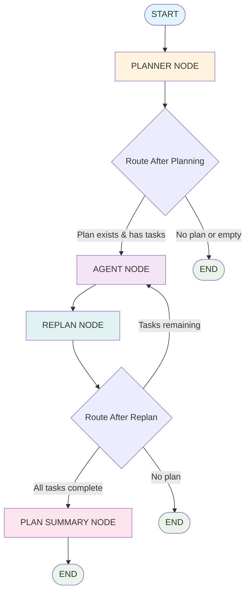
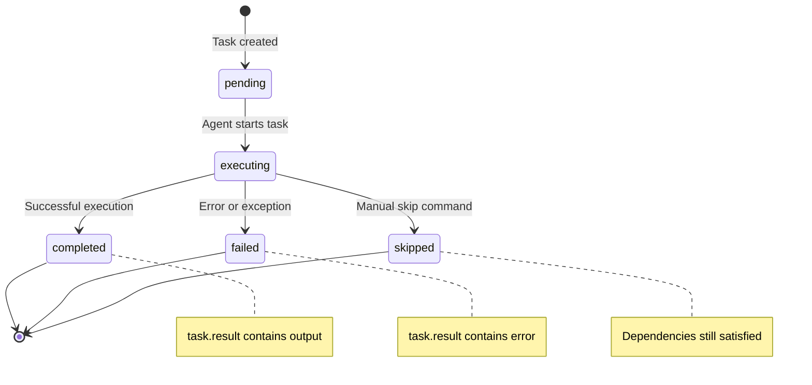
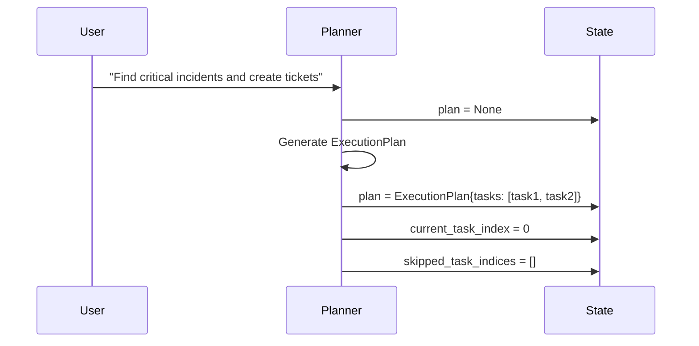
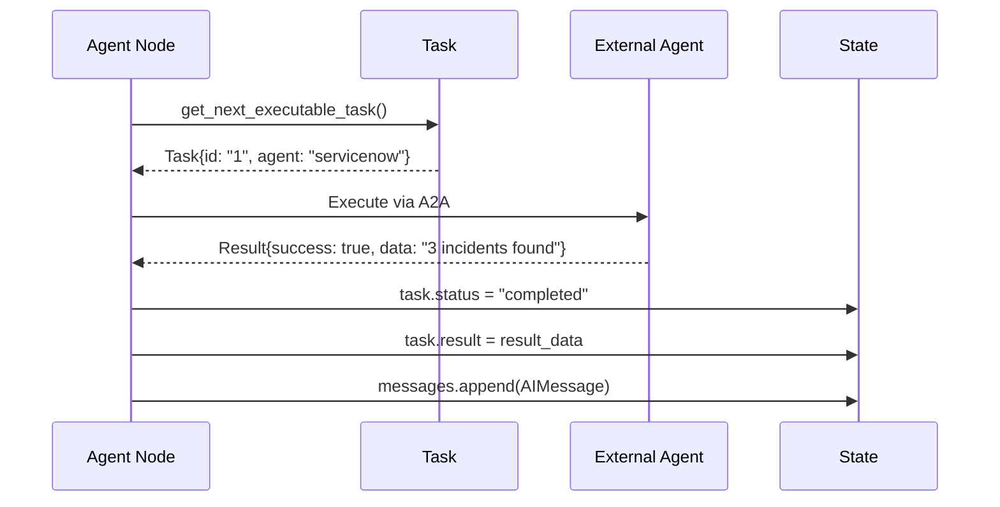
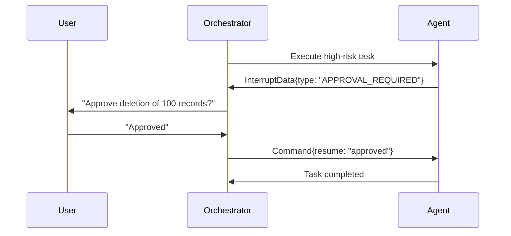

# 🎼 Orchestrator Plan-and-Execute Graph Architecture

> **A Complete Technical Deep-Dive into the LangGraph Plan-and-Execute Orchestration Engine**

---

## 📋 Table of Contents

- [Overview](#-overview)
- [High-Level Architecture](#-high-level-architecture)
- [Graph Flow Visualization](#-graph-flow-visualization)
- [Node Deep Dive](#-node-deep-dive)
- [State Management](#-state-management)
- [Execution Patterns](#-execution-patterns)
- [Advanced Features](#-advanced-features)
- [Troubleshooting Guide](#-troubleshooting-guide)

---

## 🎯 Overview

The **Plan-and-Execute Orchestrator** is the heart of our multi-agent system, implementing a pure LangGraph state machine that creates structured execution plans and coordinates their execution across specialized agents. This document provides a complete technical understanding of how the orchestrator works internally.

### Key Characteristics

- **🏗️ Pure Plan-and-Execute Pattern**: Follows the canonical plan-then-execute paradigm
- **🔄 Stateful Execution**: Maintains comprehensive state across the entire execution lifecycle
- **🎯 Agent Coordination**: Routes tasks to specialized agents (Salesforce, Jira, ServiceNow)
- **💡 Intelligent Planning**: Uses LLM-powered structured planning with dependency management
- **🛡️ Error Recovery**: Robust error handling with interruption and resume capabilities

---

## 🏛️ High-Level Architecture



---

## 🌊 Graph Flow Visualization

### Complete System Flow with State Transitions

```
                          ORCHESTRATOR PLAN-AND-EXECUTE FLOW
    
    ┌─────────────────────────────────────────────────────────────────────────┐
    │                                START                                    │
    │                         Initial State Setup                             │
    │   Input: User request, conversation context                             │
    │   State: messages=[], plan=None, original_request=""                    │
    └─────────────────────────┬───────────────────────────────────────────────┘
                              │
                              ▼
    ┌─────────────────────────────────────────────────────────────────────────┐
    │                         PLANNER NODE                                   │
    │                     Plan Generation Engine                              │
    │                                                                         │
    │  INTELLIGENCE LAYER:                                                    │
    │  ┌─────────────────────────────────────────────────────────────────┐   │
    │  │  • LLM Plan Extraction (trustcall)                             │   │
    │  │  • Structured Planning: ExecutionPlanStructured                │   │
    │  │  • Dependency Analysis                                          │   │
    │  │  • Task Agent Assignment                                        │   │
    │  └─────────────────────────────────────────────────────────────────┘   │
    │                                                                         │
    │  PROCESSING FLOW:                                                       │
    │  1. Detect existing plan → 2. Generate/Continue plan                    │
    │  3. Convert to ExecutionPlan → 4. Update state                         │
    │                                                                         │
    │  STATE CHANGES:                                                         │
    │  • plan = new ExecutionPlan{tasks[], description}                      │
    │  • current_task_index = 0                                              │
    │  • plan_history.append(plan)                                           │
    └─────────────────────────┬───────────────────────────────────────────────┘
                              │
                              ▼
                         _route_after_planning()
                     ┌─ Plan exists? ──No──► END
                     │
                    Yes
                     │
                     ▼
    ┌─────────────────────────────────────────────────────────────────────────┐
    │                          AGENT NODE                                    │
    │                    Task Execution Engine                                │
    │                                                                         │
    │  TASK SELECTION:                                                        │
    │  ┌─────────────────────────────────────────────────────────────────┐   │
    │  │  get_next_executable_task()                                     │   │
    │  │  ├─ Check dependencies satisfied                                │   │
    │  │  ├─ Skip completed/failed tasks                                 │   │
    │  │  └─ Return next runnable task                                   │   │
    │  └─────────────────────────────────────────────────────────────────┘   │
    │                                                                         │
    │  AGENT ROUTING:                                                         │
    │  ┌─────────────────────────────────────────────────────────────────┐   │
    │  │  task.agent == "salesforce"  → SalesforceAgentTool._arun()     │   │
    │  │  task.agent == "jira"        → JiraAgentTool._arun()           │   │
    │  │  task.agent == "servicenow"  → ServiceNowAgentTool._arun()     │   │
    │  │  task.agent == "orchestrator"→ _invoke_llm()                   │   │
    │  └─────────────────────────────────────────────────────────────────┘   │
    │                                                                         │
    │  A2A COMMUNICATION:                                                     │
    │  ┌─────────────────────────────────────────────────────────────────┐   │
    │  │  1. Build filtered state: _build_agent_state()                 │   │
    │  │  2. Send task context + conversation                           │   │
    │  │  3. Receive agent response                                     │   │
    │  │  4. Process result (Command/dict/string)                       │   │
    │  └─────────────────────────────────────────────────────────────────┘   │
    │                                                                         │
    │  STATE UPDATES:                                                         │
    │  • task.status = "completed"/"failed"                                  │
    │  • task.result = execution_result                                      │
    │  • messages.append(AIMessage(task_outcome))                            │
    └─────────────────────────┬───────────────────────────────────────────────┘
                              │
                              ▼
    ┌─────────────────────────────────────────────────────────────────────────┐
    │                         REPLAN NODE                                    │
    │                    Completion Checker                                   │
    │                                                                         │
    │  COMPLETION CHECK:                                                      │
    │  ┌─────────────────────────────────────────────────────────────────┐   │
    │  │  is_plan_complete()                                             │   │
    │  │  ├─ All tasks status in ["completed", "failed", "skipped"]     │   │
    │  │  ├─ No executable tasks remaining                               │   │
    │  │  └─ Return completion status                                    │   │
    │  └─────────────────────────────────────────────────────────────────┘   │
    │                                                                         │
    │  SIMPLE ROUTING LOGIC:                                                  │
    │  • Plan complete → "plan_summary"                                      │
    │  • Tasks remaining → "execute" (back to agent)                         │
    │  • No plan → "end"                                                     │
    └─────────────────────────┬───────────────────────────────────────────────┘
                              │
                              ▼
                         _route_after_replan()
         ┌─ All tasks complete? ──No──► execute (back to AGENT)
         │                                        │
        Yes                                       │
         │                                        │
         ▼                                        │
    ┌───────────────────────────────────────┐     │
    │         PLAN SUMMARY NODE             │     │
    │       Executive Summary Generator      │     │
    │                                       │     │
    │  SUMMARY GENERATION:                  │     │
    │  ┌─────────────────────────────────┐   │     │
    │  │  Multi-task: LLM summary        │   │     │
    │  │  Single-task: Extract result    │   │     │
    │  │  Format: Executive markdown     │   │     │
    │  └─────────────────────────────────┘   │     │
    │                                       │     │
    │  STATE FINALIZATION:                  │     │
    │  • plan.summary = generated_summary   │     │
    │                                       │     │
    │  OUTPUT:                              │     │
    │  • Structured business summary       │     │
    │  • Task outcomes & recommendations   │     │
    └─────────────────┬─────────────────────┘     │
                      │                           │
                      ▼                           │
                     END                          │
                      ▲                           │
                      │                           │
                      └───────────────────────────┘
```

---

## 🔍 Node Deep Dive

### 📝 PLANNER NODE - The Brain

> **Purpose**: Intelligent plan generation and continuation using structured LLM extraction

#### 🧠 Core Logic Flow

```
                       Plan Detection & Strategy Selection
    
    ┌─────────────────────────────────────────────────────────────────┐
    │                    Plan Detection Logic                         │
    │                                                                 │
    │  Current State Analysis:                                        │
    │  ┌─────────────────────────────────────────────────────────┐   │
    │  │  existing_plan = state.get("plan")                     │   │
    │  │  is_complete = is_plan_complete(existing_plan)         │   │
    │  │                                                         │   │
    │  │  Decision Tree:                                         │   │
    │  │  ├─ No existing plan → CREATE_NEW_PLAN                 │   │
    │  │  ├─ Plan exists & complete → CREATE_NEW_PLAN           │   │
    │  │  └─ Plan exists & incomplete → CONTINUE_PLAN           │   │
    │  └─────────────────────────────────────────────────────────┘   │
    └─────────────────────────────────────────────────────────────────┘
                                    │
                                    ▼
    ┌─────────────────────────────────────────────────────────────────┐
    │                 LLM-Powered Plan Generation                     │
    │                                                                 │
    │  Structured Extraction (trustcall):                            │
    │  ┌─────────────────────────────────────────────────────────┐   │
    │  │  _plan_extractor.ainvoke(                               │   │
    │  │    prompt=enhanced_system_message,                      │   │
    │  │    messages=conversation_history                        │   │
    │  │  )                                                      │   │
    │  │                                                         │   │
    │  │  Returns: ExecutionPlanStructured {                     │   │
    │  │    description: str                                     │   │
    │  │    tasks: List[ExecutionTaskStructured]                │   │
    │  │    success_criteria: str                               │   │
    │  │    estimated_total_time: str                           │   │
    │  │  }                                                      │   │
    │  └─────────────────────────────────────────────────────────┘   │
    └─────────────────────────────────────────────────────────────────┘
                                    │
                                    ▼
    ┌─────────────────────────────────────────────────────────────────┐
    │                    Plan Conversion & Validation                 │
    │                                                                 │
    │  Format Conversion:                                             │
    │  ┌─────────────────────────────────────────────────────────┐   │
    │  │  ExecutionPlanStructured → ExecutionPlan                │   │
    │  │                                                         │   │
    │  │  For each task:                                         │   │
    │  │  ├─ Generate unique task_id                             │   │
    │  │  ├─ Validate agent assignment                           │   │
    │  │  ├─ Parse dependencies                                  │   │
    │  │  ├─ Set initial status = "pending"                     │   │
    │  │  └─ Add execution metadata                              │   │
    │  └─────────────────────────────────────────────────────────┘   │
    │                                                                 │
    │  Validation Checks:                                             │
    │  • Agent assignments valid (salesforce/jira/servicenow/orch)   │
    │  • Dependency references exist                                 │
    │  • No circular dependencies                                    │
    │  • Task descriptions meet length requirements                  │
    └─────────────────────────────────────────────────────────────────┘
```

#### 📊 State Transformations

| **State Variable** | **Before** | **After** | **Purpose** |
|-------------------|------------|-----------|-------------|
| `plan` | `None` or completed plan | `ExecutionPlan` object | Stores current execution plan |
| `current_task_index` | Any value | `0` | Resets execution position |
| `skipped_task_indices` | Any value | `[]` | Clears previous skip state |
| `plan_history` | Previous history | `+= [new_plan]` | Maintains version history |
| `original_request` | Previous or empty | User's request | Preserves intent |

#### 🛠️ Tools & Dependencies

- **🤖 _plan_extractor**: Trustcall-powered structured LLM extraction
- **📝 Background Summarization**: Triggered based on message count
- **✂️ Message Trimming**: Maintains context window under limits
- **🔄 State Validation**: Ensures plan integrity

#### ⚠️ Error Handling

```python
try:
    # Plan generation logic
    structured_plan = await _plan_extractor.ainvoke(...)
except Exception as e:
    # Create recovery interrupt
    interrupt_data = InterruptData(
        type="ERROR_RECOVERY",
        context={"error": str(e), "node": "planner"},
        metadata={"recoverable": True}
    )
    state["interrupted"] = True
    state["interrupt_data"] = interrupt_data
```

---

### 🤖 AGENT NODE - The Executor

> **Purpose**: Execute individual tasks by routing to specialized agents and processing results

#### 🎯 Task Selection Algorithm

```
                    Smart Task Selection: get_next_executable_task()
    
    ┌─────────────────────────────────────────────────────────────────┐
    │                    Task Filtering Pipeline                      │
    │                                                                 │
    │  1. BASIC FILTERING:                                            │
    │  ┌─────────────────────────────────────────────────────────┐   │
    │  │  for task in plan.tasks:                               │   │
    │  │    if task.status in ["completed", "failed"]:         │   │
    │  │      continue  # Skip finished tasks                  │   │
    │  │    if task.task_id in skipped_task_indices:           │   │
    │  │      continue  # Skip manually skipped tasks          │   │
    │  └─────────────────────────────────────────────────────────┘   │
    │                                                                 │
    │  2. DEPENDENCY VALIDATION:                                      │
    │  ┌─────────────────────────────────────────────────────────┐   │
    │  │  dependencies_satisfied = True                          │   │
    │  │  for dep_task_id in task.depends_on:                   │   │
    │  │    dep_task = find_task_by_id(dep_task_id)             │   │
    │  │    if dep_task.status not in ["completed", "skipped"]: │   │
    │  │      dependencies_satisfied = False                    │   │
    │  │      break                                              │   │
    │  │                                                         │   │
    │  │  if not dependencies_satisfied:                        │   │
    │  │    continue  # Skip if dependencies not met            │   │
    │  └─────────────────────────────────────────────────────────┘   │
    │                                                                 │
    │  3. SELECTION:                                                  │
    │  • Return first task that passes all filters                   │
    │  • Maintains execution order while respecting dependencies     │
    └─────────────────────────────────────────────────────────────────┘
```

#### 🌐 Agent Routing Architecture

```
                         Intelligent Agent Routing System
    
    ┌─────────────────────────────────────────────────────────────────┐
    │                        Agent Decision Matrix                    │
    │                                                                 │
    │  task.agent value    │ Routing Target    │ Communication        │
    │  ═══════════════════════════════════════════════════════════════ │
    │  "salesforce"        │ SalesforceAgent   │ A2A Protocol         │
    │  "jira"              │ JiraAgent         │ A2A Protocol         │
    │  "servicenow"        │ ServiceNowAgent   │ A2A Protocol         │
    │  "orchestrator"      │ Internal LLM      │ Direct invocation    │
    └─────────────────────────────────────────────────────────────────┘
                                    │
                                    ▼
    ┌─────────────────────────────────────────────────────────────────┐
    │                    A2A Communication Flow                       │
    │                                                                 │
    │  1. STATE PREPARATION:                                          │
    │  ┌─────────────────────────────────────────────────────────┐   │
    │  │  agent_state = _build_agent_state(                     │   │
    │  │    full_state=state,                                   │   │
    │  │    task_content=task.description                       │   │
    │  │  )                                                     │   │
    │  │                                                         │   │
    │  │  Includes:                                              │   │
    │  │  • messages: Filtered conversation                     │   │
    │  │  • task_context: Current task details                  │   │
    │  │  • summary: Conversation summary                       │   │
    │  │  • agent_specific_context: Customized data             │   │
    │  └─────────────────────────────────────────────────────────┘   │
    │                                                                 │
    │  2. AGENT INVOCATION:                                           │
    │  ┌─────────────────────────────────────────────────────────┐   │
    │  │  result = await agent_tool._arun(                      │   │
    │  │    **agent_state                                       │   │
    │  │  )                                                     │   │
    │  │                                                         │   │
    │  │  Handles:                                               │   │
    │  │  • Network timeouts and retries                        │   │
    │  │  • Circuit breaker protection                          │   │
    │  │  • Result format standardization                       │   │
    │  └─────────────────────────────────────────────────────────┘   │
    │                                                                 │
    │  3. RESULT PROCESSING:                                          │
    │  ┌─────────────────────────────────────────────────────────┐   │
    │  │  if isinstance(result, Command):                       │   │
    │  │    # Handle Command objects (pause, resume, etc.)      │   │
    │  │  elif isinstance(result, dict):                        │   │
    │  │    # Extract result from standardized format           │   │
    │  │  else:                                                  │   │
    │  │    # Handle string responses                            │   │
    │  └─────────────────────────────────────────────────────────┘   │
    └─────────────────────────────────────────────────────────────────┘
```

#### 📊 Task Status Lifecycle



#### 💡 Task Context Injection

The agent node builds rich context for each agent to enhance task execution:

```python
def _build_agent_state(state: PlanExecuteState, task_content: str = "") -> Dict[str, Any]:
    """Build contextual state for agent execution"""
    return {
        "messages": filtered_conversation_history,
        "task_context": {
            "current_task": task.description,
            "task_id": task.task_id,
            "original_request": state.get("original_request", ""),
            "plan_position": f"Step {task_index + 1} of {total_tasks}",
            "dependencies_completed": [dep_results...]
        },
        "summary": state.get("summary", ""),
        "agent_context": agent_specific_data
    }
```

---

### 🔄 REPLAN NODE - The Controller

> **Purpose**: Simple but critical flow control - determines when plans are complete

#### ✅ Completion Logic

```
                       Plan Completion Analysis: is_plan_complete()
    
    ┌─────────────────────────────────────────────────────────────────┐
    │                    Completion Criteria Check                    │
    │                                                                 │
    │  STATUS ANALYSIS:                                               │
    │  ┌─────────────────────────────────────────────────────────┐   │
    │  │  COMPLETED_STATUSES = ["completed", "failed", "skipped"]│   │
    │  │                                                         │   │
    │  │  for task in plan.tasks:                               │   │
    │  │    if task.status not in COMPLETED_STATUSES:          │   │
    │  │      return False  # Found incomplete task             │   │
    │  │                                                         │   │
    │  │  return True  # All tasks in final state               │   │
    │  └─────────────────────────────────────────────────────────┘   │
    │                                                                 │
    │  ROUTING DECISIONS:                                             │
    │  ┌─────────────────────────────────────────────────────────┐   │
    │  │  All Complete → "plan_summary"                          │   │
    │  │  Tasks Remaining → "execute" (back to agent)           │   │
    │  │  No Plan → "end"                                       │   │
    │  └─────────────────────────────────────────────────────────┘   │
    └─────────────────────────────────────────────────────────────────┘
```

**Design Philosophy**: The replan node is intentionally simple. Complex replanning logic has been removed in favor of:
- ✅ **Predictable flow control**
- ✅ **Clear completion criteria**  
- ✅ **Minimal state changes**
- ✅ **Reliable routing**

---

### 📋 PLAN SUMMARY NODE - The Synthesizer

> **Purpose**: Generate executive summaries and final reports for completed plans

#### 📝 Summary Generation Strategy

```
                        Intelligent Summary Generation
    
    ┌─────────────────────────────────────────────────────────────────┐
    │                      Summary Type Detection                     │
    │                                                                 │
    │  Plan Analysis:                                                 │
    │  ┌─────────────────────────────────────────────────────────┐   │
    │  │  task_count = len(plan.tasks)                           │   │
    │  │                                                         │   │
    │  │  if task_count == 1:                                    │   │
    │  │    # Single Task: Extract direct result                │   │
    │  │    summary = task.result                               │   │
    │  │                                                         │   │
    │  │  else:                                                  │   │
    │  │    # Multi Task: Generate LLM summary                  │   │
    │  │    summary = _generate_plan_completion_summary()       │   │
    │  └─────────────────────────────────────────────────────────┘   │
    └─────────────────────────────────────────────────────────────────┘
                                    │
                                    ▼
    ┌─────────────────────────────────────────────────────────────────┐
    │                   Multi-Task Summary Generation                 │
    │                                                                 │
    │  LLM-Powered Executive Summary:                                 │
    │  ┌─────────────────────────────────────────────────────────┐   │
    │  │  prompt = f"""                                          │   │
    │  │  Generate an executive summary for this plan:           │   │
    │  │                                                         │   │
    │  │  Original Request: {original_request}                   │   │
    │  │  Plan Description: {plan.description}                   │   │
    │  │                                                         │   │
    │  │  Task Results:                                          │   │
    │  │  {formatted_task_results}                               │   │
    │  │                                                         │   │
    │  │  Create a business-focused summary with:                │   │
    │  │  - Key accomplishments                                  │   │
    │  │  - Important findings                                   │   │
    │  │  - Next steps (if applicable)                          │   │
    │  │  """                                                    │   │
    │  └─────────────────────────────────────────────────────────┘   │
    │                                                                 │
    │  Output Format:                                                 │
    │  • Markdown formatted                                           │
    │  • Executive style (business-focused)                           │
    │  • Actionable insights when possible                            │
    │  • Cross-system coordination highlights                         │
    └─────────────────────────────────────────────────────────────────┘
```

#### 📊 Summary Examples

**Single Task Summary:**
```
Direct task result (e.g., "Found 3 critical incidents: INC001, INC002, INC003")
```

**Multi-Task Executive Summary:**
```markdown
# Plan Execution Summary

## Key Accomplishments
- Successfully identified 3 critical incidents in ServiceNow
- Created corresponding Jira tickets for tracking (INFRA-456, INFRA-457, INFRA-458)
- Linked incidents to tickets for cross-system visibility

## Important Findings
- All critical incidents are related to email server infrastructure
- Average resolution time is exceeding SLA by 2 hours
- Two incidents assigned to Infrastructure team, one unassigned

## Recommended Next Steps
1. Escalate unassigned incident to Infrastructure team lead
2. Review email server monitoring and alerting
3. Consider infrastructure upgrade to prevent recurring issues

*Plan completed in 12.3 seconds across ServiceNow and Jira systems.*
```

---

## 📊 State Management

### 🏗️ State Schema Architecture

The orchestrator uses a layered state approach with clear separation between public and private data:

```python
# Complete State Schema
class PlanExecuteState(TypedDict):
    # CONVERSATION LAYER
    messages: Annotated[List[BaseMessage], add_messages]
    original_request: str
    summary: str
    
    # PLAN EXECUTION LAYER  
    plan: Optional[ExecutionPlan]
    current_task_index: int
    skipped_task_indices: List[int]
    plan_history: List[ExecutionPlan]
    
    # EXECUTION CONTROL
    interrupted: bool
    interrupt_data: Optional[InterruptData]
    approval_pending: bool
    
    # METRICS & MONITORING
    tool_calls_since_memory: int
    agent_calls_since_memory: int
    conversation_start_time: float
    
    # CONTEXT SHARING
    task_context: TaskContext
    agent_context: Dict[str, Any]
    execution_context: Dict[str, Any]

# Agent-Visible State (Filtered)
class AgentVisibleState(TypedDict):
    messages: Annotated[List[BaseMessage], add_messages]
    summary: str
    task_context: TaskContext
    tool_calls_since_memory: int
    agent_calls_since_memory: int
```

### 🔄 State Flow Patterns

#### Plan Creation Flow


#### Task Execution Flow


### 💾 State Persistence

The system uses LangGraph's built-in checkpointing for state persistence:

- **🔄 Automatic Checkpointing**: State saved after each node execution
- **📱 Thread Isolation**: Each conversation maintains separate state
- **🔁 Resume Capability**: Can resume from any checkpoint after interruption
- **📊 State Versioning**: Plan history maintained for debugging

---

## ⚡ Execution Patterns

### 🎯 Linear Execution

Most common pattern for sequential tasks:

```
Task 1 (Salesforce) → Task 2 (Jira) → Task 3 (ServiceNow) → Summary
     DONE                  DONE            DONE               REPORT
```

### 🌿 Dependency-Based Execution

Tasks with dependencies execute in proper order:

```
Task 1 (Get Account)     → Task 3 (Create Opportunity)
     DONE                      ↗        DONE
Task 2 (Get Contact)    ────┘
     DONE                
```

### ⏭️ Skip-Based Navigation

Users can skip tasks during execution:

```
Task 1 DONE → Task 2 SKIP → Task 3 DONE → Task 4 DONE → Summary REPORT
                ↑
         User: "skip step 2"
```

### 🛑 Error Recovery

Failed tasks don't break the entire plan:

```
Task 1 DONE → Task 2 FAIL → Task 3 DONE → Summary REPORT
                ↑                        ↑
        (Network error)          (Includes failure info)
```

---

## 🚀 Advanced Features

### 🎯 Task Context Injection

Each agent receives rich context about their role in the larger plan:

```json
{
  "task_context": {
    "current_task": "Create Jira tickets for critical incidents",
    "task_id": "task_2", 
    "original_request": "Handle critical incidents end-to-end",
    "plan_position": "Step 2 of 3",
    "dependencies_completed": [
      "Found 3 critical incidents: INC001, INC002, INC003"
    ]
  }
}
```

This context injection enables agents to:
- ✅ **Understand their role** in the larger workflow
- ✅ **Reference previous results** from dependencies  
- ✅ **Maintain consistency** across the plan
- ✅ **Provide better responses** with full context

### 🔄 Plan Modification System

Users can modify plans during execution with three operations:

#### Skip to Step
```python
# User: "skip to step 3"
PlanModification(
    modification_type="skip_to_step",
    target_step_number=3,
    reasoning="User wants to jump to final step"
)
```

#### Skip Multiple Steps  
```python
# User: "skip steps 2 and 4"
PlanModification(
    modification_type="skip_steps", 
    steps_to_skip=[2, 4],
    reasoning="User wants to skip specific steps"
)
```

#### Conversation Only
```python
# User: "just asking a question"
PlanModification(
    modification_type="conversation_only",
    reasoning="User clarification, no plan changes needed"
)
```

### 🎪 Human-in-the-Loop Integration

The orchestrator supports interrupting plans for human approval:



### 📊 Comprehensive Monitoring

The system provides detailed monitoring at every level:

- **📈 Task-Level Metrics**: Execution time, success rate, error types
- **🔄 Plan-Level Analytics**: Total execution time, task dependencies, bottlenecks  
- **🌐 Agent Performance**: Response times, availability, error rates
- **💰 Cost Tracking**: Token usage per task, LLM call efficiency

---

## 🔧 Troubleshooting Guide

### 🐛 Common Issues & Solutions

#### "Plan generation failed"
```bash
# Check: LLM connectivity and token limits
# Fix: Verify Azure OpenAI credentials and adjust max_tokens
```

#### "Agent not responding"
```bash 
# Check: Agent health and A2A connectivity
# Fix: Restart agent, check network connectivity
curl http://localhost:8001/a2a/agent-card
```

#### "Task stuck in executing"
```bash
# Check: Task dependencies and agent logs
# Fix: Skip task or restart with plan modification
tail -f logs/orchestrator.log | grep task_execution
```

#### "State serialization error"
```bash
# Check: Message serialization in state
# Fix: Ensure proper message serialization
# Pattern: serialize_messages() before storage
```

### 🔍 Debug Patterns

#### View Current Plan State
```python
# In agent code or debug console
current_plan = state.get("plan")
if current_plan:
    for i, task in enumerate(current_plan.tasks):
        print(f"Task {i+1}: {task.status} - {task.description}")
```

#### Monitor Task Execution
```bash
# Follow orchestrator logs for task flow
tail -f logs/orchestrator.log | grep -E "(task_started|task_completed|task_failed)"
```

#### Check Agent Communication
```bash
# Monitor A2A protocol logs
tail -f logs/a2a_protocol.log | grep -E "(request|response|error)"
```

---

## 🎯 Best Practices

### 📋 Plan Design
- ✅ **Clear task descriptions** (15-200 characters)
- ✅ **Proper agent assignment** (salesforce/jira/servicenow/orchestrator)
- ✅ **Logical dependencies** (avoid circular references)
- ✅ **Reasonable task scope** (atomic, focused operations)

### 🚀 Performance
- ✅ **Message trimming** at 20+ messages
- ✅ **Background summarization** for long conversations  
- ✅ **Efficient state serialization** with proper message handling
- ✅ **Circuit breaker** utilization for resilient A2A calls

### 🛡️ Error Handling  
- ✅ **Graceful task failures** (don't break entire plan)
- ✅ **Comprehensive logging** for debugging
- ✅ **User-friendly error messages** in summaries
- ✅ **Recovery mechanisms** with interrupts and resumes

---

*This documentation represents the complete technical architecture of the Plan-and-Execute Orchestrator. For implementation details, see the source code in `src/orchestrator/plan_execute_graph.py`.*

**🏗️ Generated by Claude Code** | **📅 Last Updated**: 2025-07-20