# A2A Protocol

JSON-RPC 2.0 based communication protocol for multi-agent systems.

## Overview

Enterprise-grade communication framework enabling reliable inter-agent communication in distributed systems. Built on JSON-RPC 2.0 over HTTP with circuit breakers, connection pooling, and automatic retry logic.

## Architecture

### Core Components

```mermaid
flowchart TB
    %% Define styles for protocol layers
    classDef stackClass fill:#1565c0,stroke:#0d47a1,stroke-width:3px,color:#ffffff,font-weight:bold
    classDef appClass fill:#2e7d32,stroke:#1b5e20,stroke-width:2px,color:#ffffff
    classDef protocolClass fill:#6a1b9a,stroke:#4a0080,stroke-width:2px,color:#ffffff
    classDef resilienceClass fill:#d84315,stroke:#bf360c,stroke-width:2px,color:#ffffff
    classDef connClass fill:#00838f,stroke:#006064,stroke-width:2px,color:#ffffff
    classDef transportClass fill:#455a64,stroke:#263238,stroke-width:2px,color:#ffffff
    
    %% Protocol Stack
    STACK[🌐 A2A PROTOCOL STACK]:::stackClass
    
    %% Layer components
    STACK --> APP[📦 Application Layer<br/>━━━━━━━━━━━━━━━<br/>AgentCard • Task<br/>Artifact • Message]:::appClass
    STACK --> PROTO[🔧 Protocol Layer<br/>━━━━━━━━━━━━━━<br/>JSON-RPC 2.0<br/>Request/Response]:::protocolClass
    STACK --> RESIL[🛡️ Resilience Layer<br/>━━━━━━━━━━━━━━━━<br/>Circuit Breaker<br/>Retry Logic]:::resilienceClass
    STACK --> CONN[🔌 Connection Layer<br/>━━━━━━━━━━━━━━━━<br/>Connection Pool<br/>Session Management]:::connClass
    STACK --> TRANS[📡 Transport Layer<br/>━━━━━━━━━━━━━━━<br/>HTTP/HTTPS<br/>aiohttp]:::transportClass
    
    %% Show data flow
    APP -.->|"Data Models"| PROTO
    PROTO -.->|"Requests"| RESIL
    RESIL -.->|"Protected Calls"| CONN
    CONN -.->|"Network I/O"| TRANS
```



### Key Design Principles

- **Loose Coupling**: Agents discover capabilities dynamically
- **Fault Tolerance**: Circuit breakers and retry logic handle failures
- **Performance**: Connection pooling reduces latency
- **Observability**: Structured logging enables debugging
- **Standards Compliance**: JSON-RPC 2.0 ensures interoperability

## Quick Start

### Basic Agent Implementation

```python
# minimal_agent.py
import asyncio
from typing import Dict, Any
from src.a2a.protocol import A2AServer, AgentCard

class MinimalAgent:
    async def process_task(self, params: Dict[str, Any]) -> Dict[str, Any]:
        task = params.get("task", {})
        result = f"Processed: {task.get('instruction', '')}"
        
        return {
            "status": "completed",
            "artifacts": [{
                "id": f"result-{task.get('id')}",
                "task_id": task.get("id"),
                "content": result,
                "content_type": "text/plain"
            }]
        }
    
    async def get_agent_card(self, params: Dict[str, Any]) -> Dict[str, Any]:
        return {
            "name": "minimal-agent",
            "version": "1.0.0",
            "description": "A minimal A2A agent",
            "capabilities": ["basic"],
            "endpoints": {"process_task": "/a2a", "agent_card": "/a2a/agent-card"},
            "communication_modes": ["synchronous"]
        }

# Start server
agent_card = AgentCard(
    name="minimal-agent", version="1.0.0", description="Minimal agent",
    capabilities=["basic"], endpoints={"process_task": "/a2a"},
    communication_modes=["synchronous"]
)

handler = MinimalAgent()
server = A2AServer(agent_card, "0.0.0.0", 8003)
server.register_handler("process_task", handler.process_task)
server.register_handler("get_agent_card", handler.get_agent_card)

asyncio.run(server.start())
```

### Testing

```bash
# Test agent card
curl http://localhost:8003/a2a/agent-card

# Test task processing
curl -X POST http://localhost:8003/a2a \
  -H "Content-Type: application/json" \
  -d '{"jsonrpc":"2.0","method":"process_task","params":{"task":{"id":"test-1","instruction":"Hello Agent"}},"id":"1"}'
```

## Data Models

### AgentCard
```python
@dataclass
class AgentCard:
    name: str                           # Unique agent identifier
    version: str                        # Semantic version (e.g., "1.0.0")
    description: str                    # Human-readable purpose
    capabilities: List[str]             # e.g., ["salesforce_operations", "crm_management"]
    endpoints: Dict[str, str]           # API endpoints mapping
    communication_modes: List[str]      # e.g., ["synchronous", "streaming"]
    metadata: Optional[Dict[str, Any]]  # Additional configuration
```

### A2ATask
```python
@dataclass
class A2ATask:
    id: str                             # Unique task identifier (UUID)
    instruction: str                    # Natural language task description
    context: Dict[str, Any]             # Execution context and parameters
    state_snapshot: Optional[Dict]      # Conversation/memory state
    artifacts: List[A2AArtifact]        # Input artifacts from previous tasks
```

### A2AArtifact
```python
@dataclass
class A2AArtifact:
    id: str                             # Unique artifact identifier
    task_id: str                        # Associated task ID
    content: str                        # Artifact content (text, JSON, etc.)
    content_type: str                   # MIME type (e.g., "text/plain")
```

### A2AMessage
```python
@dataclass
class A2AMessage:
    role: str                           # "user", "assistant", "system"
    content: str                        # Message content
    metadata: Optional[Dict[str, Any]]  # Additional context
```

## Message Examples

### Basic Task Request

```json
{
  "jsonrpc": "2.0",
  "method": "process_task",
  "params": {
    "task": {
      "id": "550e8400-e29b-41d4-a716-446655440000",
      "instruction": "Get all contacts for Acme Corp",
      "context": {
        "user_id": "user123",
        "session_id": "session456",
        "priority": "normal"
      },
      "state_snapshot": {
        "memory": {
          "accounts": ["Acme Corp"],
          "last_action": "viewed_accounts"
        }
      },
      "artifacts": []
    }
  },
  "id": "request-001"
}
```

### Task with Artifacts

```json
{
  "jsonrpc": "2.0",
  "method": "process_task",
  "params": {
    "task": {
      "id": "660e8400-e29b-41d4-a716-446655440001",
      "instruction": "Create a summary report for these contacts",
      "context": {
        "user_id": "user123",
        "format": "markdown"           // Specify output format
      },
      "artifacts": [
        {
          "id": "artifact-001",
          "task_id": "550e8400-e29b-41d4-a716-446655440000",
          "content": "[{\"name\": \"John Doe\", \"email\": \"john@acme.com\"}]",
          "content_type": "application/json",
          "metadata": {
            "source": "salesforce",
            "record_count": 1
          }
        }
      ]
    }
  },
  "id": "request-002"
}
```

### Successful Response

```json
{
  "jsonrpc": "2.0",
  "result": {
    "status": "completed",
    "artifacts": [
      {
        "id": "result-660e8400-e29b-41d4-a716-446655440001",
        "task_id": "660e8400-e29b-41d4-a716-446655440001",
        "content": "# Contact Summary\n\n- John Doe (john@acme.com)",
        "content_type": "text/markdown",
        "metadata": {
          "generated_at": "2024-01-15T10:30:00Z",
          "word_count": 8
        }
      }
    ],
    "messages": [
      {
        "role": "assistant",
        "content": "Successfully generated summary for 1 contact"
      }
    ]
  },
  "id": "request-002"
}
```

### Error Response

```json
{
  "jsonrpc": "2.0",
  "error": {
    "code": -32603,                    // Standard JSON-RPC error code
    "message": "Internal error",       // Human-readable message
    "data": {                          // Additional error details
      "exception": "ConnectionError",
      "details": "Unable to connect to Salesforce API",
      "task_id": "660e8400-e29b-41d4-a716-446655440001",
      "timestamp": "2024-01-15T10:30:00Z"
    }
  },
  "id": "request-002"
}
```

**Error Codes:**
- `-32700`: Parse error (invalid JSON)
- `-32600`: Invalid request
- `-32601`: Method not found
- `-32602`: Invalid params
- `-32603`: Internal error

### Agent Card Response

```json
{
  "jsonrpc": "2.0",
  "result": {
    "name": "salesforce-agent",
    "version": "1.2.0",
    "description": "Handles all Salesforce CRM operations",
    "capabilities": [
      "salesforce_operations",
      "lead_management",
      "account_management",
      "opportunity_tracking"
    ],
    "endpoints": {
      "process_task": "/a2a",
      "agent_card": "/a2a/agent-card",
      "health": "/health"              // Optional health check
    },
    "communication_modes": ["synchronous"],
    "metadata": {
      "max_batch_size": 100,           // Agent-specific limits
      "supported_objects": ["Lead", "Account", "Contact", "Opportunity"],
      "rate_limit": "1000/hour"
    }
  },
  "id": "card-request-001"
}
```

## Client Implementation

### A2AClient Features

1. **Connection Pooling**
   ```python
   # Pool configuration prevents connection exhaustion
   connector = aiohttp.TCPConnector(
       limit=50,                    # Total pool size
       limit_per_host=20,          # Per-host connections
       ttl_dns_cache=300,          # DNS cache TTL
       keepalive_timeout=30,       # Keep-alive duration
       enable_cleanup_closed=True   # Automatic cleanup
   )
   ```

2. **Circuit Breaker Integration**
   ```python
   # Prevents cascading failures
   circuit_breaker = CircuitBreaker(
       failure_threshold=5,         # Failures before opening
       timeout=60,                 # Open circuit duration
       half_open_max_calls=3       # Test calls when recovering
   )
   ```

3. **Retry Logic**
   ```python
   # Exponential backoff with jitter
   retry_config = RetryConfig(
       max_attempts=3,
       base_delay=1.0,
       max_delay=30.0,
       exponential_base=2
   )
   ```

### Making A2A Calls

```python
# Initialize client with timeout
async with A2AClient(timeout=30) as client:
    # Create task
    task = A2ATask(
        id=str(uuid.uuid4()),
        instruction="Get all contacts for Acme Corp account",
        context={"user_id": "user123"},
        state_snapshot={"memory": current_memory}
    )
    
    # Call agent
    result = await client.call_agent(
        agent_url="http://localhost:8001/a2a",
        task=task
    )
    
    # Process artifacts
    for artifact in result.artifacts:
        print(f"Result: {artifact.content}")
```

## Server Implementation

### A2AServer Architecture

The server provides a framework for agents to handle incoming A2A requests:

1. **Request Routing**: Maps JSON-RPC methods to handler functions
2. **Input Validation**: Ensures requests conform to protocol specification
3. **Error Handling**: Standardized error responses for debugging
4. **Async Processing**: Non-blocking request handling for scalability

### Creating an A2A Agent

```python
class MyAgentHandler:
    async def process_task(self, params: Dict[str, Any]) -> Dict[str, Any]:
        task_data = params.get("task", {})
        instruction = task_data.get("instruction", "")
        
        # Process the task
        result = await self.execute_task(instruction)
        
        # Return artifacts
        return {
            "artifacts": [{
                "id": f"result-{task_data.get('id')}",
                "task_id": task_data.get("id"),
                "content": result,
                "content_type": "text/plain"
            }],
            "status": "completed"
        }
    
    async def get_agent_card(self, params: Dict[str, Any]) -> Dict[str, Any]:
        return {
            "name": "my-agent",
            "version": "1.0.0",
            "description": "My specialized agent",
            "capabilities": ["my_capability"],
            "endpoints": {
                "process_task": "/a2a",
                "agent_card": "/a2a/agent-card"
            },
            "communication_modes": ["synchronous"]
        }

# Start server
server = A2AServer(agent_card, "0.0.0.0", 8001)
server.register_handler("process_task", handler.process_task)
server.register_handler("get_agent_card", handler.get_agent_card)
await server.start()
```

## Common Implementation Patterns

### Use UUIDs for Task IDs
```python
import uuid
task = A2ATask(
    id=str(uuid.uuid4()),  # Always use UUIDs
    instruction="Do something"
)
```

### Handle Timeouts Appropriately
```python
client = A2AClient(timeout=30)  # Normal operations
health_client = A2AClient(timeout=10)  # Health checks
```

### Respect Circuit Breakers
```python
try:
    result = await client.call_agent(url, task)
except CircuitBreakerOpen:
    logger.warning(f"Agent {url} is unavailable")
    return fallback_response()
```

### Preserve State Between Agents
```python
task = A2ATask(
    id=str(uuid.uuid4()),
    instruction="Continue conversation",
    state_snapshot={
        "conversation_history": previous_messages,
        "user_context": user_data,
        "memory": extracted_facts
    }
)
```

### Provide Structured Error Messages
```python
except ValidationError as e:
    return {
        "jsonrpc": "2.0",
        "error": {
            "code": -32602,
            "message": "Invalid parameters",
            "data": {
                "field": e.field_name,
                "reason": str(e)
            }
        },
        "id": request_id
    }
```

### Use Async Operations
```python
async def process_task(self, params):
    async with aiohttp.ClientSession() as session:
        async with session.get("http://api.com") as response:
            result = await response.text()
    return {"result": result}
```

### Always Validate Input
```python
async def process_task(self, params):
    if not params or "task" not in params:
        raise ValidationError("Missing 'task' parameter")
    
    task = params["task"]
    instruction = task.get("instruction", "")
    
    if not instruction:
        raise ValidationError("Task instruction cannot be empty")
```

### Clean Up Resources
```python
async def call_many_agents():
    async with A2AClient() as client:  # Auto cleanup
        for i in range(1000):
            await client.call_agent(...)
```

## Protocol Flow

### Task Execution Flow

```mermaid
sequenceDiagram
    %% Define participants with styling
    participant Orch as 🧠 Orchestrator
    participant A2A as 🌐 A2A Protocol
    participant Agent as 🤖 Specialized Agent
    
    %% Task creation phase
    rect rgba(33, 150, 243, 0.1)
        note over Orch: Task Creation
        Orch->>Orch: CREATE TASK<br/>UUID + Context
    end
    
    %% Request phase
    rect rgba(156, 39, 176, 0.1)
        note over Orch,A2A: Request Phase
        Orch->>A2A: POST /a2a<br/>{method: "process_task",<br/>params: {task: {...}}}
        A2A->>A2A: Validate JSON-RPC
        A2A->>Agent: Forward Request
    end
    
    %% Processing phase
    rect rgba(76, 175, 80, 0.1)
        note over Agent: Processing Phase
        Agent->>Agent: Validate Task
        Agent->>Agent: Execute Logic
        Agent->>Agent: Generate Artifacts
    end
    
    %% Response phase
    rect rgba(255, 152, 0, 0.1)
        note over A2A,Orch: Response Phase
        Agent-->>A2A: Return Result<br/>{artifacts: [...]}
        A2A-->>Orch: JSON-RPC Response<br/>{result: {artifacts: [...]}}
    end
```



### Service Discovery Flow

```mermaid
sequenceDiagram
    %% Define participants
    participant Orch as 🧠 Orchestrator
    participant A2A as 🌐 A2A Protocol
    participant Reg as 📋 Agent Registry
    participant Agent as 🤖 Agent
    
    %% Discovery phase
    rect rgba(33, 150, 243, 0.1)
        note over Orch,Agent: Agent Discovery
        Orch->>Agent: GET /a2a/agent-card
        Agent-->>Orch: Return AgentCard<br/>{name, version,<br/>capabilities, endpoints}
    end
    
    %% Registration phase
    rect rgba(156, 39, 176, 0.1)
        note over Orch,Reg: Registration
        Orch->>Reg: Register Agent<br/>{url, capabilities}
        Reg->>Reg: Store in Registry
        Reg-->>Orch: Confirm Registration
    end
    
    %% Health check phase
    rect rgba(76, 175, 80, 0.1)
        note over Reg,Agent: Health Monitoring
        loop Every 30s
            Reg->>Agent: GET /health
            Agent-->>Reg: {status: "healthy"}
            Reg->>Reg: Update Status
        end
    end
```



## Connection Pool Management

Connection pool uses composite keys to prevent timeout mismatches:
```python
pool_key = f"{base_url}_timeout_{timeout}"
```

Features:
- **Connection Limits**: Prevents resource exhaustion
- **DNS Caching**: Reduces lookup overhead  
- **Keep-Alive**: Maintains persistent connections
- **Automatic Cleanup**: Removes stale connections

## Error Handling

```python
# JSON-RPC 2.0 error format
{
    "jsonrpc": "2.0",
    "error": {
        "code": -32603,
        "message": "Internal error",
        "data": {
            "exception": "ConnectionTimeout",
            "details": "Request timed out after 30s"
        }
    },
    "id": "request-123"
}
```

## Resilience Patterns

### Circuit Breaker States


### Retry Strategy
- **Exponential Backoff**: Delays double with each retry
- **Jitter**: Random variation prevents thundering herd
- **Max Attempts**: Prevents infinite retry loops

## Observability

```json
{
    "timestamp": "2024-01-15T10:30:45.123Z",
    "operation": "A2A_TASK_START",
    "task_id": "abc-123", 
    "agent_url": "http://localhost:8001/a2a",
    "timeout": 30
}
```

**Key Metrics:**
- Request Duration, Success Rate
- Circuit Breaker Status, Connection Pool Stats
- Retry Attempts

## Best Practices

### Client Implementation
- Use connection pooling
- Set appropriate timeouts
- Handle errors gracefully
- Log context with task IDs
- Monitor circuit breakers

### Server Implementation  
- Validate input
- Return structured errors
- Implement health checks
- Use async processing
- Version your API

### System Design
- Design for failure
- Keep agents stateless
- Use capability discovery
- Monitor everything
- Test resilience regularly

## Configuration

### Environment Variables

```bash
# A2A Client Settings
A2A_TIMEOUT=30                    # Default request timeout
A2A_RETRY_ATTEMPTS=3              # Maximum retry attempts
A2A_CIRCUIT_BREAKER_THRESHOLD=5   # Failures before opening

# Connection Pool Settings
A2A_POOL_SIZE=50                  # Total connections
A2A_POOL_SIZE_PER_HOST=20        # Per-host limit
A2A_KEEPALIVE_TIMEOUT=30         # Keep-alive duration
```

### System Configuration

```json
{
  "a2a": {
    "timeout": 30,
    "health_check_timeout": 10,
    "retry_attempts": 3,
    "circuit_breaker_threshold": 5,
    "connection_pool_size": 50
  }
}
```

## Troubleshooting

### Common Issues

- **10-Second Timeouts**: Connection pool key doesn't include timeout
- **Circuit Breaker Always Open**: Check endpoint health, adjust threshold  
- **Connection Pool Exhaustion**: Increase pool size or implement queuing
- **JSON-RPC Parse Errors**: Validate JSON structure, check content-type
- **Task Context Loss**: Include state_snapshot in task creation

## Quick Reference

### Testing Commands
```bash
# Test agent health
curl http://localhost:8003/a2a/agent-card

# Send test task
curl -X POST http://localhost:8003/a2a \
  -H "Content-Type: application/json" \
  -d '{"jsonrpc":"2.0","method":"process_task","params":{"task":{"id":"test-1","instruction":"Hello Agent"}},"id":"1"}'
```

### Implementation Patterns
```python
# Validate input
if "task" not in params:
    raise ValueError("Missing task parameter")

# Extract safely
instruction = params.get("task", {}).get("instruction", "")

# Always return artifacts list
return {
    "status": "completed",
    "artifacts": [...]  # Even if empty!
}

# Include task_id in artifacts
"task_id": params.get("task", {}).get("id")

# Use proper content types
"content_type": "application/json"  # for JSON
"content_type": "text/plain"        # for text
"content_type": "text/markdown"     # for markdown

# Handle errors gracefully
try:
    # your code
except Exception as e:
    return {
        "status": "failed",
        "error": str(e),
        "artifacts": []
    }
```

### Debugging Checklist
1. ✓ **Is the agent running?** `ps aux | grep python`
2. ✓ **Is the port open?** `lsof -i :8002`
3. ✓ **Can you reach the health endpoint?** `curl http://localhost:8002/a2a/agent-card`
4. ✓ **Is the JSON valid?** `echo $REQUEST | jq .`
5. ✓ **Are timeouts appropriate?** Health=10s, Normal=30s, Complex=60s+
6. ✓ **Is the circuit breaker open?** Check logs for circuit breaker messages
7. ✓ **Are connection pools exhausted?** Look for "Too many connections" errors

### Key Principles
- Always use UUIDs for task IDs: `str(uuid.uuid4())`
- Always return artifacts even if empty: `"artifacts": []`
- Always include content_type in artifacts
- Always use async/await - never block the event loop
- Always validate input - don't trust incoming data
- Always log errors for debugging
- Always clean up resources - use context managers

## Extended Protocol Features

### Server-Sent Events (SSE)

The orchestrator provides an SSE endpoint for real-time streaming of plan execution updates, memory graph changes, and task progress to UI clients.

#### SSE Endpoint

```
GET /sse
```

#### Connection Example

```javascript
const eventSource = new EventSource('http://localhost:8000/sse');

eventSource.onmessage = (event) => {
    const data = JSON.parse(event.data);
    console.log('SSE Event:', data.event, data.data);
};

eventSource.onerror = (error) => {
    console.error('SSE Error:', error);
};
```

#### Event Types

##### Plan Updates
```json
{
    "event": "plan_update",
    "data": {
        "task_id": "550e8400-e29b-41d4-a716-446655440000",
        "thread_id": "thread-123",
        "plan": {
            "steps": [
                {
                    "step": 1,
                    "description": "Search for account information",
                    "status": "completed"
                },
                {
                    "step": 2,
                    "description": "Update account details",
                    "status": "executing"
                }
            ]
        }
    }
}
```

##### Task Progress
```json
{
    "event": "task_progress",
    "data": {
        "task_id": "550e8400-e29b-41d4-a716-446655440000",
        "status": "executing",
        "progress": 0.5,
        "message": "Processing account updates..."
    }
}
```

##### Memory Graph Updates
```json
{
    "event": "memory_update",
    "data": {
        "thread_id": "thread-123",
        "graph_stats": {
            "total_nodes": 42,
            "total_edges": 38,
            "new_nodes": ["account_001", "contact_003"]
        },
        "visualization": "ASCII graph representation..."
    }
}
```

##### Interrupt Notifications
```json
{
    "event": "interrupt_requested",
    "data": {
        "thread_id": "thread-123",
        "interrupt_type": "user_escape",
        "message": "User requested plan modification"
    }
}
```

#### SSE Implementation Details

- **Queue-based**: Messages are queued to ensure delivery even if client briefly disconnects
- **Auto-reconnect**: Clients automatically reconnect on connection loss
- **CORS enabled**: Allows cross-origin connections for web UIs
- **Keep-alive**: Periodic heartbeat messages prevent timeout

### WebSocket Support

The orchestrator provides a WebSocket endpoint for bidirectional communication, primarily used for interrupt handling and interactive features.

#### WebSocket Endpoint

```
WS /ws
```

#### Connection Example

```javascript
const ws = new WebSocket('ws://localhost:8000/ws');

ws.onopen = () => {
    console.log('WebSocket connected');
};

ws.onmessage = (event) => {
    const message = JSON.parse(event.data);
    console.log('WebSocket message:', message);
};

// Send interrupt request
ws.send(JSON.stringify({
    type: 'interrupt',
    payload: {
        thread_id: 'thread-123',
        reason: 'user_interrupt'
    },
    id: 'msg-001'
}));
```

#### Message Types

##### Interrupt Request
```json
{
    "type": "interrupt",
    "payload": {
        "thread_id": "thread-123",
        "reason": "user_interrupt"
    },
    "id": "msg-001"
}
```

##### Interrupt Acknowledgment
```json
{
    "type": "interrupt_ack",
    "payload": {
        "success": true,
        "thread_id": "thread-123",
        "message": "Task interrupted successfully"
    },
    "id": "msg-001"
}
```

##### Resume Request
```json
{
    "type": "resume",
    "payload": {
        "thread_id": "thread-123",
        "user_input": "Let's modify the plan to include data validation"
    },
    "id": "msg-002"
}
```

##### Resume Acknowledgment
```json
{
    "type": "resume_ack",
    "payload": {
        "success": true,
        "thread_id": "thread-123",
        "message": "Task resumed with updated plan"
    },
    "id": "msg-002"
}
```

#### WebSocket Features

- **Bidirectional**: Enables real-time interaction between UI and orchestrator
- **Interrupt handling**: Primary channel for user interrupts and plan modifications
- **State persistence**: Interrupt context preserved across reconnections
- **Error handling**: Graceful degradation on connection issues

### Integration Example

Here's how SSE and WebSocket work together in a typical UI implementation:

```javascript
class OrchestratorClient {
    constructor(baseUrl) {
        this.baseUrl = baseUrl;
        this.eventSource = null;
        this.websocket = null;
    }

    connect() {
        // Connect SSE for updates
        this.eventSource = new EventSource(`${this.baseUrl}/sse`);
        this.eventSource.onmessage = (event) => {
            const data = JSON.parse(event.data);
            this.handleSSEEvent(data);
        };

        // Connect WebSocket for interactions
        this.websocket = new WebSocket(`ws://${this.baseUrl.replace('http://', '')}/ws`);
        this.websocket.onmessage = (event) => {
            const message = JSON.parse(event.data);
            this.handleWebSocketMessage(message);
        };
    }

    handleSSEEvent(data) {
        switch(data.event) {
            case 'plan_update':
                this.updatePlanDisplay(data.data);
                break;
            case 'memory_update':
                this.updateMemoryGraph(data.data);
                break;
            case 'interrupt_requested':
                this.showInterruptDialog(data.data);
                break;
        }
    }

    interruptTask(threadId, reason) {
        this.websocket.send(JSON.stringify({
            type: 'interrupt',
            payload: { thread_id: threadId, reason },
            id: crypto.randomUUID()
        }));
    }

    resumeTask(threadId, userInput) {
        this.websocket.send(JSON.stringify({
            type: 'resume',
            payload: { thread_id: threadId, user_input: userInput },
            id: crypto.randomUUID()
        }));
    }
}
```

### Protocol Coordination

The standard A2A protocol (JSON-RPC), SSE, and WebSocket work together:

1. **A2A Protocol**: Task submission and agent communication
2. **SSE**: One-way streaming of updates from server to client
3. **WebSocket**: Two-way communication for interactive features

This combination provides:
- Reliable task execution (A2A)
- Real-time updates (SSE)
- Interactive control (WebSocket)
- Graceful degradation if any component fails
- Always handle timeouts - network calls can fail